# AI Answers - Government of Canada AI Assistant

## Overview

AI Answers is a specialized AI chat agent designed for Government of Canada websites. It provides highly accurate, brief answers to user questions about government services, programs, and information, with a single citation to an official government source or next step of their task. AI Answers is model-independent, with an innovative evaluation system that uses detailed human expert evaluations to fuel automated AI evaluations and accurate answers. An extensive Admin interface supports evaluation, metrics, user management, and logging views.

## Documentation

### System Documentation
- **[SYSTEM_CARD.md](SYSTEM_CARD.md)** - Complete system card with technical architecture, safety measures, evaluation framework, and governance details

### Developer Documentation
- **[docs/architecture/pipeline-architecture.md](docs/architecture/pipeline-architecture.md)** - Complete LangGraph architecture and implementation details
- **[docs/pipeline.md](docs/pipeline.md)** - Step-by-step pipeline breakdown with links to implementation files
- **[docs/agents-prompts/system-prompt-documentation.md](docs/agents-prompts/system-prompt-documentation.md)** - AI agent system prompts for all pipeline steps

**Français** : [README_FR.md](README_FR.md) | [SYSTEM_CARD_FR.md](SYSTEM_CARD_FR.md)

## Quick Start

### Current Status
- **Environment**: Preparing for public pilot
- **Production**: https://ai-answers.alpha.canada.ca
- **Staging**: ai-answers.cdssandbox.xyz

### Key Features
- **Context-Aware Responses**: Uses referral URLs and department detection
- **Citation system**: Federal government answers include verified source links
- **Privacy and manipulation protection**: Automatic PI, profanity, manipulation and threat blocking
- **Evaluation-driven**: Continuous improvement through expert and automated evaluation

### Safety & Compliance
- **Content filtering**: Blocks inappropriate content, threats, and manipulation attempts
- **Rate limiting**: 3 questions per session to prevent abuse
- **Character limits**: 260 character limit per question
- **PI protection**: 2-stage detection blocks personal information before AI answering and logging (Stage 1: pattern-based, Stage 2: AI-powered)
- **Accessibility**: Tested with screen reader users and WCAG compliant
- **Official languages**: Compliant with Canadian official languages requirements

## Technical Architecture

### Core Components
- **Frontend**: React-based chat interface with Canada.ca design system
- **Backend**: Node.js with LangGraph state machine orchestration
- **AI services**: Azure OpenAI GPT models (production), with OpenAI and Anthropic support
- **Database**: MongoDB (AWS DocumentDB in production)
- **Deployment**: Azure cloud

**For detailed architecture, see [docs/architecture/pipeline-architecture.md](docs/architecture/pipeline-architecture.md)**

## 🌟 Key Features

### Accuracy & Source Verification
- **Intelligent search**: AI-optimized search queries find relevant and current government content in the appropriate language
- **Layered prompt architecture**: Multiple specialized prompts guide the AI to source information exclusively from federal government online content
- **Scenario-based guidance**: Department-specific scenarios address top user tasks and common government issues with verified answers
- **Citation requirements**: Federal government answers include verified source links to official government content
- **Real-time verification**: AI agent downloads and reads current web pages to verify accuracy of time-sensitive information
- **Expert evaluation**: Continuous human expert review ensures response quality and accuracy

### Tuned for Canada.ca User Needs
- **User-centered design**: 50+ usability testing sessions conducted to refine the UX during the design process, with ongoing improvements based on user feedback
- AI response is tagged so sentences in answer can be displayed in accessible canada.ca format and single citation url can be displayed for next step of task, with clickable link
- Assumes the AI service will be called from a specific canada.ca page, and uses the referral url to pass that information to the AI service
- System prompt forces short answers of a maximum of 4 sentences to improve clarity, use plain language, and reduce risk of hallucinations
- Scenarios address top user issues, top task issues and general GC instructions for the AI service to answer the question accurately and provide a citation url for all answers sourced from canada.ca or gc.ca sites
- Takes advantage of canada.ca interaction patterns and support - e.g. if a wizard is already in place, direct the user to answer those questions rather than having the AI service attempt to answer
- **Department-aligned**: Departments can provide prompt scenarios to address specific communications needs
- Since GC pages are added and updated frequently, the AI agent uses the downloadWebPage tool to read the page if it identifies a new, updated or unfamiliar url

### AI Agent Capabilities
- **Autonomous tool use**: AI agent can choose and use specialized tools (downloadWebPage, checkUrlStatus, contextAgentTool) during answer generation
- **Future vision**: Architecture supports handing off to department-specific agents for deep service tasks and complex interactions

### 2-Stage Privacy Protection & Content Filtering
- **Stage 1 - Initial Redaction**: RedactionService filters profanity, threats, manipulation attempts, and common PI patterns (phone numbers, emails, addresses, SIN numbers)
- **Stage 2 - AI PI Detection**: Specialized PI Agent performs intelligent detection of any personal information that slipped through, particularly names and personal identifiers
- When PI is detected at either stage, users are alerted and the question is blocked to protect privacy
- Most personal information never reaches AI services or gets logged to the database
- Government form numbers, product serial numbers, and public reference codes are explicitly preserved
- Usability testing of this feature showed users were successful at understanding the instructions and asking the question without specific threat words

### Official Languages Support
- Matches canada.ca spec with EN and FR official translated versions of the main AI Answers page
- Users can ask questions in any language on either page, but the citation url will be to an English canada.ca or gc.ca URL if the user is asking from the English AI Answers page, and to a French citation url if the user is asking from the French AI Answers page
- Language selector also available in batch process
- System prompt scenarios and updates all include English and French citation urls pairs when a scenario or example suggests a specific url be used for related questions
- All text displayed to users in JSON language files for easy updates and translations in the locales folder

### AI Service Provider Independence
- Original design was tested with two AI service providers for exploration of strengths and weaknesses of different models
- On this repo, Azure OpenAI GPT models are currently supported
- Failover was in place, to switch to the other AI service if one fails - with only one service, will need to pull product out of service when ai performance is degraded or down. Setting to turn it off and display a message is provided in the Admin interface
- Prompt caching implemented to improve response quality and speed
- Temperature set to 0 for more deterministic responses for both models
- Conversation history management - pass conversation history to AI service for context in 'message' field
- Enhanced citation handling - the AI calls a tool to check if the citation url is valid and if not, finds another url, finally failing to a search link if no url is found
- System prompts optimized for 2025 model compatibility

### Evaluation-Driven Design (>95% Answer Accuracy Target)
- **Expert evaluation system**: 
  - **In-app evaluation**: Experts evaluate questions within the actual app interface, in the same view as a user would experience
  - **Flexible evaluation**: Experts can enter their own questions or use existing chat IDs to evaluate user conversations
  - **Sentence-level scoring**: Each sentence in AI responses is scored individually (100/80/0 points) with detailed explanations logged and embedded into the database for use by the AI
  - **Citation rating**: Separate scoring for citation accuracy and relevance (25/20/0 points)
  - **Weighted total score**: 75% sentence scores + 25% citation score for comprehensive quality assessment
  - **Embedding generation**: Expert feedback creates embeddings that enable automated AI evaluations for similar questions
  - **Future enhancement**: These embeddings will soon assist in answering questions quickly and accurately
- **Separate public user feedback**: 
  - **Simple interface**: "Was this helpful?" with Yes/No options for all users
  - **Detailed follow-up**: Single question asking why they clicked Yes or No with specific reason options
  - **Positive reasons**: No call needed, no visit needed, saved time, other
  - **Negative reasons**: Irrelevant, confusing, not detailed enough, not what they wanted, other

### Accessibility Features
- Usability sessions were held with people who rely on a range of screenreader assistive technologies to identify improvements that met their needs
- Note that the response is formatted and complete before it is displayed or announced - no streaming
- Aria-labels for helpful context, use of Aria-live to announce answers and error messages

## Pipeline Architecture

### LangGraph State Machine
- **Server-side orchestration** using LangGraph state machine for deterministic, traceable execution
- **9-step pipeline** with validation, translation, context derivation, and answer generation [see diagram](#architecture-diagram)
- **Multi-agent processing** - Specialized AI agents for different tasks:
  - **PII Agent**: AI-powered personal information detection (GPT-4 mini)
  - **Translation Agent**: Language detection and translation (GPT-4 mini)
  - **Query Rewrite Agent**: Search query optimization (GPT-4 mini)
  - **Context Agent**: Department matching and context derivation (configurable model)
  - **Answer Agent**: Response generation with tool integration (configurable model)
- **Performance optimizations**:
  - **Short-circuit**: Reuses similar answered questions (40-60% hit rate)
  - **Context reuse**: Leverages previous context for follow-up questions
  - **Prompt caching**: Reduces AI costs by ~50% for repeated content
- **Multi-provider support** - Azure OpenAI (production), OpenAI, and Anthropic Claude models

**See [docs/architecture/pipeline-architecture.md](docs/architecture/pipeline-architecture.md) for complete technical details**

### Agentic Tool Use
AI agents can autonomously use specialized tools during answer generation:

- **Canada.ca search tool** - Searches government websites for relevant content
- **Google context search tool** - Alternative search provider for broader context
- **URL status checker** - Validates citation URLs before including in responses
- **Web page downloader** - Downloads and parses web page content for verification
- **Context agent tool** - Re-derives context if needed during answer generation

For detailed tool integration, see [docs/architecture/pipeline-architecture.md](docs/architecture/pipeline-architecture.md#agentic-tool-use).

## Admin Features

### User Management
- Admin and partner role management
- User creation, editing, and deletion
- Role-based access control

### Batch Processing
- Bulk AI evaluation with CSV uploads
- Batch monitoring and management
- Multi-provider support (OpenAI, Anthropic)

### Database Management
- Export/import capabilities
- Table statistics and maintenance
- System monitoring and analytics

### Performance Metrics
- Real-time analytics and reporting
- Chat logs dashboard
- System configuration controls

### Department-Specific Context Loading
- `scenarios-all.js` - Always loaded with general scenarios for all departments
- Department-specific scenarios and updates files loaded if available
- Located in context folders within [`src/services/systemPrompt/`](src/services/systemPrompt/)
- Ensures general scenarios as base with department-specific additions

## Development

### AI Service Manager
**Model configuration** (`config/ai-models.js`) - Manages API keys, endpoints, and model configurations for each AI service
- **Azure OpenAI** (production) - GPT-4 and GPT-4o Mini models
- **OpenAI** - GPT-4.1 and GPT-4o models  
- **Anthropic** - Claude Sonnet and Haiku models

## Contributing

TODO: Contributing guidelines and code of conduct for details on how to participate in this project.

## Architecture Diagram

```mermaid
flowchart TB
    User(["User/Browser"])

    subgraph Frontend
        ChatUI["React Chat Interface<br>Canada.ca Design<br>SSE Status Updates"]
    end

    subgraph "LangGraph Pipeline (Server-Side)"
        API["API: /chat-graph-run<br>Graph Execution Entry Point"]

        subgraph Graph["DefaultWithVectorGraph State Machine"]
            Init["1. init<br>Initialize State"]
            Validate["2. validate<br>Short Query Check<br>(Programmatic)"]
            Redact["3. redact<br>Stage 1: Pattern Redaction<br>Stage 2: AI PII Detection<br>(GPT-4 mini)"]
            Translate["4. translate<br>Language Detection<br>(GPT-4 mini)"]
            Context["5. contextNode<br>Query Rewrite → Search<br>Department Matching<br>(GPT-4 mini)"]
            ShortCircuit["6. shortCircuit<br>Similar Answer Detection<br>(Vector + AI Reranking)"]
            Answer["7. answerNode<br>Answer Generation<br>(Configurable Model)"]
            Verify["8. verifyNode<br>Citation Validation<br>(Programmatic)"]
            Persist["9. persistNode<br>Save to Database<br>Trigger Evaluation"]
        end
    end

    subgraph Infrastructure
        DB["MongoDB<br>DocumentDB"]
        Search["Search Providers<br>Canada.ca / Google"]
        AI["AI Providers<br>Azure OpenAI / OpenAI / Anthropic"]
        Embeddings["Embedding Service<br>Vector Similarity"]
    end

    User -->|Question| ChatUI
    ChatUI -->|SSE Connection| API
    API --> Init
    Init --> Validate
    Validate --> Redact
    Redact -->|AI Call| AI
    Redact --> Translate
    Translate -->|AI Call| AI
    Translate --> Context
    Context -->|AI Call| AI
    Context -->|Search| Search
    Context --> ShortCircuit
    ShortCircuit -->|Check Vectors| Embeddings
    ShortCircuit -->|Match?| Answer
    ShortCircuit -->|No Match| Answer
    Answer -->|AI Call| AI
    Answer --> Verify
    Verify --> Persist
    Persist -->|Save| DB
    Persist -->|Create Embeddings| Embeddings
    Persist -->|Return| API
    API -->|SSE Stream| ChatUI
```

**For detailed flow and implementation, see:**
- [Pipeline Documentation](docs/pipeline.md) - Detailed step breakdown
- [Architecture Documentation](docs/architecture/pipeline-architecture.md) - Complete technical architecture
