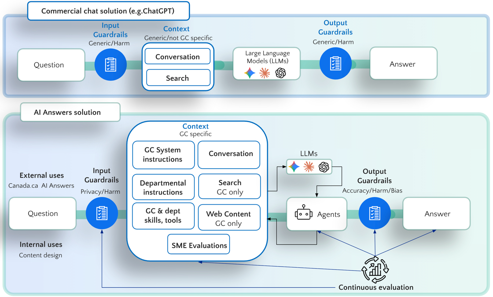

# AI Answers System Card

**Version**: 1.1
**Date**: February 2026
**Organization**: Canada.ca Experience Office, Service Canada  
**Contact**: Michael Karlin at servicecanada.gc.ca   

**Français** : [SYSTEM_CARD_FR.md](SYSTEM_CARD_FR.md)

## On this page
- [Executive Summary](#executive-summary)
- [Current Status](#current-status)
- [System Purpose and Scope](#system-purpose-and-scope)
- [Technical Architecture](#technical-architecture)
- [Risk Assessment and Safety Measures](#risk-assessment-and-safety-measures)
- [Performance and Evaluation](#performance-and-evaluation)
- [Limitations and Constraints](#limitations-and-constraints)
- [Administrative Features and Management](#administrative-features-and-management)
- [Deployment and Infrastructure](#deployment-and-infrastructure)
- [Responsible AI Principles and Governance](#responsible-ai-principles-and-governance)
- [Future Development](#future-development)
- [Contact and Support](#contact-and-support)

## Executive Summary

AI Answers is a specialized AI chat agent designed for Government of Canada websites. It provides accurate, brief answers to user questions about government services, programs, and information, with a single appropriate citation. AI Answers is model-independent, with an innovative evaluation system that uses detailed human expert evaluations to fuel automated AI evaluations and accurate answers. The system is built with usability, privacy, and accuracy as core principles. An extensive Admin interface supports evaluation, metrics, user management, and settings.

Image Description (Alt Text)

The diagram is divided into two horizontal swim lanes.

**Top lane – "Commercial chat solution (e.g. ChatGPT)":**

A linear pipeline flows left to right: Question → Input Guardrails (Generic/Harm) → Context block containing "Conversation" and "Search" (labelled "Generic/not GC specific") → Large Language Models (icons for Gemini, Claude, OpenAI) → Output Guardrails (Generic/Harm) → Answer.

**Bottom lane – "AI Answers solution":**

Two entry points appear on the left: "External uses" (Canada.ca, AI Answers) and "Internal uses" (Content design). Both feed into Input Guardrails (Privacy/Harm). The context block is larger and labelled "GC specific," containing six elements: GC System instructions, Conversation, Departmental instructions, Search (GC only), GC & dept skills/tools, and Web Content (GC only). An additional component, "SME Evaluations," sits below the context block and feeds into a "Continuous evaluation" loop. The context feeds into the same set of LLMs, which connect to an "Agents" node. Agents pass through Output Guardrails (Accuracy/Harm/Bias) before producing the Answer. Arrows from the Continuous evaluation loop return to both the Agents and the Context block, indicating iterative refinement.

## Current Status
- **Environment**: Beta-testing on Canada.ca 
- **Production**: https://ai-answers.alpha.canada.ca (Azure OpenAI + AWS DocumentDB)
- **Evaluation**: Ongoing expert evaluation and response scoring generating AI automated evals & answers
- **Platform**: Departments can add scenario prompts and files to meet specific needs

## System Purpose and Scope

### Primary Function
- Assist users with questions about Government of Canada issues
- Provide accurate information about Government of Canada programs, benefits, and services
- Direct users to appropriate government resources and next steps

### Target Users
- Anyone visiting Canada.ca or federal websites

### Content Scope
- **In scope**: Government of Canada services, programs, benefits, regulations, and official information
- **Out of scope**: Provincial/territorial/municipal services, personal advice, non-government topics
- **Sources**: Only Canada.ca, gc.ca, and federal organization domains

### Language Support
- Full bilingual support (English/French pages)
- Official language compliance
- On the English page: Users can ask questions in any language and receive answers in the same language they asked
- On the French page: Users receive answers in French regardless of the language in which the question was asked
- Citation matches the page language
- Responds in other languages as needed (translates into English first for accuracy and logging)

## Technical Architecture

### System Components
1. **Frontend**: React-based chat interface using Canada.ca design system
2. **Backend**: Node.js with LangGraph state machine orchestration
3. **AI Services**: Azure OpenAI GPT models (production), with OpenAI and Anthropic support
4. **Database**: MongoDB (AWS DocumentDB in production)

**For detailed architecture, see [docs/architecture/pipeline-architecture.md](docs/architecture/pipeline-architecture.md)**

### AI Model Details
- **Current production models**: Azure OpenAI GPT-4.1 family (configurable per pipeline step and graph variant), 5.1 in evaluation stage
- **Temperature**: 0 (deterministic responses)
- **Context engineering**: Separate agents in LangGraph perform pipeline steps, context agent selects dept prompt and context files to pull in as needed
- **Model independence**: System designed to work with different AI providers, tested with GPT & Claude

### Agentic Capabilities
- **Tool usage**: AI can autonomously use specialized tools to enhance responses during answer generation
- **downloadWebPage tool**: Critical for accuracy - downloads and reads web pages to verify current information, especially for:
  - New or updated government pages
  - Time-sensitive content (tax year changes, program updates)
  - Pages modified within the last 4 months
  - Unfamiliar URLs not in training data
  - Specific details like numbers, codes, dates, dollar amounts
- **URL validation**: Automatically checks if citation URLs are active and accessible
- **Context generation**: Derives fresh context for **every question**, including follow-on questions, to ensure accurate department identification and relevant content
- **Content verification**: Prioritizes freshly downloaded content over training data
- **Context reuse optimization**: Can reuse valid context from previous questions in the same conversation to improve response time

### Pipeline Flow (LangGraph State Machine)
The system uses a **multi-step LangGraph pipeline** that orchestrates all processing server-side. Multiple graph variants exist with different capabilities (e.g. vector short-circuit, QA lookup, reasoning models). Not all steps run in every variant.

1. **Initialization**: Set up timing and state tracking
2. **Short Query Validation** (Programmatic): Block queries that are too short to be meaningful
3. **Two-Stage Question Blocking**:
   - **Stage 1** (Programmatic): Pattern-based blocking for profanity, threats, and common PI (word lists configurable by admins via Settings page)
   - **Stage 2** (AI - configurable model): AI detects personal information that slipped through; question is then blocked
4. **Translation** (AI - configurable mini model): Detects language and translates to English for processing
5. **Context Derivation** (AI - mini model for query rewrite; full model for context generation):
   - Query rewrite for optimized search
   - Search execution (Canada.ca or Google)
   - Department matching and context generation
   - Optional: Load department-specific scenarios
6. **Short-Circuit Check** (AI): Vector similarity search to find previously answered similar questions. Only present in certain graph variants, not the default pipeline
7. **Answer Generation** (AI - Configurable model): Generate response with citations using specialized tools
8. **Citation Verification** (Programmatic): Validate citation URL formatting and generate fallback search URL if needed
9. **Persistence**: Save interaction to database, create embeddings, trigger evaluation

**For complete pipeline details, see [docs/architecture/pipeline-architecture.md](docs/architecture/pipeline-architecture.md)**

## Risk Assessment and Safety Measures

### Potential Harms and Mitigation Strategies

#### **Information accuracy risks**
**Potential harms:**
- Providing outdated or incorrect government information
- Misleading users about eligibility requirements or deadlines
- Giving incomplete information that could affect user decisions

**Mitigation strategies:**
- **Real-time content verification**: downloadWebPage tool downloads and reads current web pages to verify information accuracy
- **Citation requirements**: Every answer must include a single verified government source link
- **URL validation**: Automatic checking of citation URLs for validity and accessibility
- **Expert evaluation system**: Continuous human expert evaluation of response accuracy
- **Content freshness monitoring**: Prioritizes freshly downloaded content over potentially outdated training data
- **Department-specific scenarios**: Tailored prompts for different government departments to improve accuracy

#### **Privacy and data protection risks**
**Potential harms:**
- Accidental exposure of personal information
- Logging sensitive user data
- Unauthorized access to user conversations

**Mitigation strategies:**
- **2-stage PI detection and blocking**: 
  - **Stage 1**: Pattern-based detection blocks known PI formats (SIN, emails, phone numbers, addresses)
  - **Stage 2**: AI-powered PI Agent catches personal information that slipped through, especially names and personal identifiers
  - Government form numbers, product serial numbers, and public reference codes are explicitly preserved
- **User notification**: Users are warned when PI is detected and asked to rephrase
- **Data minimization**: Only conversation data that is sent to the AI service is stored
- **Access controls**: Database access restricted to authorized personnel with role-based permissions
- **Encryption**: All data encrypted at rest and in transit

#### **Content safety risks**
**Potential harms:**
- Generation of inappropriate or harmful content
- Response to manipulation attempts
- Providing advice outside government scope

**Mitigation strategies:**
- **Content filtering**: Blocks profanity, discriminatory language, threats, and manipulation attempts (word lists configurable by admins via Settings page)
- **Scope enforcement**: Strict limitation to Government of Canada information only
- **Rate limiting**: 3 questions per session to prevent abuse
- **Character limits**: 260 character limit per question to prevent prompt injection
- **User warnings**: Clear notifications when inappropriate content is detected - usability tested
- **Response length limits**: Maximum 4 sentences to reduce hallucination risk

#### **Accessibility and fairness risks**
**Potential harms:**
- Accessibility barriers
- Language barriers for non-English/French speakers
- Inconsistent service quality across different user groups

**Mitigation strategies:**
- **Screen reader testing**: Iterative usability sessions held with range of screen reader users to test and improve
- **WCAG 2.1 AA compliance**: Full accessibility standards implementation
- **Bilingual support**: Full English/French support with official language compliance
- **Multi-language input**: On the English page, users can ask questions in many languages and receive an answer in the same language asked. On the French page, users receive answers in French regardless of question language. Indigenous language support is planned
- **Plain language**: Responses use clear, simple language matching Canada.ca standards, extensive iterative usability testing

#### **System reliability risks**
**Potential harms:**
- Service outages affecting user access
- API dependency failures
- Data loss or corruption

**Mitigation strategies:**
- **Infrastructure monitoring**: CloudWatch metrics and logging for production environment
- **Automated backups**: AWS DocumentDB with automated backup systems
- **Failover planning**: System designed for model independence with multiple AI providers
- **Rate limiting**: Prevents system overload and abuse
- **Outage setting**: Turn system off and show outage message via Admin panel

### Bias and Fairness Considerations

#### **Potential biases**
- **Language bias**: Potential preference for English over French content
- **Department bias**: Possible over-representation of certain government departments
- **Content recency bias**: Newer government content may be prioritized over established information
- **Geographic bias**: Focus on federal services may not address regional variations

#### **Mitigation strategies**
- **Balanced language support**: Equal treatment of English and French content with official language compliance
- **Department-specific context**: Tailored scenarios for all major government departments
- **Content verification**: downloadWebPage tool ensures current information regardless of training data age
- **Expert evaluation**: Human assessment of answers to identify and correct potential biases via system prompts and eval embeddings to feed improved answers
- **Transparency**: Clear documentation of system limitations and scope

## Performance and Evaluation

### Response Quality
- **Length**: Maximum 4 sentences per answer for clarity
- **Style**: Plain language matching Canada.ca standards
- **Accuracy**: Sourced exclusively from government content
- **Helpfulness**: Corrects misunderstandings and provides actionable next steps
- **Dept-aligned**: Dept can provide prompt scenarios to address specific communications needs, such as sending particular questions to a wizard rather than attempting to answer, or overcoming out-dated content issues by directing to most recent content

### Evaluation Methods
- **Innovative Expert Evaluation System**: 
  - **In-App Evaluation**: Experts evaluate questions within the actual app interface, experiencing the same user experience
  - **Flexible Evaluation**: Experts can enter their own questions or use existing chat IDs to evaluate user conversations
  - **Sentence-Level Scoring**: Each sentence in AI responses is scored individually (100/80/0 points) with detailed explanations
  - **Citation Rating**: Separate scoring for citation accuracy and relevance (25/20/0 points)
  - **Weighted Total Score**: 75% sentence scores + 25% citation score for comprehensive quality assessment
  - **Embedding Generation**: Expert feedback creates embeddings that enable automated AI evaluations for similar questions
  - **Future Enhancement**: These embeddings will soon assist in answering questions quickly and accurately

- **Separate Public User Feedback**: 
  - **Simple Interface**: "Was this helpful?" with Yes/No options for all users
  - **Detailed Follow-up**: Single question asking why they clicked Yes or No with specific reason options
  - **Positive Reasons**: No call needed, no visit needed, saved time, other
  - **Negative Reasons**: Irrelevant, confusing, not detailed enough, not what they wanted, other
  - **Survey Integration**: Links to external surveys for additional feedback collection

### Current Performance
- **Response Time**: Under 10 seconds for most queries
- **Accuracy**: Continuously monitored through expert feedback
- **Accessibility**: Tested with screen reader users
- **Uptime**: Production environment monitoring

### Continuous Monitoring and Evaluation

#### **Real-time Monitoring**
- **System Health**: CloudWatch metrics for uptime, response times, and error rates
- **User Feedback**: Continuous collection of public feedback and expert evaluations
- **Content Quality**: Automated tracking of citation accuracy and response relevance
- **Safety Metrics**: Monitoring of content filtering effectiveness and PI detection rates

#### **Performance Benchmarks**
- **Accuracy Target**: Continuous improvement toward 100% answer accuracy
- **Response Quality**: Maximum 4 sentences for clarity and reduced hallucination risk
- **Accessibility**: WCAG 2.1 AA compliance maintained
- **Language Support**: Equal quality for English and French responses

*For detailed evaluation framework and methodologies, see Evaluation Methods section above.*

## Limitations and Constraints

### Technical Limitations
- **Language Models**: Dependent on OpenAI API availability
- **Content Freshness**: Dependent to some degree on government website content availability
- **Complex Queries**: May require clarifying questions for ambiguous requests
- **Jurisdiction**: Does not provide information about provincial/territorial/municipal services

### Operational Constraints
- **Rate Limits**: 3 questions per session
- **Character Limits**: 260 characters per question
- **Content Scope**: Government of Canada information only
- **Language**: Primary support for English and French

### Known Issues
- **Department Detection**: May occasionally misidentify relevant departments
- **Citation Accuracy**: URLs in prompts may become outdated as government sites change
- **Complex Scenarios**: Multi-step processes may require multiple interactions

## Administrative Features and Management

### User Roles and Access Control
- **Admin Users**: Full system access including user management, database operations, and system configuration
- **Partner Users**: Access to suite of evaluation tools to score sentences and citation for chat responses, batch processing, and performance metrics
- **Role-Based UI**: Different interfaces and capabilities based on user permissions
- **Authentication**: Secure login system with role-based route protection

### Admin Dashboard Capabilities

#### **User Management**
- Create, edit, and delete user accounts
- Manage user roles (admin/partner) and account status (active/inactive)
- View user creation dates and activity
- Bulk user operations with confirmation dialogs

#### **Batch Processing System**
- **Batch Creation**: Upload CSV files with questions for bulk AI evaluation
- **Batch Monitoring**: Track running, completed, and failed batch operations
- **Batch Management**: Cancel running batches, download results in CSV/Excel format
- **Context Derivation**: Automatic context generation for questions without provided context
- **Multi-Provider Support**: Process batches with OpenAI or Anthropic AI services

#### **Evaluation Tools**
- **Expert Evaluation Interface**: Experts can evaluate questions within the app interface or assess existing user conversations by chat ID
- **In-App Evaluation**: Same interface users experience, ensuring evaluators understand the actual user experience
- **Flexible Input**: Enter custom questions or reference chat IDs for evaluation
- **Automated Evaluation**: Generate AI evaluations based on expert feedback patterns
- **Evaluation Regeneration**: Rebuild all evaluations with updated criteria
- **Progress Tracking**: Real-time monitoring of evaluation processing with batch statistics
- *For detailed scoring methodologies and evaluation framework, see Performance and Evaluation section.*

#### **Database Management**
- **Data Export**: Export entire database or specific collections with date filtering
- **Data Import**: Bulk import data with chunked upload support for large datasets
- **Table Statistics**: View record counts across all database collections
- **Index Management**: Drop and rebuild database indexes for performance optimization
- **System Maintenance**: Repair timestamps, migrate data structures, clean system logs

#### **Performance Monitoring**
- **Chat Logs Dashboard**: View recent chat interactions with export capabilities
- **Metrics Dashboard**: Comprehensive performance analytics including:
  - Total conversations and interactions
  - Language breakdown (English/French)
  - AI-scored accuracy metrics
  - User feedback analysis
  - Public feedback reasons and scores
- **Real-time Charts**: Visual representation of system performance with bar charts and pie charts
- **Data Export**: Download metrics in JSON, CSV, and Excel formats

#### **System Configuration**
- **Service Status**: Toggle system availability (available/unavailable)
- **Settings Management**: Configure system-wide settings and parameters

#### **Chat Viewer and Analysis**
- **Chat Session Review**: View complete chat interactions by chat ID
- **Interaction Analysis**: Examine individual question-answer pairs with feedback
- **Expert Rating Interface**: Provide detailed expert feedback on AI responses with sentence-level scoring within the app interface
- **In-App Evaluation**: Experts can evaluate questions in the same interface users experience, or evaluate existing user conversations by chat ID
- **Public Feedback Analysis**: Manage public feedback collection and analysis
- **Separate Feedback Systems**: Expert evaluation (sentence-level) vs public feedback (helpful/not helpful)

### Partner-Specific Features
- **AI Service Selection**: Choose between OpenAI and Anthropic for testing
- **Search Service Toggle**: Switch between Google and Canada.ca search services
- **Expert Feedback Tools**: Access to detailed evaluation interfaces
- **Batch Processing**: Create and manage evaluation batches
- **Performance Metrics**: View system performance and user feedback analytics

## Deployment and Infrastructure

### Environment Configuration
- **Production Environment**:
  - **URL**: https://ai-answers.alpha.canada.ca
  - **Infrastructure**: AWS ECS with auto-scaling
  - **Database**: AWS DocumentDB with automated backups
  - **AI Services**: Azure OpenAI GPT models
  - **Monitoring**: CloudWatch metrics and logging
  - **Platform**: Departments can add prompt scenarios to meet specific needs

### Security
- **HTTPS**: All communications encrypted
- **API Security**: Rate limiting and authentication
- **Data Protection**: Encryption at rest and in transit
- **Access Control**: Role-based permissions

### Compliance
- **Official Languages**: Compliant with Canadian official languages requirements
- **Accessibility**: WCAG 2.1 AA compliance
- **Privacy**: PIPEDA compliance for data handling
- **Government Standards**: Canada.ca design system compliance

## Responsible AI Principles and Governance

### Core Principles
- **Accuracy First**: All responses must be accurate and verifiable through official government sources
- **Privacy by Design**: Personal information is never processed or stored unnecessarily
- **Accessibility for All**: Full compliance with accessibility standards and inclusive design
- **Transparency**: Clear documentation of system capabilities, limitations, and decision-making processes
- **Accountability**: Continuous monitoring and evaluation with human oversight
- **Fairness**: Equal treatment across languages, regions, and user groups

### Governance Framework
- **Oversight**: Canadian Digital Service (CDS) provides overall governance and oversight
- **Compliance**: Adherence to Government of Canada standards, policies, and legal requirements
- **Transparency**: Open source codebase and comprehensive documentation
- **Stakeholder Engagement**: Regular consultation with government departments and user communities
- **Continuous Improvement**: Regular review and updates based on feedback and evaluation results

### Ethical Considerations
- **Public Service Mandate**: System designed exclusively for public service, not commercial purposes
- **User Autonomy**: Users maintain control over their interactions and can choose not to use the service
- **Benefit Maximization**: Focus on providing maximum benefit to Canadian citizens and residents
- **Harm Minimization**: Comprehensive safety measures to prevent any potential harms
- **Cultural Sensitivity**: Respect for Canada's diverse population and official languages

## Future Development

### Planned Improvements
- **Enhanced Evaluation**: Automated response quality assessment from previous expert evaluations by experts
- **Additional Languages**: Support for Indigenous languages
- **Additional departmental partners**: add specific dept prompt layer and expert evaluations

### Research Areas
- **Response Quality**: Improving accuracy and helpfulness
- **User Experience**: Streamlining interaction patterns - iterative usability testing with over 50 participants
- **Accessibility**: Enhanced support for assistive technologies

## Contact and Support

### Technical Support
- **Issues**: GitHub repository for bug reports and feature requests
- **Documentation**: Comprehensive README and API documentation
- **Monitoring**: Real-time system status monitoring

### Governance
- **Oversight**: Canadian Digital Service (CDS)
- **Compliance**: Government of Canada standards and policies
- **Transparency**: Open source codebase and documentation

### Incident Response and Reporting
- **Incident Classification**: Clear categorization of incidents by severity and impact
- **Response Procedures**: Documented procedures for handling safety, privacy, or accuracy incidents
- **Reporting Mechanisms**: Multiple channels for reporting issues (GitHub, admin dashboard, direct contact)
- **Escalation Process**: Clear escalation paths for critical incidents
- **Post-Incident Review**: Systematic review and improvement process after incidents
- **Transparency**: Public reporting of significant incidents and lessons learned

### Contact and Reporting
- **Technical Issues**: GitHub repository for bug reports and feature requests
- **Safety Concerns**: Direct contact through admin dashboard or GitHub issues
- **Privacy Incidents**: Immediate reporting through designated channels
- **Accessibility Issues**: Dedicated accessibility feedback channels
- **General Feedback**: Multiple feedback mechanisms for different user types

---

*This system card is a living document that will be updated as the system evolves. For the most current information, please refer to the project repository.* 