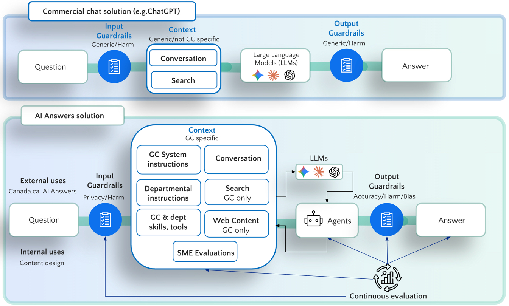

# AI Answers system card

**Version**: 1.2
**Date**: July 2026
**Organization**: Canada.ca Experience Office, Service Canada  
**Contact**: Michael Karlin at servicecanada.gc.ca   

**Français** : [SYSTEM_CARD_FR.md](SYSTEM_CARD_FR.md)

## On this page
- [Executive summary](#executive-summary)
- [Current status](#current-status)
- [System purpose and scope](#system-purpose-and-scope)
- [Technical architecture](#technical-architecture)
- [Risk assessment and safety measures](#risk-assessment-and-safety-measures)
- [Performance and evaluation](#performance-and-evaluation)
- [Limitations and constraints](#limitations-and-constraints)
- [Administrative features and management](#administrative-features-and-management)
- [Deployment and infrastructure](#deployment-and-infrastructure)
- [Responsible AI principles and governance](#responsible-ai-principles-and-governance)
- [Future development](#future-development)
- [Contact and support](#contact-and-support)

## Executive summary

AI Answers is a specialized AI chat agent platform designed for Government of Canada websites. It provides accurate, brief answers to user questions sourced from the entire federal government online ecosystem. The system is built with usability, privacy, and accuracy as core principles. AI Answers is model-independent, with an innovative evaluation system that uses detailed human expert evaluations to fuel later answers and to fuel automated AI evaluations.  An extensive Admin interface supports evaluation, metrics, user management, and settings.

Image Description (Alt Text)

The diagram is divided into two horizontal swim lanes.

**Top lane – "Commercial chat solution (e.g. ChatGPT)":**

A linear pipeline flows left to right: Question → Input Guardrails (Generic/Harm) → Context block containing "Conversation" and "Search" (labelled "Generic/not GC specific") → Large Language Models (icons for Gemini, Claude, OpenAI) → Output Guardrails (Generic/Harm) → Answer.

**Bottom lane – "AI Answers solution":**

Two entry points appear on the left: "External uses" (Canada.ca, AI Answers) and "Internal uses" (Content design). Both feed into Input Guardrails (Privacy/Harm). The context block is larger and labelled "GC specific," containing six elements: GC System instructions, Conversation, Institutional instructions, Search (GC only), GC & dept skills/tools, and Web Content (GC only). An additional component, "SME Evaluations," sits below the context block and feeds into a "Continuous evaluation" loop. The context feeds into the same set of LLMs, which connect to an "Agents" node. Agents pass through Output Guardrails (Accuracy/Harm/Bias) before producing the Answer. Arrows from the Continuous evaluation loop return to both the Agents and the Context block, indicating iterative refinement.

## Current status
- **Environment**: Beta-testing on Canada.ca paused after the last of four public trials ended in February 2026.
- **Trial results**: [AI Answers: Enterprise-scale trials for Canada.ca](https://blog.canada.ca/2025/12/17/ai-answers.html)
- **Production**: https://ai-answers.alpha.canada.ca (no public access - available within GC network only)
- **Platform**: Federal institution partners can add scenario prompts, agentic tools, and files to meet specific needs, [view prompts a
nd partner institution prompt example](docs/agents-prompts/system-prompt-documentation.md)

## System purpose and scope

### Primary function
- Assist users with questions about Government of Canada issues
- Provide accurate information about Government of Canada programs, benefits, and services
- Direct users to appropriate government resources and next steps
- Models a conversation with a call centre agent - [brief answers for better service](docs/pdf/short-ai-answers-en.pdf)

### Target users
- Anyone visiting Canada.ca or federal websites

### Content scope
- **In scope**: Government of Canada services, programs, benefits, regulations, and official public information
- **Sources**: Canada.ca, gc.ca, and federal organization domains
- **Out of scope**: Provincial/territorial/municipal services, personal/legal advice, non-government topics

### Language support
- Full bilingual support (English/French pages, including Admin) for Official language compliance
- Users can ask questions in most languages and receive answers in the same language they asked

## Technical architecture

### System components
1. **Frontend**: React-based chat interface 
2. **Backend**: Node.js with LangGraph state machine orchestration
3. **AI Services**: Azure OpenAI GPT models, with hooks to use other AI models (e.g. Cohere, Anthropic) through Amazon Bedrock if deployed/procured
4. **Database**: AWS DocumentDB 
5. **Search**: Google, with plans to migrate to Canada.ca search API

**For detailed architecture, see [docs/architecture/pipeline-architecture.md](docs/architecture/pipeline-architecture.md)**

### AI model details
- **Current production models**: Azure OpenAI GPT-5.1 family (cutover March 18,2026 from GPT 4.1); evaluation agents use GPT-4.1-mini
- **Model family routing**: Selecting a model family (e.g. GPT-5.1) does not use a single model for every step. The system automatically routes each pipeline step or service to the appropriate model within that family — supporting steps (PII redaction, translation, query rewrite) use the mini variant (e.g. GPT-5-mini) for cost and speed, while context generation and answer generation use the full model (e.g. GPT-5.1). This routing is handled internally by AgentFactory and is not configurable per step by admins.
- **Temperature**: 0 (deterministic responses), reasoning low
- **Context engineering**: Separate agents in LangGraph perform pipeline steps, context agent selects dept prompt and context files to pull in as needed
- **Model independence**: System designed to work with different AI providers, tested with GPT & Claude, plans in place to deploy more models, including Cohere, via AWS Bedrock

### Agentic capabilities
- **Tool usage**: AI can autonomously choose to use specialized tools to enhance responses during answer generation
- **downloadWebPage tool**: Critical for accuracy - downloads and reads web pages to verify current information, especially for:
  - New or updated government pages
  - Time-sensitive content (tax year changes, program updates)
  - Specific details like numbers, codes, dates, dollar amounts
- **URL validation**: Automatically checks if citation URLs are active and accessible
- **Context generation**: Derives fresh context for **every question**, including follow-on questions, to ensure accurate Institution identification and relevant content
- **OpenGov API tool**: Uses OpenGov API to find open datasets for data-oriened questions 

### Pipeline flow (LangGraph state machine)
The system uses a **multi-step LangGraph pipeline** that orchestrates all processing server-side. Multiple graph variants exist with different capabilities (e.g. vector short-circuit, eval-informed answers, reasoning models). Not all steps run in every variant.

1. **Initialization**: Set up timing and state tracking
2. **Short Query Validation** (Programmatic): Block queries that are too short to be meaningful
3. **Two-Stage Question Blocking**:
   - **Stage 1** (Programmatic): Pattern-based blocking for profanity, threats, and common PI (word lists configurable by admins via Settings page)
   - **Stage 2** (AI - Azure OpenAI GPT-4o, Canada East region): AI detects personal information that slipped through; question is then blocked
4. **Translation** (AI - configurable mini model): Detects language and translates to English for processing
5. **Query Rewrite & Search** (AI - mini model): Rewrite the translated question into an optimized search query and run it against Canada.ca or Google. If the first search returns zero or one result, automatically rewrite again with a simplified query and retry; the better result set is kept.
6. **Context Derivation** (AI - full model): Institution matching and context generation from search results; optionally loads Institution-specific scenarios
7. **Short-Circuit Check** (AI): Vector similarity search to find previously answered similar questions. Only present in certain graph variants, not the default pipeline
8. **Answer Generation** (AI - Configurable model): Generate response with citations using specialized tools
9. **Citation Verification** (Programmatic): Validate citation URL formatting and generate fallback search URL if needed
10. **Persistence**: Save interaction to database, create embeddings, trigger evaluation
11. **Auto-Evaluation**: Evaluation worker checks whether the saved interaction already has a linked AI evaluation (e.g. from a QA match); if not, runs the AI auto-evaluation and links the result to the interaction
12. **Task classifier**: (AI - full model): use question and answer to assign program and action (e.g. IRCC account - sign in) to question for reporting and analysis by institutions 

**For complete pipeline details, see [docs/architecture/pipeline-architecture.md](docs/architecture/pipeline-architecture.md)**

## Risk assessment and safety measures

### Potential harms and mitigation strategies

#### **Information accuracy risks**
**Potential harms:**
- Providing outdated or incorrect government information
- Misleading users about eligibility requirements or deadlines

**Mitigation strategies:**
- **Real-time content verification**: downloadWebPage tool downloads and reads current web pages to verify information accuracy
- **Citation requirements**: Every answer must include a single verified government source link
- **URL validation**: Automatic checking of citation URLs for validity and accessibility
- **Expert evaluation system**: Continuous human expert evaluation of response accuracy — a sample of 2,500 questions was evaluated across the public trials, producing an accuracy rate of 96%
- **Eval-informed answers**: Previous human evals of similar questions are loaded into context for new answer, act as system memory
- **Content freshness monitoring**: Prioritizes freshly downloaded content over potentially outdated training data
- **Institution-specific scenarios**: Tailored prompts, tools and files for different government institutions to improve accuracy
- **Response length limits**: Maximum 4 sentences to reduce hallucination risk

#### **Privacy and data protection risks**
**Potential harms:**
- Accidental exposure of personal information to AI service
- Logging of personal identifying user data
- Unauthorized access to user conversations

**Mitigation strategies:**
- **2-stage PI detection and blocking**: 
  - **Stage 1**: Pattern-based detection blocks known PI formats (SIN, emails, phone numbers, addresses)
  - **Stage 2**: AI model (located in Canada) acts as PI Agent to flag personal information that slipped through pattern stage, especially names and personal identifiers
  - Government form numbers, product serial numbers, and names in historical, political and address contexts are explicitly preserved (e.g. Louis Riel day, James Flaherty building, PM Carney)
- **User notification**: Users are warned when PI is detected that their question won't be logged or sent to the AI service, must ask the question differently to continue
- **Data minimization**: Only questions not flagged as containing PI are sent to the AI service and stored
- **Access controls**: Database access restricted to authorized personnel with role-based permissions
- **Encryption**: All data encrypted at rest and in transit
- **Reporting**: Metrics capture only a count of questions blocked due to PI by stage, no blocked questions with PI data are stored

#### **AI manipulation risks**
**Potential harms:**
- Deliberate manipulation to generate inappropriate responses 
- Public servant exposure to profanity, threats, discriminatory language or manipulation

**Mitigation strategies:**
- **Content blockingg**: Profanity, discriminatory language, threats, and manipulation attempts (word lists configurable by admins via Settings page) are detected immediately or by the initial Azure guardrails and blocked.  
- **Prompt injection prevention**: Codes, keywords and other common prompt injection techniques are blocked
- **Scope enforcement**: Strict limitation to Government of Canada sourced content
- **Rate limiting**: 3 questions per session to prevent manipulation (longer conversations are more at risk of inaccuracy)
- **Character limits**: 260 character limit per question help prevent prompt injection and force clearer questions 
- **User warnings**: Users are notified that their question won't be logged or sent to the AI service when the question is blocked. Their question is displayed with the offending words or phrases replaced with "###" symbols.  Usability testing of this blocking process confirmed that users understood the issue and rephrased their questions to avoid the marked content. 
-**Reporting**: metrics capture only a count of the type of blocked questions - the questions themselves are not stored. 

#### **Accessibility risks**
**Potential harms:**
- Accessibility barriers
- Language barriers for non-English/French speakers
- Inconsistent service quality across different user groups

**Mitigation strategies:**
- **Screen reader testing**: Iterative usability sessions held in 2025 with range of screen reader users to test and improve
- **WCAG 2.1 AA compliance**: Full accessibility standards implementation with review
- **Bilingual support**: Full English/French support with official language compliance
- **Multi-language input**: Users can ask questions in many languages and receive an answer in the same language asked. Indigenous language support may be implemented in future through Indigenous Services Canada. 
- **Plain language**: Responses use clear, simple language matching Canada.ca standards, extensive iterative usability testing of the short answers. 

### Bias and inclusiveness considerations

#### **Potential issues**
- **Safety and inclusiveness**: Potential for biased responses in factors such as age, disability, education, ethnicity (e.g., Indigenous identity, national origin, immigration status), economic status, geography (including community, remoteness, and rurality),language, race, religion, and sexual orientation

#### **Mitigation strategies**
- **Balanced language support**: Equal treatment of English and French content with official language compliance and accuracy parity evaluated by human experts
- **Content verification**: downloadWebPage tool ensures responses are sourced from federal government content regardless of biases in training data 
- **Expert evaluation**: Human assessment of answers to identify and correct potential biases via system prompts and eval embeddings to feed improved answers
- **Transparency**: Clear documentation of system limitations and scope
- **Extensive taxonomy**: Taxonomy created to guide development of question test sets for bias and safety testing
- **Test datasets**: large datasets of questions to test for regression during prompt/model upgrades and changes

### **System reliability risks**
**Potential harms:**
- Service outages affecting user access
- API dependency failures
- Data loss or corruption

**Mitigation strategies:**
- **Infrastructure monitoring**: CloudWatch metrics and logging for production environment
- **Automated backups**: AWS DocumentDB with automated backup systems
- **Failover planning**: System designed for model independence with multiple AI providers
- **Rate limiting**: Prevents system overload and abuse
- **Outage setting**: Turn system off and show outage message via Admin panel
- **Automated health monitoring**: A background monitor continuously probes the system's core dependencies (database, search, and AI model). When a dependency fails repeatedly within a short rolling window, the monitor sends an alert email to the operations team and — if auto-disable is enabled — automatically sets the site to unavailable so users see the outage message instead of failing responses. Polling speeds up while failures are being confirmed and backs off once the dependency recovers, and the site returns to available automatically when the failures clear.

## Performance and evaluation

### Response quality
- **Length**: Maximum 4 sentences per answer for clarity, reduce risk of hallucination
- **Style**: Plain language matching Canada.ca standards
- **Accuracy**: Sourced exclusively from federal public content, aided by expert evaluations of similar questions
- **Helpfulness**: Corrects misunderstandings and provides actionable next steps
- **Institution-specific**: Partnering institutions can provide prompt scenarios to address specific communications needs, such as sending particular questions to a wizard rather than attempting to answer, or overcoming out-dated content issues by directing to most recent content. Can add API tools and additional content files (e.g. ISC contact details file pulled from 32+ pages across ISC site)

### Evaluation infrastructure for human experts from partner institutions
- **Innovative expert evaluation system**: 
  - **In-app evaluation**: Experts evaluate questions within the actual app interface, reviewing the conversation exactly as the user saw it [evaluation processs with screenshots](docs/pdf/ai-answers-expert-evals-integration.pdf)
  - **Flexible evaluation**: Experts can enter their own questions or use existing chat IDs to evaluate user conversations
  - **Sentence-level scoring**: Each sentence in AI responses is scored individually (100/80/0 points) with detailed explanations
  - **Citation rating**: Separate scoring for citation accuracy and relevance (25/20/0 points)
  - **Weighted total score**: 75% sentence scores + 25% citation score for comprehensive quality assessment
  - **AI evals**: Expert evals saved as embeddings that enable automated AI evaluations for similar questions
  - **Evaluation-informed answers**: Expert evaluations are injected into similar question context to prevent errors, improve consistency — see [Using evaluations to improve answers](#using-evaluations-to-improve-answers) below for current status
  - **Eval analysis engine**: produces AI analysis report of evaluation patterns, cluster analysis with examples, break outs by evaluator and language (FR/EN)
  - **Sampling rate**: Target sample size for trial accuracy evaluations is for 25% of all answers evaluated for a specific institution. Within two months of a full launch for a specific institution, expert evaluation sample sizes may decrease to 10% if AI evals contribute the other 15%. So the target is always 25% of answers to be evaluated - we expect the mix of human to AI evaluations to change over time.
- **Separate public user feedback**: 
  - **Simple interface**: "Was this helpful?" with Yes/No options for all users
  - **Detailed follow-up**: Single question asking why they clicked Yes or No with specific reason options
  - **Positive reasons**: No call needed, no visit needed, saved time, other
  - **Negative reasons**: Irrelevant, confusing, not detailed enough, link didn't work, not what they wanted, other

### Using evaluations to improve answers

Expert evaluations of past answers are not only used for reporting — they can also be fed back into live answer generation. Two mechanisms have been built for this, both drawing on the same store of expert-rated question/answer pairs. 

- **Eval-informed answering (similar questions)**: Before the AI generates an answer, the system retrieves a few of the most similar expert-rated past question-answer-evals sets and includes them in the model's instructions as worked examples — perfect-score pairs to follow, and flagged-mistake pairs (with the expert's sentence-by-sentence notes and the corrected citation) so the model can avoid repeating known errors. A similarity floor ensures only genuinely related examples are used; when no relevant example exists, none is injected. 
- **Instant verified answers (short-circuit serving) — not yet in production**: When a new question very closely matches a past question whose answer an expert scored a perfect 100/100, the system would serve that verified answer directly and skip the AI model, reducing cost and latency. Only perfect-score answers would be eligible, and the match must be very close to avoid serving the wrong answer. In testing this approach has not yet performed reliably enough to deploy, so it remains off in production.

Both mechanisms are implemented as selectable pipeline variants ("graphs"), require that expert feedback exists for a past answer, and are designed to degrade gracefully — if the lookup is unavailable, answer generation proceeds normally without examples.

**For full technical detail, see [docs/architecture/using-evals-for-answers.md](docs/architecture/using-evals-for-answers.md)**

### Current performance
- **Response time**: Target is 6 to 14 seconds depending on complexity. Length of downloaded pages contributes to longer response delays. Users are shown progress messages for each step. 
- **Accuracy**: Target accuracy rate is greater than 90% of answers in a sample. Across public trials in 2025, an accuracy rate of 96% was achieved. [AI Answers: Enterprise-scale trials for Canada.ca](https://blog.canada.ca/2025/12/17/ai-answers.html)
- **Uptime**: High. 

### Continuous monitoring and security

#### **Real-time monitoring**
- **API connectivity**: Production environment monitoring and email alerts are in place for outages across the database, AI model(s) and search API. 
- **Session monitoring**: Live sessions by chat ID, errors, time frame, latency
- **User feedback**: Continuous collection of public feedback
- **Safety metrics**: Monitoring of blocked queries

### Known issues
- **Institution detection**: May occasionally misidentify institution associated with a particular question, prompt is constantly refined
- **Citation accuracy**: URLs in institutional scenario prompts may become outdated if not consistently maintained
- **Inaccurate responses**: System tends to respond even when search results and known urls are poor - model upgrades will improve this

### Incident response and reporting
- **Incident classification**: Clear categorization of incidents by severity and impact
- **Response procedures**: Documented procedures for handling safety, privacy, or accuracy incidents
- **Reporting mechanisms**: Multiple channels for reporting issues (GitHub, admin dashboard, direct contact)
- **Escalation process**: Clear escalation paths for critical incidents
- **Post-incident review**: Systematic review and improvement process after incidents
- **Transparency**: Public reporting of significant incidents and lessons learned

## Administrative features and management

### User roles and access control
- **Admin users**: Full system access including user management, database operations, and system configuration
- **Partner users**: Access to suite of evaluation tools and reports to score sentences and citation for chat responses, batch processing, and performance metrics
- **Role-based UI**: Different interfaces and capabilities based on user permissions
- **Authentication**: Secure login system with role-based route protection

### Administrator functionality

#### **User management**
- Create, edit, and delete user accounts
- Manage user roles (admin/partner) and account status (active/inactive)
- View user creation dates and activity
- Bulk user operations with confirmation dialogs

#### **Batch processing and dataset comparison system**
- **Batch creation**: Upload CSV files with questions for bulk AI evaluation
- **Batch monitoring**: Track running, completed, and failed batch operations
- **Batch management**: Cancel running batches, download results in CSV/Excel format
- **Context derivation**: Automatic context generation for questions without provided context
- **Workflow selection**: Process batches with differnt workflow settings
- **Compare results across trials**: Compare results of multiple trials for a question dataset to reference answers or across a set

#### **Evaluation tools**
- **Expert evaluation interface**: Experts can evaluate questions within the app interface or assess existing user conversations by chat ID
- **In-app evaluation**: Same interface users experience, ensuring evaluators understand the actual user experience
- **Flexible input**: Enter custom questions or reference chat IDs for evaluation
- **Automated evaluation**: Generate AI evaluations based on expert feedback patterns
- **Evaluation regeneration**: Rebuild all evaluations with updated criteria
- **Progress tracking**: Real-time monitoring of evaluation processing with batch statistics
- *For detailed scoring methodologies and evaluation framework, see Performance and Evaluation section.*

#### **Database management**
- **Data export**: Export entire database or specific collections with date filtering
- **Data import**: Bulk import data with chunked upload support for large datasets
- **Table statistics**: View record counts across all database collections
- **Index management**: Drop and rebuild database indexes for performance optimization
- **System maintenance**: Repair timestamps, migrate data structures, clean system logs

#### **Conversation monitoring**
- **Chat logs dashboard**: View recent chat interactions with export capabilities
- **Metrics report**: Comprehensive performance analytics including:
  - Total conversations and interactions
  - Language breakdown (English/French)
  - AI-scored accuracy metrics
  - User feedback analysis
  - Public feedback reasons and scores
- **Real-time partner and public reports**: Visual representation of system performance with bar charts and pie charts per partner needs
- **Data export**: Download metrics in JSON, CSV, and Excel formats

#### **System configuration**
- **Service status**: Toggle system availability (available/unavailable)
- **Settings management**: Configure system-wide settings and parameters

## Deployment and infrastructure

### Environment configuration
- **Production environment**:
  - **URL**: https://ai-answers.alpha.canada.ca
  - **Infrastructure**: AWS ECS with auto-scaling
  - **Database**: AWS DocumentDB with automated backups
  - **AI services**: Azure OpenAI GPT 4.0, 5.1 family of models - plans to add Cohere and Anthropic
  - **Monitoring**: CloudWatch metrics and logging
  - **Platform**: Institutions can add prompt scenarios to meet specific needs

### Security
- **HTTPS**: All communications encrypted
- **API security**: Rate limiting and authentication
- **Data protection**: Encryption at rest and in transit
- **Access control**: Role-based permissions

### Compliance
- **Official languages**: Compliant with Canadian official languages requirements
- **Accessibility**: WCAG 2.1 AA compliance
- **Privacy**: no personal identifying information is stored - questions with personal details are blocked/rejected
- **Government standards**: Canada.ca design compliance

## Responsible AI principles and governance

### Core principles
- **Accuracy first**: All responses must be accurate and verifiable through official government sources
- **Accessibility for all**: Full compliance with accessibility standards and inclusive design
- **Transparency**: Clear documentation of system capabilities, limitations, and decision-making processes
- **Accountability**: Continuous monitoring and evaluation with human oversight
- **Safety**: Inclusive unbiased responses across all groups measured by expert evaluation

### Ethical considerations
- **Public service mandate**: System designed exclusively for public service, not commercial purposes
- **User autonomy**: Users maintain control over their interactions and can choose not to use the service
- **Benefit maximization**: Focus on providing maximum benefit to Canadian citizens and residents
- **Harm minimization**: Comprehensive safety measures to prevent any potential harms
- **Cultural sensitivity**: Respect for Canada's diverse population and official languages

## Future development

### Planned improvements
- **Additional languages**: Support for Indigenous languages
- **Additional institutional partners**: add specific dept prompt layer and expert evaluations
- **Agentic tools**: add tools for institutional agents to use to support AI assistance beyond chat

## Contact and support

### Technical support
- **Issues**: GitHub repository for bug reports and feature requests
- **Documentation**: Comprehensive README and API documentation
- **Monitoring**: Real-time system status monitoring

### Contact and reporting
- **Technical issues**: GitHub repository for bug reports and feature requests
- **Safety concerns**: Direct contact through product email
- **General feedback**: Multiple feedback mechanisms for different user types

---

*This system card is a living document that will be updated as the system evolves. For the most current information, please refer to the project repository.* 
