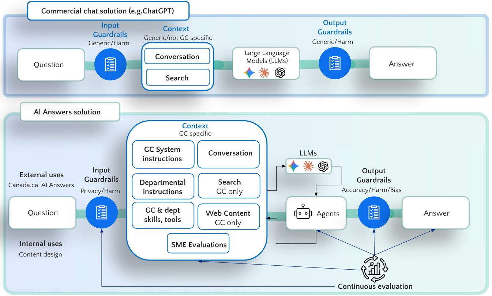

# AI Answers system card

<dl>
  <dt>Version</dt>
  <dd>2.0</dd>
  <dt>Date</dt>
  <dd>October 2026</dd>
  <dt>Organization</dt>
  <dd>Canada.ca Experience Office, Service Canada</dd>
  <dt>Contact</dt>
  <dd><a href="https://blog.canada.ca/contact-us">Use the Canada.ca Experience Office contact form</a></dd>
</dl>

## On this page
- [Executive summary](#executive-summary)
- [Current status](#current-status)
- [System purpose and scope](#system-purpose-and-scope)
- [Technical architecture](#technical-architecture)
- [Risk assessment and safety measures](#risk-assessment-and-safety-measures)
- [Performance and evaluation](#performance-and-evaluation)
- [Administrative features and management](#administrative-features-and-management)
- [Responsible AI principles and governance](#responsible-ai-principles-and-governance)
- [Future development](#future-development)
- [Contact and support](#contact-and-support)

## Executive summary

AI Answers is a specialized AI chat agent platform designed for Government of Canada websites. It provides accurate, brief answers to user questions sourced from the entire federal government online ecosystem. The system is built with usability, privacy, and accuracy as core principles. AI Answers is model-independent, with an innovative evaluation system that uses detailed human expert evaluations to fuel later answers and to fuel automated AI evaluations. Trials in 2025 reported an accuracy rate of 96% as evaluated by experts from 7 partnering institutions. An extensive admin interface supports evaluation, metrics, user management, and settings.

Image description: AI Answers system architecture diagram

The diagram is divided into two horizontal swim lanes.

**Top lane – "Commercial chat solution (e.g. ChatGPT)":**

A linear pipeline flows left to right: Question → Input Guardrails (Generic/Harm) → Context block containing "Conversation" and "Search" (labelled "Generic/not GC specific") → Large Language Models (icons for Gemini, Claude, OpenAI) → Output Guardrails (Generic/Harm) → Answer.

**Bottom lane – "AI Answers solution":**

Two entry points appear on the left: "External uses" (Canada.ca, AI Answers) and "Internal uses" (Content design). Both feed into Input Guardrails (Privacy/Harm). The context block is larger and labelled "GC specific," containing six elements: GC System instructions, Conversation, Institutional instructions, Search (GC only), GC & dept skills/tools, and Web Content (GC only). An additional component, "SME Evaluations," sits below the context block and feeds into a "Continuous evaluation" loop. The context feeds into the same set of LLMs, which connect to an "Agents" node. Agents pass through Output Guardrails (Accuracy/Harm/Bias) before producing the Answer. Arrows from the Continuous evaluation loop return to both the Agents and the Context block, indicating iterative refinement.

## Current status
- **Environment**: Beta-testing on Canada.ca paused after the last of four public trials ended in February 2026.
- **Trial results**: [AI Answers: Enterprise-scale trials for Canada.ca](https://blog.canada.ca/2025/12/17/ai-answers.html)
- **Production**: https://ai-answers.alpha.canada.ca (no public access after February 2026 - available within GC network only).
- **Institution partners**: Federal institution partners evaluate answers for accuracy, and can add scenario prompts, agentic tools to use APIs, and files to meet specific needs.

## System purpose and scope

### Primary function
- Assist users with questions about Government of Canada issues
- Provide accurate information about Government of Canada programs, benefits, and services
- Direct users to appropriate government resources and next steps
- Models a conversation with a call centre agent
  - [Brief answers for better service (PDF, 496 KB)](docs/pdf/short-ai-answers-en.pdf)

### Target users
- Anyone visiting Canada.ca or federal websites

### Content scope
- **In scope**: Government of Canada services, programs, benefits, regulations, and official public information
- **Sources**: Canada.ca, gc.ca, and federal organization domains
- **Out of scope**: Provincial/territorial/municipal services, personal/legal advice, non-government topics

### Language support
- Full bilingual support (English/French pages, including Admin) for Official language compliance.
- Users can ask questions in most languages and receive answers in the same language they asked.

## Technical architecture

### System components
1. **Frontend**: React-based chat interface 
2. **Backend**: Node.js with LangGraph state machine orchestration
3. **AI Services**: Azure OpenAI GPT models, with hooks to use other AI models (e.g. Cohere, Anthropic) through Amazon Bedrock if deployed/procured
4. **Database**: AWS DocumentDB 
5. **Search**: Google or Canada.ca search, based on the selected search provider
6. **Hosting**: AWS ECS with auto-scaling and CloudWatch monitoring

### AI model details
- **Current production models**: Azure OpenAI GPT-5.1 for answers, GPT-4o for personal information detection (kept in Canada East), and mini models for supporting steps.
- **Model family routing**: The system automatically routes each pipeline step or service to the appropriate model — supporting steps (translation, query rewrite) use mini for cost and speed, while answer generation uses the full model GPT-5.1. This routing is handled internally by AgentFactory and is not configurable per step by admins.
- **Temperature**: 0 (deterministic responses), reasoning low.
- **Context engineering**: Separate agents in LangGraph perform pipeline steps, context agent selects dept prompt and context files to pull in as needed.
- **Model independence**: System designed to work with different AI providers, tested with GPT & in prototype with Anthropic API, plans to deploy more models, including Cohere, via AWS Bedrock.

### Agentic capabilities
- **Tool usage**: During answer generation, the AI can autonomously choose to use specialized tools:
  - **downloadWebPage**: Critical for accuracy — downloads and reads web pages to verify current information, especially new or updated pages, time-sensitive content (tax year changes, program updates), and specific details like numbers, codes, dates, and dollar amounts
  - **OpenGov API**: Finds open datasets for data-oriented questions
- **Context generation**: Derives fresh context for **every question**, including follow-on questions, to ensure accurate institution identification and relevant content

### Pipeline flow (LangGraph state machine)
The system uses a **multi-step LangGraph pipeline** that orchestrates all processing server-side. Multiple graph variants exist with different capabilities (e.g. vector short-circuit, eval-informed answers, reasoning models). Not all steps run in every variant.

#### What sets AI Answers apart

Three things in this flow set AI Answers apart from a general-purpose chatbot.

1. Answers are built only from Government of Canada content, with the citation link checked before the person sees it.
2. The system works out which institution a question belongs to, then loads that institution's own material into the instructions for that one answer — the scenarios, agentic tools and files its partner team has written. A question about a passport and a question about a tax credit are answered under different institutional instructions, chosen per question, with no one having to route the question first.
3. Expert evaluations act as memory. When an expert evaluates an answer, that judgement — including what was wrong with it — becomes a worked example the model is shown the next time someone asks something similar. Automated AI evaluations never become examples, so the system never learns from its own judgements.

#### Pipeline steps

1. **Initialization**: Set up timing and state tracking.
2. **Short query validation** (Programmatic): Block queries that are too short to be meaningful.
3. **Two-stage question blocking**:
   - **Stage 1** (Programmatic): Pattern-based blocking for profanity, threats, and common PI.
   - **Stage 2** (AI - Azure OpenAI GPT-4o, Canada East region): AI detects personal information that slipped through; question is then blocked (see Privacy and data protection risks).
4. **Translation** (AI - configurable mini model): Detects language and translates to English for processing. The word-list guardrails then re-run on the English text, and for source languages other than English or French the AI personal-information check runs a second time — a threat or personal detail written in another language may only be recognizable once translated.
5. **Instant verified answer check** (AI - vector similarity and reranking): Looks for a past question, rated 100/100 by an expert, that very closely matches the new one, and serves that verified answer directly. Only present in certain graph variants, not in the production pipeline.
6. **Query rewrite and search** (AI - mini model): Rewrite the translated question into an optimized search query and run it against Canada.ca or Google. If the first search returns zero or one result, automatically rewrite again with a simplified query and retry; the better result set is kept.
7. **Context derivation** (AI - full model): Institution matching and context generation from search results; optionally loads Institution-specific scenarios.
8. **Eval-informed answering** (embedding lookup, no language-model call): Adds up to three of the most similar expert-rated past answers to the model's instructions as examples (see Using evaluations to improve answers). In production since August 2026.
9. **Answer generation** (AI - Configurable model): Generate response with citations using specialized tools.
10. **Citation verification** (Programmatic): Validate citation URL formatting and generate fallback search URL if needed.
11. **Persistence**: Save interaction to database, create embeddings, trigger evaluation.
12. **Auto-evaluation** (background; not every answer receives one): Evaluation worker checks whether the saved interaction already has a linked AI evaluation (e.g. from a QA match); if not, runs the AI auto-evaluation and links the result to the interaction.
13. **Task classifier** (AI - full model, runs in the background after the answer is delivered): use question and answer to assign program and action (e.g. IRCC account - sign in) to question for reporting and analysis by institutions.

## Risk assessment and safety measures

### Information accuracy risks
**Potential harms:**
- Providing outdated or incorrect government information
- Misleading users about eligibility requirements or deadlines

**Mitigation strategies:**
- **Real-time content verification**: downloadWebPage tool downloads and reads current web pages to verify information accuracy.
- **Citation requirements**: Every answer must include a single verified government source link.
- **URL validation**: Automatic checking of citation URLs for validity and accessibility.
- **Expert evaluation system**: Continuous human expert evaluation of response accuracy — a sample of 2,500 questions was evaluated across the public trials, producing an accuracy rate of 96%.
- **Eval-informed answers**: Similar expert-rated past answers are shown to the model as examples.
- **Content freshness monitoring**: Prioritizes freshly downloaded content over potentially outdated training data.
- **Institution-specific scenarios**: Tailored prompts, tools and files for different government institutions to improve accuracy — for example, sending particular questions to a wizard, directing to the most recent content, or adding a contact-details file pulled from 32+ pages of a department site.
- **Response length limits**: Maximum 4 sentences to reduce hallucination risk.

### Privacy and data protection risks
**Potential harms:**
- Accidental exposure of personal information to AI service
- Logging of personal identifying user data
- Unauthorized access to user conversations

**Mitigation strategies:**
- **2-stage PI detection and blocking**: 
  - **Stage 1**: Pattern-based detection blocks known PI formats (SIN, emails, phone numbers, addresses).
  - **Stage 2**: AI model (located in Canada) acts as PI Agent to flag personal information that slipped through pattern stage, especially names, personal identifiers and dates of birth.
  - Government form numbers, product serial numbers, and names in historical, political and address contexts are explicitly preserved (e.g. Louis Riel day, James Flaherty building, PM Carney).
- **User notification**: Users are warned when PI is detected that their question won't be logged or sent to the AI service, must ask the question differently to continue.
- **Data minimization**: Only questions not flagged as containing PI are sent to the AI service and stored.
- **Access controls**: Database access is restricted to authorized personnel with role-based permissions.
- **Encryption**: All data is encrypted at rest and in transit.
- **Reporting**: Metrics capture only counts of blocked questions, by PI stage and by type of block; the blocked questions themselves are never stored.

### AI manipulation risks
**Potential harms:**
- Deliberate manipulation to generate inappropriate responses 
- Public servant exposure to profanity, threats, discriminatory language or manipulation

**Mitigation strategies:**
- **Content blocking**: Profanity, discriminatory language, threats, and manipulation attempts (word lists configurable by admins via Settings page) are detected immediately or by the initial Azure guardrails and blocked.  
- **Prompt injection prevention**: Codes, keywords and other common prompt injection techniques are blocked.
- **Scope enforcement**: Strict limitation to Government of Canada sourced content.
- **Rate limiting**: 3 questions per session to prevent manipulation (longer conversations are more at risk of inaccuracy).
- **Character limits**: 260 character limit per question helps prevent prompt injection and force clearer questions.
- **User warnings**: Blocked questions are shown with the offending words or phrases replaced by "###" symbols. Usability testing confirmed that users understood the issue and rephrased their questions.

### Accessibility risks
**Potential harms:**
- Accessibility barriers
- Language barriers for non-English/French speakers
- Inconsistent service quality across different user groups

**Mitigation strategies:**
- **Screen reader testing**: Iterative usability sessions held in 2025 with range of screen reader users to test and improve.
- **WCAG 2.1 AA compliance**: Full accessibility standards implementation with review.
- **Multi-language input**: Users can ask questions in many languages and receive an answer in the same language asked. Indigenous language support may be implemented in future through Indigenous Services Canada. 
- **Plain language**: Responses use clear, simple language matching Canada.ca standards, extensive iterative usability testing of the short answers. 

### Bias and inclusiveness considerations

**Potential issues:**
- **Safety and inclusiveness**: Potential for biased responses in factors such as age, disability, education, ethnicity (e.g., Indigenous identity, national origin, immigration status), economic status, geography (including community, remoteness, and rurality),language, race, religion, and sexual orientation

**Mitigation strategies:**
- **Balanced language support**: Equal treatment of English and French content with official language compliance and accuracy parity evaluated by human experts.
- **Content verification**: downloadWebPage tool ensures responses are sourced from federal government content regardless of biases in training data.
- **Expert evaluation**: Human assessment of answers to identify and correct potential biases via system prompts and eval embeddings to feed improved answers.
- **Transparency**: Clear documentation of system limitations and scope.
- **Extensive taxonomy**: Taxonomy created to guide development of question test sets for bias and safety testing.
- **Test datasets**: Large datasets of questions to test for regression during prompt/model upgrades and changes.

### System reliability risks
**Potential harms:**
- Service outages affecting user access
- API dependency failures
- Data loss or corruption

**Mitigation strategies:**
- **Infrastructure monitoring**: CloudWatch metrics and logging for production environment.
- **Automated backups**: AWS DocumentDB with automated backup systems.
- **Failover planning**: System designed for model independence with multiple AI providers.
- **Rate limiting**: Prevents system overload and abuse.
- **Outage setting**: Turn system off and show outage message via admin panel.
- **Automated health monitoring**: A background monitor continuously probes the system's core dependencies (database, search, and AI model). When a dependency fails repeatedly within a short rolling window, the monitor sends an alert email to the operations team and — if auto-disable is enabled — automatically sets the site to unavailable so users see the outage message instead of failing responses. Polling speeds up while failures are being confirmed and backs off once the dependency recovers, and the site returns to available automatically when the failures clear.

## Performance and evaluation

### Evaluation infrastructure for human experts and public feedback

**Innovative evaluation system for experts from partner institutions:**
- **In-app evaluation**: Experts evaluate answers to questions within the actual app interface, reviewing the conversation exactly as the user saw it.
  - [Evaluation process with screenshots (PDF, 1.04 MB)](docs/pdf/ai-answers-expert-evals-integration.pdf)
- **Flexible evaluation**: Experts can enter their own questions or use existing chat IDs to evaluate user conversations.
- **Sentence-level scoring**: Each sentence in AI responses is scored individually (100/80/0 points) with detailed explanations.
- **Citation rating**: Separate scoring for citation accuracy and relevance (25/20/0 points).
- **Weighted total score**: 75% sentence scores + 25% citation score for comprehensive quality assessment.
- **AI evals**: Expert evals are saved as embeddings that enable automated AI evaluations for similar questions.
- **Eval analysis engine**: Produces AI analysis report of evaluation patterns, cluster analysis with examples, break outs by evaluator and language (FR/EN).
- **Sampling rate**: Target sample size for trial accuracy evaluations is for 25% of all answers evaluated for a specific institution. Within two months of a full launch for a specific institution, expert evaluation sample sizes may decrease to 10% if AI evals contribute the other 15%. So the target is always 25% of answers to be evaluated - we expect the mix of human to AI evaluations to change over time.

**Public user feedback:**
- **Simple interface**: "Was this helpful?" with "Yes" and "No" buttons for all public users
- **Detailed follow-up**: Single question asking why they clicked "Yes" or "No" with specific reason options
- **Positive reasons**: No call needed, no visit needed, saved time, other
- **Negative reasons**: Irrelevant, confusing, not detailed enough, link didn't work, not what they wanted, other

### Using evaluations to improve answers

Expert evaluations of past answers are not only used for reporting — they can also be fed back into live answer generation. Two mechanisms have been built for this, both drawing on the same store of expert-rated question/answer pairs. 

- **Eval-informed answering (similar questions) — in production since August 2026**: Before the AI generates an answer, the system retrieves a few of the most similar expert-rated past question-answer-evals sets and includes them in the model's instructions as evaluated examples — perfect-score pairs to follow, and flagged-mistake pairs (with the expert's sentence-by-sentence notes and the corrected citation) so the model can avoid repeating known errors. A similarity floor ensures only genuinely related examples are used, and an expert rating older than one year is not reused; when no relevant example exists, none is injected. 
- **Instant verified answers (short-circuit serving) — not yet in production**: When a new question very closely matches a past question whose answer an expert scored a perfect 100/100, the system would serve that verified answer directly and skip the AI model, reducing cost and latency. Only perfect-score answers would be eligible, and the match must be very close to avoid serving the wrong answer. In testing this approach has not yet performed reliably enough to deploy, so it remains off in production.

Both mechanisms are implemented as selectable pipeline variants ("graphs"), require that expert feedback exists for a past answer, and are designed to degrade gracefully — if the lookup is unavailable, answer generation proceeds normally without examples.

**Only human evaluations feed back into answers.** Automated AI evaluations are used for reporting and monitoring, never as examples for the model: they are deliberately excluded from the store that both mechanisms draw on. The system does not learn from its own judgements — every example an answer is shaped by traces back to a person's assessment.

### Current performance
- **Response time**: Target is 6 to 14 seconds depending on complexity. Length of downloaded pages contributes to longer response delays. Users are shown progress messages for each step. 
- **Accuracy**: Target accuracy rate is greater than 90% of answers in a sample. Across public trials in 2025, an accuracy rate of 96% was achieved.
- **Uptime**: High.

### Continuous monitoring and security

- **Session monitoring**: Live sessions by chat ID, errors, time frame, latency
- **User feedback**: Continuous collection of public feedback
- **Safety metrics**: Monitoring of blocked queries

### Known issues
- **Institution detection**: May occasionally misidentify institution associated with a particular question, prompt is constantly refined.
- **Citation accuracy**: URLs in institutional scenario prompts may become outdated if not consistently maintained.
- **Inaccurate responses**: System tends to respond even when search results and known urls are poor - model upgrades will improve this.

### Incident response and reporting
- **Response procedures**: Documented procedures for safety, privacy, or accuracy incidents, with classification by severity and clear escalation paths.
- **Reporting and transparency**: Issues can be reported through GitHub, the admin dashboard, or direct contact. Significant incidents and lessons learned are reported publicly, after a systematic post-incident review.

## Administrative features and management

### User roles and access control
- **Admin users**: Full system access including user management, database operations, and system configuration
- **Partner users**: Access to suite of evaluation tools and reports to score sentences and citation for chat responses, batch processing, and performance metrics
- **Authentication**: Secure login system with role-based route protection

### Admin tools
- **Batch processing**: Upload question sets, process them with different workflow settings, and compare trial results to reference answers
- **Monitoring and reporting**: Chat logs dashboard and metrics reports (accuracy, language, user feedback), exportable as JSON, CSV, and Excel
- **System controls**: Settings, database export, import and maintenance, and a service-status switch that shows the outage message

## Responsible AI principles and governance
- **Accuracy first**: All responses must be accurate and verifiable through official government sources.
- **Accessibility and inclusion**: Full compliance with accessibility standards and inclusive design, with unbiased responses across all groups measured by expert evaluation.
- **Transparency and accountability**: Clear documentation of capabilities and limitations, with continuous monitoring and evaluation under human oversight.
- **Public service mandate**: Designed exclusively for public service, not commercial purposes; users keep control of their interactions and can choose not to use the service.

## Future development
- **Additional institutional partners**: Add specific dept prompt layer and expert evaluations
- **Agentic tools**: Add tools for institutional agents to use to support AI assistance beyond chat

## Contact and support
- **Technical issues and feature requests**: GitHub repository
- **Safety concerns**: Direct contact through the [Canada.ca Experience Office contact form](https://blog.canada.ca/contact-us)
- **General feedback**: Multiple feedback mechanisms for different user types

---

*This system card is a living document that will be updated as the system evolves. For the most current information, please refer to the project GitHub repository.* 
