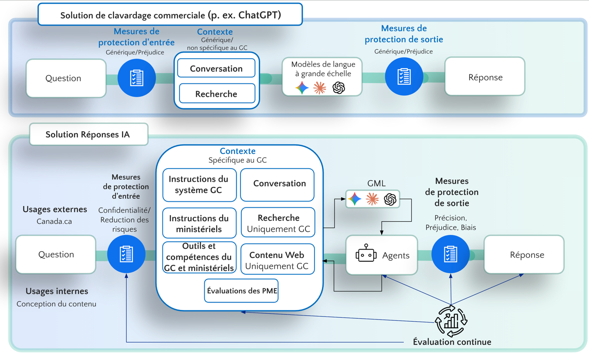

# Fiche système Réponses IA

**Version** : 1.1
**Date** : Février 2026
**Organisation** : Bureau de l’expérience Canada.ca de Service Canada
**Contact** : Michael Karlin à servicecanada.gc.ca

**English** : [SYSTEM_CARD.md](SYSTEM_CARD.md)

## Sur cette page
- [Résumé exécutif](#résumé-exécutif)
- [État actuel](#état-actuel)
- [Objectif et portée du système](#objectif-et-portée-du-système)
- [Architecture technique](#architecture-technique)
- [Évaluation des risques et mesures de sécurité](#évaluation-des-risques-et-mesures-de-sécurité)
- [Performance et évaluation](#performance-et-évaluation)
- [Limitations et contraintes](#limitations-et-contraintes)
- [Fonctionnalités administratives et gestion](#fonctionnalités-administratives-et-gestion)
- [Déploiement et infrastructure](#déploiement-et-infrastructure)
- [Principes d'IA responsable et gouvernance](#principes-dia-responsable-et-gouvernance)
- [Développement futur](#développement-futur)
- [Contact et support](#contact-et-support)

## Résumé exécutif

Réponses IA est un assistant IA spécialisé conçu pour les sites Web du gouvernement du Canada. Il fournit des réponses précises et brèves aux questions des utilisateurs sur les services, programmes et informations gouvernementaux, avec une citation appropriée unique. Réponses IA est indépendant du modèle, avec un système d'évaluation innovant qui utilise des évaluations détaillées d'experts humains pour alimenter les évaluations IA automatisées et des réponses précises. Le système est construit avec la convivialité, la vie privée et la précision comme principes fondamentaux. Une interface d'administration complète prend en charge l'évaluation, les métriques, la gestion des utilisateurs et les paramètres.

Description de l'image (Texte alternatif)

Le diagramme est divisé en deux couloirs horizontaux.

**Couloir supérieur – « Solution de clavardage commerciale (p. ex. ChatGPT) » :**

Un pipeline linéaire s'écoule de gauche à droite : Question → Mesures de protection d'entrée (Générique/Préjudice) → bloc Contexte contenant « Conversation » et « Recherche » (étiqueté « Générique/non spécifique au GC ») → Modèles de langue à grande échelle (icônes Gemini, Claude, OpenAI) → Mesures de protection de sortie (Générique/Préjudice) → Réponse.

**Couloir inférieur – « Solution Réponses IA » :**

Deux points d'entrée apparaissent à gauche : « Usages externes » (Canada.ca) et « Usages internes » (Conception du contenu). Les deux alimentent les Mesures de protection d'entrée (Confidentialité/Réduction des risques). Le bloc Contexte, plus grand, est étiqueté « Spécifique au GC » et contient six éléments : Instructions du système GC, Conversation, Instructions ministérielles, Recherche (Uniquement GC), Outils et compétences du GC et ministériels, et Contenu Web (Uniquement GC). Un composant additionnel, « Évaluations des PME », se situe sous le bloc Contexte et alimente une boucle d'« Évaluation continue ». Le contexte alimente le même ensemble de GML (grands modèles de langue), qui se connectent à un nœud « Agents ». Les Agents passent par les Mesures de protection de sortie (Précision/Préjudice/Biais) avant de produire la Réponse. Des flèches provenant de la boucle d'Évaluation continue retournent vers les Agents et le bloc Contexte, indiquant un raffinement itératif.

## État actuel
- **Environnement** : Préparation pour le projet pilote public
- **Production** : https://reponses-ia.alpha.canada.ca (Azure OpenAI + AWS DocumentDB)
- **Évaluation** : Collection continue de commentaires d'experts et notation de réponses alimentant les évaluations IA et réponses
- **Plateforme** : Les départements peuvent ajouter des scénarios d'invite pour répondre aux besoins spécifiques

## Objectif et portée du système

### Fonction principale
- Aider les utilisateurs avec des questions sur les enjeux du gouvernement du Canada
- Fournir des informations précises sur les programmes, prestations et services du gouvernement du Canada
- Diriger les utilisateurs vers les ressources gouvernementales appropriées et les prochaines étapes

### Utilisateurs cibles
- Toute personne visitant Canada.ca ou des sites Web fédéraux

### Portée du contenu
- **Dans la portée** : Services, programmes, prestations, réglementations et informations officielles du gouvernement du Canada
- **Hors de portée** : Services provinciaux/territoriaux/municipaux, conseils personnels, sujets non gouvernementaux
- **Sources** : Seulement les domaines Canada.ca, gc.ca et d'organisations fédérales

### Support linguistique
- Support bilingue complet (pages anglaises/françaises)
- Conformité aux langues officielles
- Sur la page anglaise : Les utilisateurs peuvent poser des questions dans n'importe quelle langue et recevoir des réponses dans la même langue qu'ils ont posée
- Sur la page française : Les utilisateurs reçoivent des réponses en français quelle que soit la langue dans laquelle la question a été posée
- Citation correspond à la langue de la page
- Répond dans d'autres langues au besoin (traduit d'abord en anglais pour la précision et la journalisation)

## Architecture technique

### Composants du système
1. **Interface utilisateur** : Interface de clavardage basée sur React utilisant le système de conception Canada.ca
2. **Serveur** : Node.js avec orchestration de machine à états LangGraph
3. **Services IA** : Modèles Azure OpenAI GPT (production), avec support OpenAI et Anthropic
4. **Base de données** : MongoDB (AWS DocumentDB en production)

**Pour l'architecture détaillée, voir [docs/architecture/pipeline-architecture.md](docs/architecture/pipeline-architecture.md)**

### Détails des modèles IA
- **Modèles de production** : Famille Azure OpenAI GPT-4.1 (configurable par étape de pipeline et variante de graphe)
- **Température** : 0 (réponses déterministes)
- **Ingénierie d'invite** : Invites de chaîne de pensée avec sortie structurée, invite de département tirée au besoin
- **Indépendance de modèle** : Système conçu pour fonctionner avec différents fournisseurs IA, testé avec GPT et Claude

### Capacités agentiques
- **Utilisation d'outils** : L'IA peut utiliser de manière autonome des outils spécialisés pour améliorer les réponses pendant la génération de réponses
- **Outil downloadWebPage** : Critique pour la précision - télécharge et lit les pages Web pour vérifier les informations actuelles, surtout pour :
  - Pages gouvernementales nouvelles ou mises à jour
  - Contenu sensible au temps (changements d'année fiscale, mises à jour de programmes)
  - Pages modifiées dans les derniers 4 mois
  - URLs inconnues non dans les données d'entraînement
  - Détails spécifiques comme numéros, codes, dates, montants en dollars
- **Validation d'URL** : Vérifie automatiquement si les URLs de citation sont actives et accessibles
- **Génération de contexte** : Dérive un contexte frais pour **chaque question**, y compris les questions de suivi, pour assurer une identification précise du département et un contenu pertinent
- **Vérification de contenu** : Priorise le contenu fraîchement téléchargé sur les données d'entraînement
- **Optimisation de réutilisation de contexte** : Peut réutiliser le contexte valide des questions précédentes dans la même conversation pour améliorer le temps de réponse

### Flux du pipeline (Machine à états LangGraph)
Le système utilise un **pipeline LangGraph multi-étapes** qui orchestre tout le traitement côté serveur. Plusieurs variantes de graphe existent avec des capacités différentes (p. ex. court-circuit vectoriel, recherche QA, modèles de raisonnement). Toutes les étapes ne s'exécutent pas dans chaque variante.

1. **Initialisation** : Configure le chronométrage et le suivi de l'état
2. **Validation de requête courte** (Programmatique) : Bloque les requêtes trop courtes pour être significatives
3. **Rédaction en deux étapes** :
   - **Étape 1** (Programmatique) : Filtrage basé sur motifs pour la profanité, les menaces et les renseignements personnels courants (listes de mots configurables par les administrateurs via la page Paramètres)
   - **Étape 2** (IA - modèle configurable) : Détection alimentée par IA des renseignements personnels qui ont échappé au premier filtrage
4. **Traduction** (IA - mini modèle configurable) : Détecte la langue et traduit en anglais pour le traitement
5. **Dérivation de contexte** (IA - mini modèle pour la réécriture de requête; modèle complet pour la génération de contexte) :
   - Réécriture de requête pour une recherche optimisée
   - Exécution de recherche (Canada.ca ou Google)
   - Correspondance de département et génération de contexte
   - Optionnel : Chargement de scénarios spécifiques au département
6. **Vérification de court-circuit** (IA) : Recherche de similarité vectorielle pour trouver des questions similaires déjà répondues. Présent uniquement dans certaines variantes de graphe, pas dans le pipeline par défaut
7. **Génération de réponse** (IA - Modèle configurable) : Génère la réponse avec citations en utilisant des outils spécialisés
8. **Vérification de citation** (Programmatique) : Valide le formatage des URLs de citation et génère une URL de recherche de secours si nécessaire
9. **Persistance** : Sauvegarde l'interaction dans la base de données, crée des incorporations, déclenche l'évaluation

**Pour les détails complets du pipeline, voir [docs/architecture/pipeline-architecture.md](docs/architecture/pipeline-architecture.md)**

## Évaluation des risques et mesures de sécurité

### Risques potentiels et stratégies d'atténuation

#### **Risques de précision de l'information**
**Risques potentiels :**
- Fournir des informations gouvernementales périmées ou incorrectes
- Induire les utilisateurs en erreur sur les exigences d'admissibilité ou les échéances
- Donner des informations incomplètes qui pourraient affecter les décisions des utilisateurs

**Stratégies d'atténuation :**
- **Vérification de contenu en temps réel** : L'outil downloadWebPage télécharge et lit les pages Web actuelles pour vérifier la précision de l'information
- **Exigences de citation** : Chaque réponse doit inclure un seul lien source gouvernemental vérifié
- **Validation d'URL** : Vérification automatique des URLs de citation pour la validité et l'accessibilité
- **Système d'évaluation d'experts** : Évaluation humaine experte continue de la précision des réponses
- **Surveillance de fraîcheur du contenu** : Priorise le contenu fraîchement téléchargé sur les données d'entraînement potentiellement périmées
- **Scénarios spécifiques aux départements** : Invites adaptées pour différents départements gouvernementaux pour améliorer la précision

#### **Risques de vie privée et de protection des données**
**Risques potentiels :**
- Exposition accidentelle de renseignements personnels
- Journalisation de données utilisateur sensibles
- Accès non autorisé aux conversations d'utilisateurs

**Stratégies d'atténuation :**
- **Détection et blocage des renseignements personnels à 2 étapes** :
  - **Étape 1** : Détection basée sur motifs bloque les formats de renseignements personnels connus (NAS, courriels, numéros de téléphone, adresses)
  - **Étape 2** : L'agent de renseignements personnels alimenté par IA attrape les renseignements personnels qui ont échappé au premier filtrage, surtout les noms et identifiants personnels
  - Les numéros de formulaires gouvernementaux, numéros de série de produits et codes de référence publics sont explicitement préservés
- **Notification utilisateur** : Les utilisateurs sont avertis quand des renseignements personnels sont détectés et invités à reformuler
- **Minimisation des données** : Seulement les données de conversation qui sont envoyées au service IA sont stockées
- **Contrôles d'accès** : L'accès à la base de données est restreint au personnel autorisé avec permissions basées sur les rôles
- **Chiffrement** : Toutes les données chiffrées au repos et en transit

#### **Risques de sécurité du contenu**
**Risques potentiels :**
- Génération de contenu inapproprié ou nuisible
- Réponse aux tentatives de manipulation
- Fournir des conseils hors de la portée gouvernementale

**Stratégies d'atténuation :**
- **Filtrage de contenu** : Bloque la profanité, le langage discriminatoire, les menaces et les tentatives de manipulation (listes de mots configurables par les administrateurs via la page Paramètres)
- **Application de portée** : Limitation stricte aux informations du gouvernement du Canada seulement
- **Limitation du taux** : 3 questions par session pour prévenir les abus
- **Limites de caractères** : Limite de 260 caractères par question pour prévenir l'injection d'invite
- **Avertissements utilisateur** : Notifications claires quand du contenu inapproprié est détecté - testé pour utilisabilité
- **Limites de longueur de réponse** : Maximum 4 phrases pour réduire le risque d'hallucination

#### **Risques d'accessibilité et d'équité**
**Risques potentiels :**
- Barrières d'accessibilité
- Barrières linguistiques pour les locuteurs non-anglais/français
- Qualité de service incohérente entre différents groupes d'utilisateurs

**Stratégies d'atténuation :**
- **Tests de lecteur d'écran** : Sessions d'utilisabilité itératives tenues avec une gamme d'utilisateurs de lecteurs d'écran pour tester et améliorer
- **Conformité WCAG 2.1 AA** : Implémentation complète des normes d'accessibilité
- **Support bilingue** : Support complet anglais/français avec conformité aux langues officielles
- **Saisie multilingue** : Sur la page anglaise, les utilisateurs peuvent poser des questions dans plusieurs langues et recevoir une réponse dans la même langue posée. Sur la page française, les utilisateurs reçoivent des réponses en français quelle que soit la langue de la question. Le support des langues autochtones est planifié
- **Langage simple** : Les réponses utilisent un langage clair et simple correspondant aux normes Canada.ca, tests d'utilisabilité itératifs extensifs

#### **Risques de fiabilité du système**
**Risques potentiels :**
- Pannes de service affectant l'accès utilisateur
- Échecs de dépendance API
- Perte ou corruption de données

**Stratégies d'atténuation :**
- **Surveillance d'infrastructure** : Métriques CloudWatch et journalisation pour l'environnement de production
- **Sauvegardes automatisées** : AWS DocumentDB avec systèmes de sauvegarde automatisés
- **Planification de basculement** : Système conçu pour l'indépendance de modèle avec plusieurs fournisseurs IA
- **Limitation du taux** : Prévient la surcharge du système et les abus
- **Paramètre de panne** : Éteindre le système et afficher un message de panne via le panneau d'administration

### Considérations de biais et d'équité

#### **Biais potentiels**
- **Biais linguistique** : Préférence potentielle du contenu anglais sur le contenu français
- **Biais départemental** : Sur-représentation potentielle de certains départements gouvernementaux
- **Biais de récence du contenu** : Le contenu gouvernemental plus récent peut être priorisé par rapport aux informations établies
- **Biais géographique** : Accent sur les services fédéraux peut ne pas aborder les variations régionales

#### **Stratégies d'atténuation**
- **Support linguistique équilibré** : Traitement égal du contenu anglais et français avec conformité aux langues officielles
- **Contexte spécifique aux départements** : Scénarios adaptés pour tous les principaux départements gouvernementaux
- **Vérification de contenu** : L'outil downloadWebPage assure les informations actuelles indépendamment de l'âge des données d'entraînement
- **Évaluation d'experts** : Évaluation humaine des réponses pour identifier et corriger les biais potentiels via les invites système et les incorporations d'évaluation pour améliorer les réponses
- **Transparence** : Documentation claire des limitations et de la portée du système

## Performance et évaluation

### Qualité des réponses
- **Longueur** : Maximum 4 phrases par réponse pour la clarté
- **Style** : Langage simple correspondant aux normes Canada.ca
- **Exactitude** : Provenant exclusivement du contenu gouvernemental
- **Utilité** : Corrige les malentendus et fournit les prochaines étapes à suivre
- **Aligné sur département** : Département peut fournir des scénarios d'invite pour répondre aux besoins de communication spécifiques, comme diriger les utilisateurs vers un assistant plutôt que de tenter de répondre, ou surmonter les problèmes de contenu périmé en dirigeant vers le contenu le plus récent

### Méthodes d'évaluation
- **Système innovant d'évaluation par des experts** :
  - **Évaluation en application** : Les experts évaluent les questions dans l'interface réelle de l'application, vivant la même expérience utilisateur
  - **Évaluation flexible** : Les experts peuvent entrer leurs propres questions ou utiliser les identifiants de discussion existants pour évaluer les conversations utilisateur
  - **Notation au niveau des phrases** : Chaque phrase dans les réponses IA est notée individuellement (100/80/0 points) avec des explications détaillées
  - **Notation de citation** : Notation séparée pour la précision et la pertinence de la citation (25/20/0 points)
  - **Score pondéré total** : 75% des scores de phrase + 25% du score de citation pour une évaluation de qualité complète
  - **Génération d'incorporations** : Les commentaires d'experts créent des incorporations qui permettent les évaluations IA automatisées pour des questions similaires
  - **Amélioration future** : Ces incorporations aideront bientôt à répondre rapidement et avec précision aux questions

- **Commentaires d'utilisateurs publics distincts** :
  - **Interface simple** : "Cela a-t-il été utile ?" avec des options Oui/Non pour tous les utilisateurs
  - **Suivi détaillé** : Une seule question demandant pourquoi ils ont cliqué sur Oui ou Non avec des options de raison spécifiques
  - **Raisons positives** : Aucun appel nécessaire, aucune visite nécessaire, temps économisé, autre
  - **Raisons négatives** : Non pertinent, confus, pas assez détaillé, pas ce qu'ils voulaient, autre
  - **Intégration d'enquête** : Liens vers des enquêtes externes pour la collecte de commentaires supplémentaires

### Performance actuelle
- **Temps de réponse** : Moins de 10 secondes pour la plupart des requêtes
- **Exactitude** : Continuellement surveillée par les commentaires d'experts
- **Accessibilité** : Testée avec des utilisateurs de lecteurs d'écran
- **Disponibilité** : Surveillance de l'environnement de production

### Surveillance et évaluation continues

#### **Surveillance en temps réel**
- **Santé du système** : Métriques CloudWatch pour le temps de disponibilité, les temps de réponse et les taux d'erreur
- **Commentaires d'utilisateurs** : Collecte continue de commentaires publics et d'évaluations d'experts
- **Qualité du contenu** : Suivi automatisé de la précision des citations et de la pertinence des réponses
- **Métriques de sécurité** : Surveillance de l'efficacité du filtrage de contenu et des taux de détection de renseignements personnels

#### **Repères de performance**
- **Cible d'exactitude** : Amélioration continue vers 100% de précision des réponses
- **Qualité des réponses** : Maximum 4 phrases pour la clarté et le risque réduit d'hallucination
- **Accessibilité** : Conformité WCAG 2.1 AA maintenue
- **Support linguistique** : Qualité égale pour les réponses anglaises et françaises

*Pour le cadre d'évaluation détaillé et les méthodologies, voir la section Performance et évaluation ci-dessus.*

## Limitations et contraintes

### Limitations techniques
- **Modèles linguistiques** : Dépendant de la disponibilité de l'API OpenAI
- **Fraîcheur du contenu** : Dépendant à un certain degré de la disponibilité du contenu des sites Web gouvernementaux
- **Requêtes complexes** : Peut nécessiter des questions de clarification pour les demandes ambiguës
- **Juridiction** : Ne fournit pas d'informations sur les services provinciaux/territoriaux/municipaux

### Contraintes opérationnelles
- **Limites de taux** : 3 questions par session
- **Limites de caractères** : 260 caractères par question
- **Portée du contenu** : Informations du gouvernement du Canada seulement
- **Langue** : Soutien principal pour l'anglais et le français

### Problèmes connus
- **Détection de département** : Peut parfois mal identifier les départements pertinents
- **Précision des citations** : Les URLs dans les invites peuvent devenir obsolètes à mesure que les sites gouvernementaux changent
- **Scénarios complexes** : Les processus multi-étapes peuvent nécessiter plusieurs interactions

## Fonctionnalités administratives et gestion

### Rôles d'utilisateurs et contrôle d'accès
- **Utilisateurs administrateurs** : Accès complet au système incluant la gestion des utilisateurs, les opérations de base de données et la configuration du système
- **Utilisateurs partenaires** : Accès à une suite d'outils d'évaluation pour noter les phrases et les citations des réponses de clavardage, au traitement par lot et aux métriques de performance
- **Interface basée sur les rôles** : Différentes interfaces et capacités basées sur les permissions d'utilisateurs
- **Authentification** : Système d'authentification sécurisé avec protection des routes basée sur les rôles

### Capacités du tableau de bord administrateur

#### **Gestion des utilisateurs**
- Créer, modifier et supprimer des comptes d'utilisateurs
- Gérer les rôles d'utilisateurs (administrateur/partenaire) et l'état du compte (actif/inactif)
- Voir les dates de création des utilisateurs et l'activité
- Opérations en masse sur les utilisateurs avec boîtes de dialogue de confirmation

#### **Système de traitement par lot**
- **Création de lots** : Télécharger des fichiers CSV avec des questions pour l'évaluation IA en masse
- **Surveillance de lot** : Suivi des opérations de lot en cours, terminées et échouées
- **Gestion de lot** : Annuler les lots en cours, télécharger les résultats en format CSV/Excel
- **Dérivation de contexte** : Génération automatique de contexte pour les questions sans contexte fourni
- **Support multi-fournisseur** : Traiter les lots avec les services IA OpenAI ou Anthropic

#### **Outils d'évaluation**
- **Interface d'évaluation d'expert** : Les experts peuvent évaluer les questions dans l'interface réelle de l'application ou évaluer les conversations utilisateur existantes par identifiant de discussion
- **Évaluation en application** : Même interface que celle vécue par les utilisateurs, garantissant que les évaluateurs comprennent l'expérience utilisateur réelle
- **Saisie flexible** : Entrez des questions personnalisées ou référencez des identifiants de discussion pour l'évaluation
- **Évaluation automatisée** : Générer des évaluations IA basées sur les modèles de commentaires d'experts
- **Régénération d'évaluation** : Reconstruire toutes les évaluations avec les critères mis à jour
- **Suivi de la progression** : Surveillance en temps réel du traitement d'évaluation avec statistiques de lot
- *Pour les méthodologies de notation détaillées et le cadre d'évaluation, voir la section Performance et évaluation.*

#### **Gestion de la base de données**
- **Exportation de données** : Exporter la base de données entière ou des collections spécifiques avec filtrage par date
- **Importation de données** : Import en masse avec support de téléchargement en segments pour les grands ensembles de données
- **Statistiques de tableau** : Voir les comptes d'enregistrements dans toutes les collections de base de données
- **Gestion d'index** : Déposer et reconstruire les index de la base de données pour l'optimisation des performances
- **Maintenance du système** : Réparer les horodatages, migrer les structures de données, nettoyer les journaux système

#### **Surveillance des performances**
- **Tableau de bord des journaux de discussion** : Voir les interactions récentes de discussion avec les capacités d'exportation
- **Tableau de bord des métriques** : Analyses de performances complètes incluant :
  - Conversations et interactions totales
  - Répartition linguistique (anglais/français)
  - Métriques de précision notées par l'IA
  - Analyse des commentaires d'utilisateurs
  - Raisons et scores de commentaires publics
- **Graphiques en temps réel** : Représentation visuelle de la performance du système avec graphiques en barres et graphiques circulaires
- **Exportation de données** : Télécharger les métriques en formats JSON, CSV et Excel

#### **Configuration du système**
- **Statut du service** : Basculer la disponibilité du système (disponible/indisponible)
- **Gestion des paramètres** : Configurer les paramètres et paramètres au niveau du système

#### **Visionneuse de discussion et analyse**
- **Examen de session de discussion** : Voir les interactions complètes de discussion par identifiant de discussion
- **Analyse d'interaction** : Examiner les paires question-réponse individuelles avec commentaires
- **Interface d'évaluation d'expert** : Fournir des commentaires d'experts détaillés sur les réponses IA avec notation au niveau des phrases dans l'interface d'application
- **Évaluation en application** : Les experts peuvent évaluer les questions dans la même interface que les utilisateurs vivent, ou évaluer les conversations d'utilisateurs existantes par identifiant de discussion
- **Analyse de commentaires publics** : Gérer la collecte et l'analyse de commentaires publics
- **Systèmes de commentaires distincts** : Évaluation d'experts (au niveau des phrases) vs commentaires publics (utile/non utile)

### Fonctionnalités spécifiques aux partenaires
- **Sélection de service IA** : Choisir entre OpenAI et Anthropic pour les tests
- **Basculement de service de recherche** : Basculer entre les services de recherche Google et Canada.ca
- **Outils de commentaires d'experts** : Accès aux interfaces d'évaluation détaillées
- **Traitement par lot** : Créer et gérer les lots d'évaluation
- **Métriques de performance** : Voir la performance du système et les analyses de commentaires d'utilisateurs

## Déploiement et infrastructure

### Configuration de l'environnement
- **Environnement de production** :
  - **URL** : https://reponses-ia.alpha.canada.ca
  - **Infrastructure** : AWS ECS avec mise à l'échelle automatique
  - **Base de données** : AWS DocumentDB avec sauvegardes automatisées
  - **Services IA** : Modèles Azure OpenAI GPT
  - **Surveillance** : Métriques et journalisation CloudWatch
  - **Plateforme** : Les départements peuvent ajouter des scénarios d'invite pour répondre aux besoins spécifiques

### Sécurité
- **HTTPS** : Toutes les communications chiffrées
- **Sécurité API** : Limitation du taux et authentification
- **Protection des données** : Chiffrement au repos et en transit
- **Contrôle d'accès** : Permissions basées sur les rôles

### Conformité
- **Langues officielles** : Conforme aux exigences de langues officielles canadiennes
- **Accessibilité** : Conformité WCAG 2.1 AA
- **Confidentialité** : Conformité à la LPRPDE pour la manipulation des données
- **Normes gouvernementales** : Conformité au système de conception Canada.ca

## Principes d'IA responsable et gouvernance

### Principes fondamentaux
- **Exactitude d'abord** : Toutes les réponses doivent être exactes et vérifiables par des sources gouvernementales officielles
- **Confidentialité par conception** : Les renseignements personnels ne sont jamais traités ou stockés inutilement
- **Accessibilité pour tous** : Conformité complète aux normes d'accessibilité et conception inclusive
- **Transparence** : Documentation claire des capacités, limitations et processus décisionnels du système
- **Responsabilité** : Surveillance et évaluation continues avec supervision humaine
- **Équité** : Traitement égal entre les langues, régions et groupes d'utilisateurs

### Cadre de gouvernance
- **Supervision** : Le Service numérique canadien (SNC) fournit la gouvernance et la supervision globales
- **Conformité** : Adhérence aux normes, politiques et exigences légales du gouvernement du Canada
- **Transparence** : Code source ouvert et documentation complète
- **Engagement des parties prenantes** : Consultation régulière avec les départements gouvernementaux et les communautés d'utilisateurs
- **Amélioration continue** : Examen et mises à jour réguliers basés sur les commentaires et les résultats d'évaluation

### Considérations éthiques
- **Mandat de service public** : Système conçu exclusivement pour le service public, pas à des fins commerciales
- **Autonomie des utilisateurs** : Les utilisateurs conservent le contrôle sur leurs interactions et peuvent choisir de ne pas utiliser le service
- **Maximisation des avantages** : Accent sur la fourniture du maximum d'avantages aux citoyens et résidents canadiens
- **Minimisation des dommages** : Mesures de sécurité complètes pour prévenir tout dommage potentiel
- **Sensibilité culturelle** : Respect de la population diverse du Canada et des langues officielles

## Développement futur

### Améliorations planifiées
- **Évaluation améliorée** : Évaluation automatisée de la qualité des réponses à partir des évaluations d'experts précédentes
- **Langues supplémentaires** : Support pour les langues autochtones
- **Partenaires départementaux supplémentaires** : Ajouter une couche d'invite spécifique au département et des évaluations d'experts

### Domaines de recherche
- **Qualité des réponses** : Amélioration de la précision et de l'utilité
- **Expérience utilisateur** : Rationalisation des modèles d'interaction - tests d'utilisabilité itératifs avec plus de 50 participants
- **Accessibilité** : Support amélioré pour les technologies d'assistance

## Contact et support

### Support technique
- **Problèmes** : Dépôt GitHub pour les rapports de bogues et les demandes de fonctionnalités
- **Documentation** : README complète et documentation API
- **Surveillance** : Surveillance du statut du système en temps réel

### Gouvernance
- **Supervision** : Service numérique canadien (SNC)
- **Conformité** : Normes et politiques du gouvernement du Canada
- **Transparence** : Code source ouvert et documentation

### Réponse aux incidents et rapports
- **Classification des incidents** : Catégorisation claire des incidents par gravité et impact
- **Procédures de réponse** : Procédures documentées pour traiter les incidents de sécurité, de confidentialité ou de précision
- **Mécanismes de signalement** : Plusieurs canaux pour signaler les problèmes (GitHub, tableau de bord administrateur, contact direct)
- **Processus d'escalade** : Chemins d'escalade clairs pour les incidents critiques
- **Examen après incident** : Processus d'examen et d'amélioration systématique après les incidents
- **Transparence** : Rapports publics des incidents importants et des leçons apprises

### Contact et signalement
- **Problèmes techniques** : Dépôt GitHub pour les rapports de bogues et les demandes de fonctionnalités
- **Préoccupations de sécurité** : Contact direct via le tableau de bord administrateur ou les problèmes GitHub
- **Incidents de confidentialité** : Signalement immédiat par les canaux désignés
- **Problèmes d'accessibilité** : Canaux de commentaires d'accessibilité dédiés
- **Commentaires généraux** : Mécanismes de commentaires multiples pour différents types d'utilisateurs

---

*Cette fiche système est un document vivant qui sera mis à jour à mesure que le système évolue. Pour les informations les plus à jour, veuillez consulter le dépôt du projet.*
