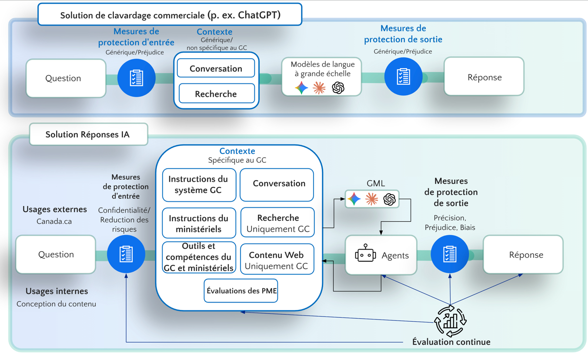

# Fiche système Réponses IA

**Version** : 1.2
**Date** : Juillet 2026
**Organisation** : Bureau de l’expérience Canada.ca de Service Canada
**Contact** : Michael Karlin à servicecanada.gc.ca

**English** : [SYSTEM_CARD.md](SYSTEM_CARD.md)

## Sur cette page
- [Résumé exécutif](#résumé-exécutif)
- [État actuel](#état-actuel)
- [Objectif et portée du système](#objectif-et-portée-du-système)
- [Architecture technique](#architecture-technique)
- [Évaluation des risques et mesures de sécurité](#évaluation-des-risques-et-mesures-de-sécurité)
- [Performance et évaluation](#performance-et-évaluation)
- [Fonctionnalités administratives et gestion](#fonctionnalités-administratives-et-gestion)
- [Déploiement et infrastructure](#déploiement-et-infrastructure)
- [Principes d'IA responsable et gouvernance](#principes-dia-responsable-et-gouvernance)
- [Développement futur](#développement-futur)
- [Contact et support](#contact-et-support)

## Résumé exécutif

Réponses IA est une plateforme d'agent conversationnel IA spécialisée conçue pour les sites Web du gouvernement du Canada. Elle fournit des réponses précises et brèves aux questions des utilisateurs, tirées de l'ensemble de l'écosystème en ligne du gouvernement fédéral. Le système est construit avec la convivialité, la protection de la vie privée et l'exactitude comme principes fondamentaux. Réponses IA est indépendant du modèle, avec un système d'évaluation innovant qui utilise des évaluations détaillées d'experts humains pour alimenter les réponses ultérieures et les évaluations IA automatisées. Les essais menés en 2025 ont rapporté un taux d'exactitude de 96 % évalué par des experts de 7 institutions partenaires. Une interface d'administration complète prend en charge l'évaluation, les métriques, la gestion des utilisateurs et les paramètres.

- **Résultats des essais** : [Réponses IA : Mise à l’essai à l’échelle de l’organisation pour Canada.ca](https://numerique.canada.ca/2025/12/17/r%C3%A9ponses-ia--mise-%C3%A0-lessai-%C3%A0-l%C3%A9chelle-de-lorganisation-pour-canada.ca/)

Description de l'image (Texte alternatif)

Le diagramme est divisé en deux couloirs horizontaux.

**Couloir supérieur – « Solution de clavardage commerciale (p. ex. ChatGPT) » :**

Un pipeline linéaire s'écoule de gauche à droite : Question → Mesures de protection d'entrée (Générique/Préjudice) → bloc Contexte contenant « Conversation » et « Recherche » (étiqueté « Générique/non spécifique au GC ») → Modèles de langue à grande échelle (icônes Gemini, Claude, OpenAI) → Mesures de protection de sortie (Générique/Préjudice) → Réponse.

**Couloir inférieur – « Solution Réponses IA » :**

Deux points d'entrée apparaissent à gauche : « Usages externes » (Canada.ca, Réponses IA) et « Usages internes » (Conception du contenu). Les deux alimentent les Mesures de protection d'entrée (Confidentialité/Réduction des risques). Le bloc Contexte, plus grand, est étiqueté « Spécifique au GC » et contient six éléments : Instructions du système GC, Conversation, Instructions ministérielles, Recherche (Uniquement GC), Outils et compétences du GC et ministériels, et Contenu Web (Uniquement GC). Un composant additionnel, « Évaluations des PME », se situe sous le bloc Contexte et alimente une boucle d'« Évaluation continue ». Le contexte alimente le même ensemble de GML (grands modèles de langue), qui se connectent à un nœud « Agents ». Les Agents passent par les Mesures de protection de sortie (Précision/Préjudice/Biais) avant de produire la Réponse. Des flèches provenant de la boucle d'Évaluation continue retournent vers les Agents et le bloc Contexte, indiquant un raffinement itératif.

## État actuel
- **Environnement** : Les essais bêta sur Canada.ca ont été mis en pause après la fin du dernier des quatre essais publics en février 2026.
- **Résultats des essais** : [Réponses IA : Mise à l’essai à l’échelle de l’organisation pour Canada.ca](https://numerique.canada.ca/2025/12/17/r%C3%A9ponses-ia--mise-%C3%A0-lessai-%C3%A0-l%C3%A9chelle-de-lorganisation-pour-canada.ca/)
- **Production** : https://reponses-ia.alpha.canada.ca (aucun accès public après février 2026 - disponible uniquement au sein du réseau du GC)
- **Partenaires institutionnels** : Les partenaires d'institutions fédérales évaluent l'exactitude des réponses et peuvent ajouter des scénarios d'invite, des outils agentiques pour utiliser des API et des fichiers pour répondre à des besoins spécifiques. [Voir la liste actuelle des institutions partenaires](src/constants/partnerDepartments.js)

## Objectif et portée du système

### Fonction principale
- Aider les utilisateurs avec des questions sur les enjeux du gouvernement du Canada
- Fournir des informations précises sur les programmes, prestations et services du gouvernement du Canada
- Diriger les utilisateurs vers les ressources gouvernementales appropriées et les prochaines étapes
- Modélise une conversation avec un agent de centre d'appels - [des réponses brèves pour un meilleur service](docs/pdf/short-ai-answers-fr.pdf)

### Utilisateurs cibles
- Toute personne visitant Canada.ca ou des sites Web fédéraux

### Portée du contenu
- **Dans la portée** : Services, programmes, prestations, réglementations et informations publiques officielles du gouvernement du Canada
- **Sources** : Canada.ca, gc.ca et domaines d'organisations fédérales
- **Hors de portée** : Services provinciaux/territoriaux/municipaux, conseils personnels/juridiques, sujets non gouvernementaux

### Support linguistique
- Support bilingue complet (pages anglaises/françaises, y compris l'administration) pour la conformité aux langues officielles
- Les utilisateurs peuvent poser des questions dans la plupart des langues et reçoivent des réponses dans la même langue que celle de leur question

## Architecture technique

### Composants du système
1. **Interface utilisateur** : Interface de clavardage basée sur React
2. **Serveur** : Node.js avec orchestration de machine à états LangGraph
3. **Services IA** : Modèles Azure OpenAI GPT, avec des points d'ancrage pour utiliser d'autres modèles d'IA (p. ex. Cohere, Anthropic) via Amazon Bedrock s'ils sont déployés/acquis
4. **Base de données** : AWS DocumentDB
5. **Recherche** : Google, avec des plans de migration vers l'API de recherche de Canada.ca

**Pour l'architecture détaillée, voir [docs/architecture/pipeline-architecture.md](docs/architecture/pipeline-architecture.md)**

### Détails des modèles IA
- **Modèles de production actuels** : Famille Azure OpenAI GPT-5.1 (bascule le 18 mars 2026 depuis GPT 4.1) ; les agents d'évaluation utilisent GPT-4.1-mini
- **Routage par famille de modèles** : Le choix d'une famille de modèles (p. ex. GPT-5.1) n'utilise pas un seul modèle pour chaque étape. Le système achemine automatiquement chaque étape du pipeline ou service vers le modèle approprié au sein de cette famille — les étapes de support (rédaction des renseignements personnels, traduction, réécriture de requête) utilisent la variante mini (p. ex. GPT-5-mini) pour le coût et la rapidité, tandis que la génération de contexte et la génération de réponse utilisent le modèle complet (p. ex. GPT-5.1). Ce routage est géré en interne par AgentFactory et n'est pas configurable par étape par les administrateurs.
- **Température** : 0 (réponses déterministes), raisonnement faible
- **Ingénierie de contexte** : Des agents séparés dans LangGraph effectuent les étapes du pipeline, l'agent de contexte sélectionne l'invite de département et les fichiers de contexte à tirer au besoin
- **Indépendance de modèle** : Système conçu pour fonctionner avec différents fournisseurs d'IA, testé avec GPT et Claude, des plans sont en place pour déployer davantage de modèles, dont Cohere, via AWS Bedrock

### Capacités agentiques
- **Utilisation d'outils** : L'IA peut choisir de manière autonome d'utiliser des outils spécialisés pour améliorer les réponses pendant la génération de réponses
- **Outil downloadWebPage** : Critique pour l'exactitude - télécharge et lit les pages Web pour vérifier les informations actuelles, surtout pour :
  - Pages gouvernementales nouvelles ou mises à jour
  - Contenu sensible au temps (changements d'année fiscale, mises à jour de programmes)
  - Détails spécifiques comme les numéros, codes, dates et montants en dollars
- **Validation d'URL** : Vérifie automatiquement si les URL de citation sont actives et accessibles
- **Génération de contexte** : Dérive un contexte frais pour **chaque question**, y compris les questions de suivi, pour assurer une identification précise de l'institution et un contenu pertinent
- **Outil API OpenGov** : Utilise l'API OpenGov pour trouver des ensembles de données ouverts pour les questions axées sur les données

### Flux du pipeline (Machine à états LangGraph)
Le système utilise un **pipeline LangGraph multi-étapes** qui orchestre tout le traitement côté serveur. Plusieurs variantes de graphe existent avec des capacités différentes (p. ex. court-circuit vectoriel, réponses éclairées par les évaluations, modèles de raisonnement). Toutes les étapes ne s'exécutent pas dans chaque variante.

1. **Initialisation** : Configure le chronométrage et le suivi de l'état
2. **Validation de requête courte** (Programmatique) : Bloque les requêtes trop courtes pour être significatives
3. **Blocage de question en deux étapes** :
   - **Étape 1** (Programmatique) : Blocage basé sur motifs pour la profanité, les menaces et les renseignements personnels courants (listes de mots configurables par les administrateurs via la page Paramètres)
   - **Étape 2** (IA - Azure OpenAI GPT-4o, région Canada Est) : L'IA détecte les renseignements personnels qui ont échappé au filtrage ; la question est alors bloquée
4. **Traduction** (IA - mini modèle configurable) : Détecte la langue et traduit en anglais pour le traitement
5. **Réécriture de requête et recherche** (IA - mini modèle) : Réécrit la question traduite en une requête de recherche optimisée et l'exécute sur Canada.ca ou Google. Si la première recherche ne retourne aucun résultat ou un seul résultat, une nouvelle réécriture simplifiée est effectuée automatiquement et la recherche est relancée ; le meilleur ensemble de résultats est conservé.
6. **Dérivation de contexte** (IA - modèle complet) : Correspondance d'institution et génération de contexte à partir des résultats de recherche ; charge optionnellement les scénarios spécifiques à l'institution
7. **Vérification de court-circuit** (IA) : Recherche de similarité vectorielle pour trouver des questions similaires déjà répondues. Présent uniquement dans certaines variantes de graphe, pas dans le pipeline par défaut
8. **Génération de réponse** (IA - Modèle configurable) : Génère la réponse avec citations en utilisant des outils spécialisés
9. **Vérification de citation** (Programmatique) : Valide le formatage des URL de citation et génère une URL de recherche de secours si nécessaire
10. **Persistance** : Sauvegarde l'interaction dans la base de données, crée des incorporations, déclenche l'évaluation
11. **Évaluation automatique** : Le travailleur d'évaluation vérifie si l'interaction sauvegardée a déjà une évaluation IA liée (p. ex. provenant d'une correspondance AQ) ; sinon, exécute l'évaluation IA automatique et lie le résultat à l'interaction
12. **Classificateur de tâches** (IA - modèle complet) : utilise la question et la réponse pour attribuer un programme et une action (p. ex. compte IRCC - ouvrir une session) à la question à des fins de rapport et d'analyse par les institutions

**Pour les détails complets du pipeline, voir [docs/architecture/pipeline-architecture.md](docs/architecture/pipeline-architecture.md)**

## Évaluation des risques et mesures de sécurité

### Risques potentiels et stratégies d'atténuation

#### **Risques de précision de l'information**
**Risques potentiels :**
- Fournir des informations gouvernementales périmées ou incorrectes
- Induire les utilisateurs en erreur sur les exigences d'admissibilité ou les échéances

**Stratégies d'atténuation :**
- **Vérification de contenu en temps réel** : L'outil downloadWebPage télécharge et lit les pages Web actuelles pour vérifier l'exactitude de l'information
- **Exigences de citation** : Chaque réponse doit inclure un seul lien source gouvernemental vérifié
- **Validation d'URL** : Vérification automatique des URL de citation pour la validité et l'accessibilité
- **Système d'évaluation d'experts** : Évaluation humaine experte continue de l'exactitude des réponses — un échantillon de 2 500 questions a été évalué au cours des essais publics, produisant un taux d'exactitude de 96 %
- **Réponses éclairées par les évaluations** : Les évaluations humaines antérieures de questions similaires sont chargées dans le contexte de la nouvelle réponse et agissent comme mémoire du système
- **Surveillance de la fraîcheur du contenu** : Priorise le contenu fraîchement téléchargé sur les données d'entraînement potentiellement périmées
- **Scénarios spécifiques aux institutions** : Invites, outils et fichiers adaptés pour différentes institutions gouvernementales afin d'améliorer l'exactitude
- **Limites de longueur de réponse** : Maximum 4 phrases pour réduire le risque d'hallucination

#### **Risques de vie privée et de protection des données**
**Risques potentiels :**
- Exposition accidentelle de renseignements personnels au service d'IA
- Journalisation de données personnelles identifiant les utilisateurs
- Accès non autorisé aux conversations d'utilisateurs

**Stratégies d'atténuation :**
- **Détection et blocage des renseignements personnels à 2 étapes** :
  - **Étape 1** : La détection basée sur motifs bloque les formats de renseignements personnels connus (NAS, courriels, numéros de téléphone, adresses)
  - **Étape 2** : Un modèle d'IA (situé au Canada) agit comme agent des renseignements personnels pour signaler les renseignements personnels qui ont échappé à l'étape des motifs, surtout les noms et les identifiants personnels
  - Les numéros de formulaires gouvernementaux, les numéros de série de produits et les noms dans des contextes historiques, politiques et d'adresses sont explicitement préservés (p. ex. jour de Louis Riel, édifice James Flaherty, PM Carney)
- **Notification utilisateur** : Les utilisateurs sont avertis lorsque des renseignements personnels sont détectés que leur question ne sera pas journalisée ni envoyée au service d'IA ; ils doivent poser la question différemment pour continuer
- **Minimisation des données** : Seules les questions non signalées comme contenant des renseignements personnels sont envoyées au service d'IA et stockées
- **Contrôles d'accès** : L'accès à la base de données est restreint au personnel autorisé avec des permissions basées sur les rôles
- **Chiffrement** : Toutes les données sont chiffrées au repos et en transit
- **Rapports** : Les métriques ne capturent qu'un décompte des questions bloquées en raison de renseignements personnels par étape ; aucune question bloquée contenant des renseignements personnels n'est stockée

#### **Risques de manipulation de l'IA**
**Risques potentiels :**
- Manipulation délibérée pour générer des réponses inappropriées
- Exposition des fonctionnaires à la profanité, aux menaces, au langage discriminatoire ou à la manipulation

**Stratégies d'atténuation :**
- **Blocage de contenu** : La profanité, le langage discriminatoire, les menaces et les tentatives de manipulation (listes de mots configurables par les administrateurs via la page Paramètres) sont détectés immédiatement ou par les mesures de protection Azure initiales et bloqués.
- **Prévention de l'injection d'invite** : Les codes, mots-clés et autres techniques courantes d'injection d'invite sont bloqués
- **Application de la portée** : Limitation stricte au contenu provenant du gouvernement du Canada
- **Limitation du taux** : 3 questions par session pour prévenir la manipulation (les conversations plus longues présentent un risque accru d'inexactitude)
- **Limites de caractères** : La limite de 260 caractères par question aide à prévenir l'injection d'invite et force des questions plus claires
- **Avertissements utilisateur** : Les utilisateurs sont avisés que leur question ne sera pas journalisée ni envoyée au service d'IA lorsqu'elle est bloquée. Leur question est affichée avec les mots ou expressions fautifs remplacés par des symboles « ### ». Les tests d'utilisabilité de ce processus de blocage ont confirmé que les utilisateurs comprenaient le problème et reformulaient leurs questions pour éviter le contenu marqué.
- **Rapports** : les métriques ne capturent qu'un décompte du type de questions bloquées - les questions elles-mêmes ne sont pas stockées.

#### **Risques d'accessibilité**
**Risques potentiels :**
- Barrières d'accessibilité
- Barrières linguistiques pour les locuteurs non anglophones/francophones
- Qualité de service incohérente entre différents groupes d'utilisateurs

**Stratégies d'atténuation :**
- **Tests avec lecteurs d'écran** : Sessions d'utilisabilité itératives tenues en 2025 avec une gamme d'utilisateurs de lecteurs d'écran pour tester et améliorer
- **Conformité WCAG 2.1 AA** : Implémentation complète des normes d'accessibilité avec révision
- **Support bilingue** : Support complet anglais/français avec conformité aux langues officielles
- **Saisie multilingue** : Les utilisateurs peuvent poser des questions dans de nombreuses langues et reçoivent une réponse dans la même langue que celle posée. Le support des langues autochtones pourrait être mis en œuvre à l'avenir par l'entremise de Services aux Autochtones Canada.
- **Langage simple** : Les réponses utilisent un langage clair et simple correspondant aux normes de Canada.ca, avec des tests d'utilisabilité itératifs extensifs des réponses courtes.

### Considérations de biais et d'inclusivité

#### **Problèmes potentiels**
- **Sécurité et inclusivité** : Possibilité de réponses biaisées selon des facteurs tels que l'âge, le handicap, l'éducation, l'origine ethnique (p. ex. identité autochtone, origine nationale, statut d'immigration), le statut économique, la géographie (y compris la communauté, l'éloignement et la ruralité), la langue, la race, la religion et l'orientation sexuelle

#### **Stratégies d'atténuation**
- **Support linguistique équilibré** : Traitement égal du contenu anglais et français avec conformité aux langues officielles et parité d'exactitude évaluée par des experts humains
- **Vérification de contenu** : L'outil downloadWebPage garantit que les réponses proviennent du contenu du gouvernement fédéral, indépendamment des biais dans les données d'entraînement
- **Évaluation d'experts** : Évaluation humaine des réponses pour identifier et corriger les biais potentiels via les invites système et les incorporations d'évaluation afin d'alimenter des réponses améliorées
- **Transparence** : Documentation claire des limitations et de la portée du système
- **Taxonomie extensive** : Taxonomie créée pour guider le développement d'ensembles de questions de test pour les tests de biais et de sécurité
- **Ensembles de données de test** : de grands ensembles de questions pour tester les régressions lors des mises à niveau et modifications d'invites/modèles

### **Risques de fiabilité du système**
**Risques potentiels :**
- Pannes de service affectant l'accès des utilisateurs
- Échecs de dépendance API
- Perte ou corruption de données

**Stratégies d'atténuation :**
- **Surveillance de l'infrastructure** : Métriques CloudWatch et journalisation pour l'environnement de production
- **Sauvegardes automatisées** : AWS DocumentDB avec systèmes de sauvegarde automatisés
- **Planification de basculement** : Système conçu pour l'indépendance de modèle avec plusieurs fournisseurs d'IA
- **Limitation du taux** : Prévient la surcharge du système et les abus
- **Paramètre de panne** : Éteindre le système et afficher un message de panne via le panneau d'administration
- **Surveillance automatisée de la santé** : Un moniteur en arrière-plan sonde continuellement les dépendances essentielles du système (base de données, recherche et modèle d'IA). Lorsqu'une dépendance échoue de façon répétée à l'intérieur d'une courte fenêtre glissante, le moniteur envoie un courriel d'alerte à l'équipe d'exploitation et — si la désactivation automatique est activée — règle automatiquement le site à indisponible afin que les utilisateurs voient le message de panne plutôt que des réponses défaillantes. La fréquence de sondage augmente pendant la confirmation des échecs et diminue une fois la dépendance rétablie, et le site redevient disponible automatiquement lorsque les échecs sont résorbés.

## Performance et évaluation

### Qualité des réponses
- **Longueur** : Maximum 4 phrases par réponse pour la clarté, réduire le risque d'hallucination
- **Style** : Langage simple correspondant aux normes de Canada.ca
- **Exactitude** : Provenant exclusivement du contenu public fédéral, aidée par les évaluations d'experts de questions similaires
- **Utilité** : Corrige les malentendus et fournit des prochaines étapes concrètes
- **Spécifique à l'institution** : Les institutions partenaires peuvent fournir des scénarios d'invite pour répondre à des besoins de communication spécifiques, comme diriger certaines questions vers un assistant plutôt que de tenter d'y répondre, ou surmonter les problèmes de contenu périmé en dirigeant vers le contenu le plus récent. Peuvent ajouter des outils API et des fichiers de contenu additionnels (p. ex. fichier de coordonnées de SAC extrait de plus de 32 pages du site de SAC)

### Infrastructure d'évaluation pour les experts humains des institutions partenaires
- **Système innovant d'évaluation par des experts** :
  - **Évaluation en application** : Les experts évaluent les questions dans l'interface réelle de l'application, en examinant la conversation exactement telle que l'utilisateur l'a vue [processus d'évaluation avec captures d'écran](docs/pdf/ai-answers-expert-evals-integration.pdf)
  - **Évaluation flexible** : Les experts peuvent entrer leurs propres questions ou utiliser des identifiants de discussion existants pour évaluer les conversations des utilisateurs
  - **Notation au niveau des phrases** : Chaque phrase des réponses IA est notée individuellement (100/80/0 points) avec des explications détaillées
  - **Notation des citations** : Notation séparée pour l'exactitude et la pertinence des citations (25/20/0 points)
  - **Score pondéré total** : 75 % des scores de phrase + 25 % du score de citation pour une évaluation de qualité complète
  - **Évaluations IA** : Les évaluations d'experts sont sauvegardées comme incorporations qui permettent les évaluations IA automatisées pour des questions similaires
  - **Réponses éclairées par les évaluations** : Les évaluations d'experts sont injectées dans le contexte des questions similaires pour prévenir les erreurs et améliorer la cohérence — voir [Utiliser les évaluations pour améliorer les réponses](#utiliser-les-évaluations-pour-améliorer-les-réponses) ci-dessous pour l'état actuel
  - **Moteur d'analyse des évaluations** : produit un rapport d'analyse IA des tendances d'évaluation, une analyse par grappes avec exemples, des ventilations par évaluateur et par langue (FR/EN)
  - **Taux d'échantillonnage** : La taille d'échantillon cible pour les évaluations d'exactitude des essais est de 25 % de toutes les réponses évaluées pour une institution donnée. Dans les deux mois suivant un lancement complet pour une institution donnée, la taille des échantillons d'évaluation par des experts peut diminuer à 10 % si les évaluations IA contribuent les 15 % restants. La cible est donc toujours de 25 % des réponses à évaluer - nous nous attendons à ce que le mélange d'évaluations humaines et IA change au fil du temps.
- **Commentaires d'utilisateurs publics distincts** :
  - **Interface simple** : « Cela a-t-il été utile ? » avec des options Oui/Non pour tous les utilisateurs
  - **Suivi détaillé** : Une seule question demandant pourquoi ils ont cliqué sur Oui ou Non avec des options de raison spécifiques
  - **Raisons positives** : Aucun appel nécessaire, aucune visite nécessaire, temps économisé, autre
  - **Raisons négatives** : Non pertinent, confus, pas assez détaillé, le lien ne fonctionnait pas, pas ce qu'ils voulaient, autre

### Utiliser les évaluations pour améliorer les réponses

Les évaluations d'experts des réponses passées ne servent pas uniquement à la production de rapports — elles peuvent aussi être réinjectées dans la génération de réponses en direct. Deux mécanismes ont été conçus à cette fin, qui puisent tous deux dans le même ensemble de paires question/réponse évaluées par des experts.

- **Réponses éclairées par les évaluations (questions similaires)** : Avant que l'IA ne génère une réponse, le système récupère quelques-uns des ensembles question-réponse-évaluation passés les plus similaires évalués par des experts et les inclut dans les instructions du modèle à titre d'exemples concrets — des paires à note parfaite à imiter, et des paires comportant des erreurs signalées (avec les notes phrase par phrase de l'expert et la citation corrigée) afin que le modèle puisse éviter de répéter des erreurs connues. Un seuil de similarité garantit que seuls des exemples véritablement pertinents sont utilisés ; lorsqu'aucun exemple pertinent n'existe, aucun n'est injecté.
- **Réponses vérifiées instantanées (service par court-circuit) — pas encore en production** : Lorsqu'une nouvelle question correspond de très près à une question passée dont la réponse a obtenu d'un expert la note parfaite de 100/100, le système servirait cette réponse vérifiée directement et contournerait le modèle d'IA, réduisant les coûts et la latence. Seules les réponses ayant obtenu la note parfaite seraient admissibles, et la correspondance doit être très étroite pour éviter de servir la mauvaise réponse. Lors des tests, cette approche ne s'est pas encore montrée assez fiable pour être déployée ; elle demeure donc désactivée en production.

Les deux mécanismes sont mis en œuvre sous forme de variantes de pipeline sélectionnables (« graphes »), exigent qu'une évaluation d'expert existe pour une réponse passée, et sont conçus pour se dégrader en douceur — si la recherche est indisponible, la génération de réponses se poursuit normalement sans exemples.

**Pour les détails techniques complets, voir [docs/architecture/using-evals-for-answers.md](docs/architecture/using-evals-for-answers.md)**

### Performance actuelle
- **Temps de réponse** : La cible est de 6 à 14 secondes selon la complexité. La longueur des pages téléchargées contribue à des délais de réponse plus longs. Des messages de progression sont affichés aux utilisateurs pour chaque étape.
- **Exactitude** : Le taux d'exactitude cible est supérieur à 90 % des réponses dans un échantillon. Au cours des essais publics de 2025, un taux d'exactitude de 96 % a été atteint. [Réponses IA : Mise à l’essai à l’échelle de l’organisation pour Canada.ca](https://numerique.canada.ca/2025/12/17/r%C3%A9ponses-ia--mise-%C3%A0-lessai-%C3%A0-l%C3%A9chelle-de-lorganisation-pour-canada.ca/)
- **Disponibilité** : Élevée.

### Surveillance continue et sécurité

#### **Surveillance en temps réel**
- **Connectivité API** : La surveillance de l'environnement de production et les alertes par courriel sont en place pour les pannes touchant la base de données, le ou les modèles d'IA et l'API de recherche.
- **Surveillance des sessions** : Sessions en direct par identifiant de discussion, erreurs, période, latence
- **Commentaires d'utilisateurs** : Collecte continue de commentaires publics
- **Métriques de sécurité** : Surveillance des requêtes bloquées

### Problèmes connus
- **Détection d'institution** : Peut occasionnellement mal identifier l'institution associée à une question donnée ; l'invite est constamment affinée
- **Exactitude des citations** : Les URL dans les invites de scénarios institutionnels peuvent devenir obsolètes si elles ne sont pas maintenues de façon cohérente
- **Réponses inexactes** : Le système tend à répondre même lorsque les résultats de recherche et les URL connues sont de mauvaise qualité - les mises à niveau de modèles amélioreront cela

### Réponse aux incidents et rapports
- **Classification des incidents** : Catégorisation claire des incidents par gravité et impact
- **Procédures de réponse** : Procédures documentées pour traiter les incidents de sécurité, de confidentialité ou d'exactitude
- **Mécanismes de signalement** : Plusieurs canaux pour signaler les problèmes (GitHub, tableau de bord administrateur, contact direct)
- **Processus d'escalade** : Chemins d'escalade clairs pour les incidents critiques
- **Examen après incident** : Processus systématique d'examen et d'amélioration après les incidents
- **Transparence** : Rapports publics des incidents importants et des leçons apprises

## Fonctionnalités administratives et gestion

### Rôles d'utilisateurs et contrôle d'accès
- **Utilisateurs administrateurs** : Accès complet au système, incluant la gestion des utilisateurs, les opérations de base de données et la configuration du système
- **Utilisateurs partenaires** : Accès à une suite d'outils et de rapports d'évaluation pour noter les phrases et les citations des réponses de clavardage, au traitement par lot et aux métriques de performance
- **Interface basée sur les rôles** : Différentes interfaces et capacités selon les permissions des utilisateurs
- **Authentification** : Système de connexion sécurisé avec protection des routes basée sur les rôles

### Fonctionnalités d'administration

#### **Gestion des utilisateurs**
- Créer, modifier et supprimer des comptes d'utilisateurs
- Gérer les rôles d'utilisateurs (administrateur/partenaire) et l'état du compte (actif/inactif)
- Voir les dates de création des utilisateurs et l'activité
- Opérations en masse sur les utilisateurs avec boîtes de dialogue de confirmation

#### **Système de traitement par lot et de comparaison d'ensembles de données**
- **Création de lots** : Télécharger des fichiers CSV contenant des questions pour l'évaluation IA en masse
- **Surveillance des lots** : Suivi des opérations de lot en cours, terminées et échouées
- **Gestion des lots** : Annuler les lots en cours, télécharger les résultats en format CSV/Excel
- **Dérivation de contexte** : Génération automatique de contexte pour les questions sans contexte fourni
- **Sélection de flux de travail** : Traiter les lots avec différents paramètres de flux de travail
- **Comparaison des résultats entre essais** : Comparer les résultats de plusieurs essais pour un ensemble de questions à des réponses de référence ou au sein d'un ensemble

#### **Outils d'évaluation**
- **Interface d'évaluation d'expert** : Les experts peuvent évaluer les questions dans l'interface de l'application ou évaluer les conversations d'utilisateurs existantes par identifiant de discussion
- **Évaluation en application** : La même interface que celle vécue par les utilisateurs, garantissant que les évaluateurs comprennent l'expérience utilisateur réelle
- **Saisie flexible** : Entrer des questions personnalisées ou référencer des identifiants de discussion pour l'évaluation
- **Évaluation automatisée** : Générer des évaluations IA basées sur les tendances des commentaires d'experts
- **Régénération d'évaluation** : Reconstruire toutes les évaluations avec des critères mis à jour
- **Suivi de la progression** : Surveillance en temps réel du traitement des évaluations avec statistiques de lot
- *Pour les méthodologies de notation détaillées et le cadre d'évaluation, voir la section Performance et évaluation.*

#### **Gestion de la base de données**
- **Exportation de données** : Exporter la base de données entière ou des collections spécifiques avec filtrage par date
- **Importation de données** : Import en masse avec support de téléchargement en segments pour les grands ensembles de données
- **Statistiques de tableau** : Voir les décomptes d'enregistrements dans toutes les collections de la base de données
- **Gestion des index** : Supprimer et reconstruire les index de la base de données pour l'optimisation des performances
- **Maintenance du système** : Réparer les horodatages, migrer les structures de données, nettoyer les journaux système

#### **Surveillance des conversations**
- **Tableau de bord des journaux de discussion** : Voir les interactions de discussion récentes avec des capacités d'exportation
- **Rapport de métriques** : Analyses de performance complètes, incluant :
  - Total des conversations et interactions
  - Répartition linguistique (anglais/français)
  - Métriques d'exactitude notées par l'IA
  - Analyse des commentaires d'utilisateurs
  - Raisons et scores des commentaires publics
- **Rapports partenaires et publics en temps réel** : Représentation visuelle de la performance du système avec des graphiques à barres et des graphiques circulaires selon les besoins des partenaires
- **Exportation de données** : Télécharger les métriques en formats JSON, CSV et Excel

#### **Configuration du système**
- **Statut du service** : Basculer la disponibilité du système (disponible/indisponible)
- **Gestion des paramètres** : Configurer les paramètres à l'échelle du système

## Déploiement et infrastructure

### Configuration de l'environnement
- **Environnement de production** :
  - **URL** : https://reponses-ia.alpha.canada.ca
  - **Infrastructure** : AWS ECS avec mise à l'échelle automatique
  - **Base de données** : AWS DocumentDB avec sauvegardes automatisées
  - **Services IA** : Famille de modèles Azure OpenAI GPT 4.0, 5.1 - plans d'ajouter Cohere et Anthropic
  - **Surveillance** : Métriques et journalisation CloudWatch
  - **Plateforme** : Les institutions peuvent ajouter des scénarios d'invite pour répondre à des besoins spécifiques

### Sécurité
- **HTTPS** : Toutes les communications sont chiffrées
- **Sécurité API** : Limitation du taux et authentification
- **Protection des données** : Chiffrement au repos et en transit
- **Contrôle d'accès** : Permissions basées sur les rôles

### Conformité
- **Langues officielles** : Conforme aux exigences canadiennes en matière de langues officielles
- **Accessibilité** : Conformité WCAG 2.1 AA
- **Confidentialité** : aucun renseignement personnel identifiant n'est stocké - les questions contenant des détails personnels sont bloquées/rejetées
- **Normes gouvernementales** : Conformité à la conception de Canada.ca

## Principes d'IA responsable et gouvernance

### Principes fondamentaux
- **L'exactitude d'abord** : Toutes les réponses doivent être exactes et vérifiables par des sources gouvernementales officielles
- **L'accessibilité pour tous** : Conformité complète aux normes d'accessibilité et conception inclusive
- **Transparence** : Documentation claire des capacités, limitations et processus décisionnels du système
- **Responsabilité** : Surveillance et évaluation continues avec supervision humaine
- **Sécurité** : Réponses inclusives et non biaisées pour tous les groupes, mesurées par évaluation d'experts

### Considérations éthiques
- **Mandat de service public** : Système conçu exclusivement pour le service public, pas à des fins commerciales
- **Autonomie des utilisateurs** : Les utilisateurs conservent le contrôle de leurs interactions et peuvent choisir de ne pas utiliser le service
- **Maximisation des avantages** : Accent sur la fourniture du maximum d'avantages aux citoyens et résidents canadiens
- **Minimisation des préjudices** : Mesures de sécurité complètes pour prévenir tout préjudice potentiel
- **Sensibilité culturelle** : Respect de la population diversifiée du Canada et des langues officielles

## Développement futur

### Améliorations planifiées
- **Langues supplémentaires** : Support des langues autochtones
- **Partenaires institutionnels supplémentaires** : ajouter une couche d'invite spécifique à l'institution et des évaluations d'experts
- **Outils agentiques** : ajouter des outils que les agents institutionnels peuvent utiliser pour soutenir l'assistance IA au-delà du clavardage

## Contact et support

### Support technique
- **Problèmes** : Dépôt GitHub pour les rapports de bogues et les demandes de fonctionnalités
- **Documentation** : README complet et documentation API
- **Surveillance** : Surveillance du statut du système en temps réel

### Contact et signalement
- **Problèmes techniques** : Dépôt GitHub pour les rapports de bogues et les demandes de fonctionnalités
- **Préoccupations de sécurité** : Contact direct par le courriel du produit RIA-AIA at servicecanada.gc.ca
- **Commentaires généraux** : Mécanismes de commentaires multiples pour différents types d'utilisateurs

---

*Cette fiche système est un document vivant qui sera mis à jour à mesure que le système évolue. Pour les informations les plus à jour, veuillez consulter le dépôt du projet.*
