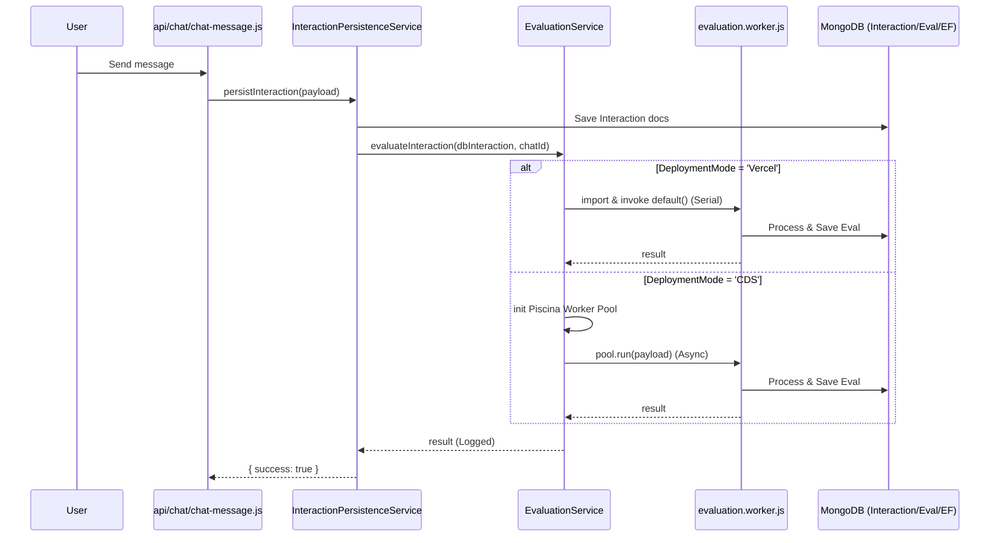
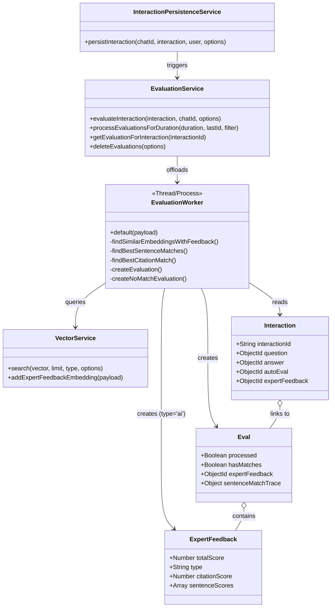
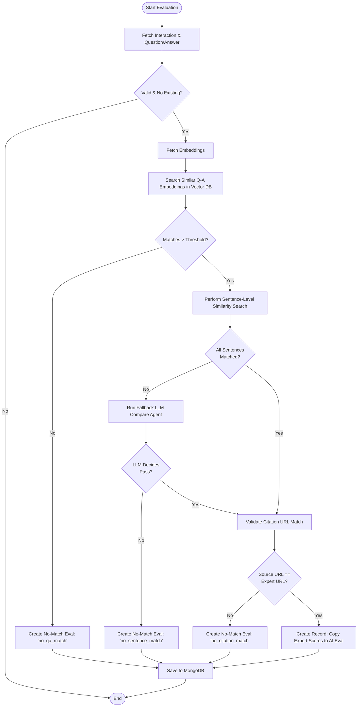

# Evaluation Service Architecture (Current Flow)

This document describes the current architecture and lifecycle of the evaluation system as of January 2026.

## 1. Sequence Diagram: Interaction Persistence & Evaluation Trigger

The following diagram shows how a new chat interaction triggers an automatic evaluation.

## 2. Class Diagram: Core Evaluation Components

While the system is primarily functional/service-oriented, the following diagram represents the logical relationships between services and data models.

## 3. Flow Diagram: Evaluation Logic (Inside Worker)

This diagram details the decision logic used by `evaluation.worker.js` to determine an interaction's score.

## 4. Key Configurations

- **evalConcurrency**: Controlled by `config/eval.js` and `SettingsService`. Defaults to `numCPUs - 1`.
- **thresholds**: Defined in `evaluation.worker.js` for QA and Sentence similarity.
- **deploymentMode**:
  - `Vercel`: Synchronous execution (handles Lambdas).
  - `CDS`: Asynchronous execution via Piscina worker pool.
