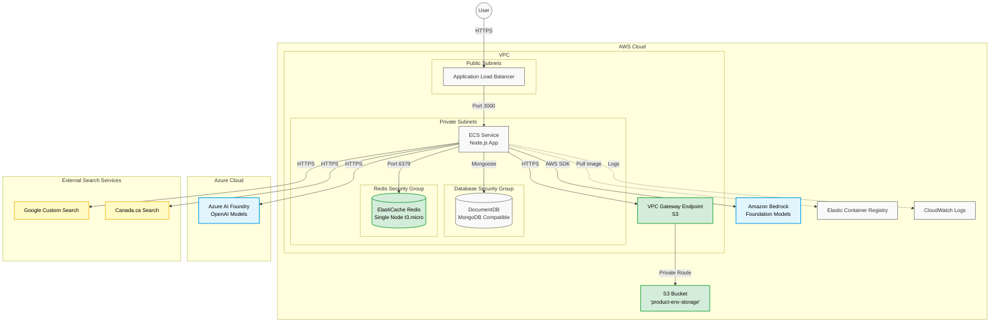

# Infrastructure Diagram

This diagram represents the infrastructure state including the proposed Redis and S3 additions.

### Components
1.  **Current Infrastructure**:
    *   **ECS & Load Balancer**: Standard web application setup.
    *   **DocumentDB**: The primary persistent store in the private subnet.
2.  **Redis**:
    *   Adds an **ElastiCache Redis Cluster** (Single Node, `cache.t3.micro`).
    *   Includes a dedicated **Security Group** and **Subnet Group** (in private subnets).
    *   Configured for cost savings (no snapshots).
3.  **S3 Storage**:
    *   Adds a private **S3 Bucket** named `{product}-{env}-storage`.
    *   configured with default server-side encryption (AES256) and public access blocking.
    *   **VPC Gateway Endpoint**: Enables private access from ECS to S3 without using the public internet.
    *   Includes a lifecycle rule to expire objects after 90 days.
4.  **Model Providers**:
    *   **Amazon Bedrock**: Accessed via AWS SDK/Role assumption for Foundation Models.
    *   **Azure AI Foundry**: Accessed via HTTPS using API keys for OpenAI Models.
5.  **External Search Services**:
    *   **Google Custom Search**: Provided through Google Cloud Search API for external web context.
    *   **Canada.ca Search**: Hits the Canada.ca search API for authoritative government content.
