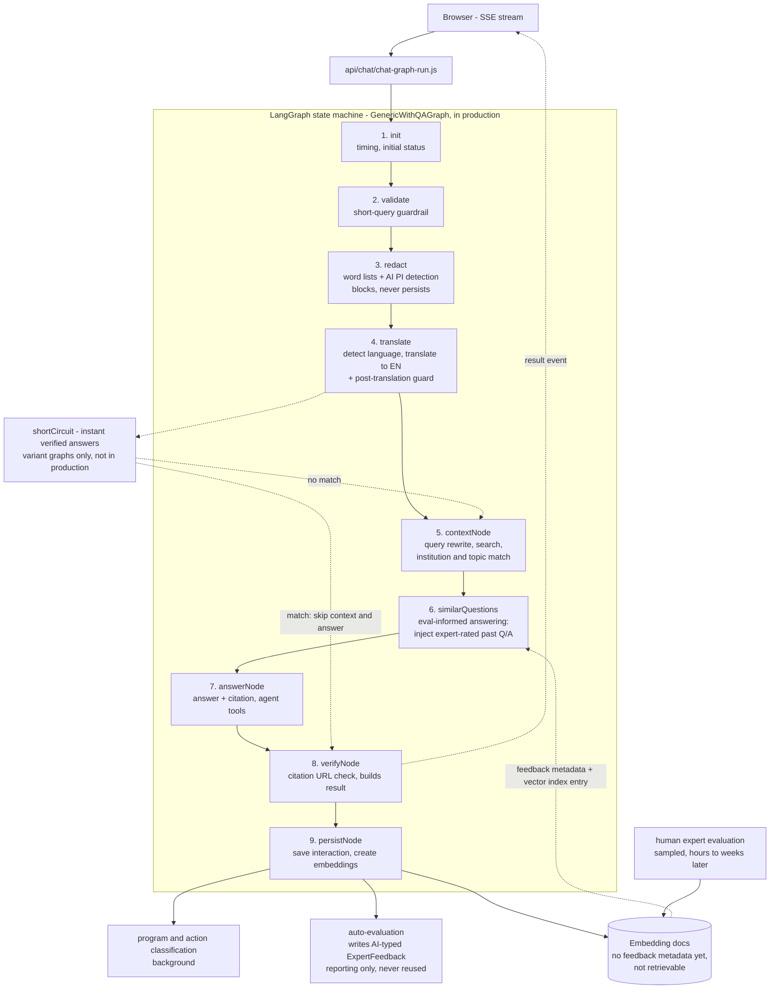

# AI Answers Pipeline Architecture

## Overview

AI Answers uses a **LangGraph-based state machine architecture** to orchestrate a multi-step pipeline that processes user questions through validation, translation, context derivation, and answer generation stages. This architecture ensures reliable, traceable, and auditable AI interactions.

**Last Updated:** August 2026

**Companion documents:** [SYSTEM_CARD.md](../../SYSTEM_CARD.md) and
[SYSTEM_CARD_FR.md](../../SYSTEM_CARD_FR.md) carry the plain-language version of this
pipeline for a general and governance audience. This document is the developer view (nodes,
state, file references); the card is the reader-facing one. They are deliberately at
different levels of detail, but a step added, removed, or moved out of the production graph
here has to be reflected there — in both languages. See
[AGENTS.md](../../AGENTS.md#keep-the-pipeline-docs-in-sync--they-have-different-jobs).

---

## Table of Contents

1. [Pipeline at a Glance](#pipeline-at-a-glance)
2. [LangGraph State Machine](#langgraph-state-machine)
3. [Pipeline Execution Flow](#pipeline-execution-flow)
4. [Optional Node: Short-Circuit Check](#optional-node-short-circuit-check-shortcircuit--variant-graphs-only)
5. [After the Answer: Evaluation and the Feedback Loop](#after-the-answer-evaluation-and-the-feedback-loop)
6. [State Management](#state-management)
7. [Monitoring & Observability](#monitoring--observability)
8. [Related Documentation](#related-documentation)
9. [Troubleshooting](#troubleshooting)

---

## Pipeline at a Glance

Every question runs the same graph server-side. The diagram is the production graph
(`GenericWithQAGraph`); dashed edges are the variant-only short-circuit path and the
post-answer track that closes the evaluation loop.



**Reading the loop:** `persistNode` writes embeddings that nothing can retrieve yet. A
human expert evaluation attaches the feedback metadata and registers those embeddings in
the vector index, which is what makes the interaction available to `similarQuestions` for
future questions. Auto-evaluations never join that corpus — see
[After the Answer](#after-the-answer-evaluation-and-the-feedback-loop).

For hosting, data stores, model providers and search services, see
[Infrastructure Diagram](./infrastructure-diagram.md) — this document stays on the request
pipeline itself.

---

## LangGraph State Machine

### What is LangGraph?

LangGraph is a framework for building stateful, multi-actor applications with LLMs. It provides:
- **Nodes**: Individual processing steps
- **Edges**: Transitions between nodes (conditional or direct)
- **State**: Shared data structure passed between nodes
- **Persistence**: Optional state checkpointing

### Graph Definition

**File:** [`agents/graphs/GenericWithQAGraph.js`](../../agents/graphs/GenericWithQAGraph.js)

The graph is defined using the `StateGraph` class from `@langchain/langgraph`. The
production graph is linear — every question runs the full pipeline:

```javascript
const graph = new StateGraph(GraphState)
  .addNode('init', initNode)
  .addNode('validate', validateNode)
  .addNode('redact', redactNode)
  .addNode('translate', translateNode)
  .addNode('contextNode', contextNode)
  .addNode('similarQuestions', similarQuestionsNode)
  .addNode('answerNode', answerNode)
  .addNode('verifyNode', verifyNode)
  .addNode('persistNode', persistNode)
  .addEdge(START, 'init')
  .addEdge('init', 'validate')
  .addEdge('validate', 'redact')
  .addEdge('redact', 'translate')
  .addEdge('translate', 'contextNode')
  .addEdge('contextNode', 'similarQuestions')
  .addEdge('similarQuestions', 'answerNode')
  .addEdge('answerNode', 'verifyNode')
  .addEdge('verifyNode', 'persistNode')
  .addEdge('persistNode', END);
```

### Graph variants

All graphs share the same backbone. They differ only in which eval-driven nodes they
add — see [Using Evals for Answers](./using-evals-for-answers.md) for the full
comparison and the retrieval parameters each one passes.

| Graph | `shortCircuit` (instant verified answers) | `similarQuestions` (eval-informed answering) |
|---|---|---|
| [`GenericWithQAGraph`](../../agents/graphs/GenericWithQAGraph.js) — **in production** | ❌ | ✅ rating ≤ 100 (`lte`, k=3, threshold=0.75) |
| [`GenericGraph`](../../agents/graphs/GenericGraph.js) | ❌ | ❌ |
| [`DefaultWithVectorGraph`](../../agents/graphs/DefaultWithVectorGraph.js) — registry fallback | ✅ rating = 100 | ❌ |
| [`InstantAndQAGraph`](../../agents/graphs/InstantAndQAGraph.js) | ✅ rating = 100 | ✅ rating < 100 |
| [`DefaultWithLocalModel`](../../agents/graphs/DefaultWithLocalModel.js) | ✅ (local model ranker) | ❌ |

**Graph selection:** the client names a graph (`src/workflows/GraphClient.js`, following
the `workflow.default` setting) and [`api/chat/chat-graph-run.js`](../../api/chat/chat-graph-run.js)
resolves it through [`agents/graphs/registry.js`](../../agents/graphs/registry.js). The
code-level fallback when no valid name arrives is `DefaultWithVectorGraph`; the
fallback in `src/config/workflows.js` (`DEFAULT_WORKFLOW`) is `GenericGraph`.

The short-circuit path is **experimental and not deployed** — every graph that relies on
it is held back.

### State Annotations

The graph maintains state across all nodes with these key fields:

```javascript
{
  chatId: string,                // Unique chat session ID
  userMessage: string,           // Original user input
  userMessageId: string,         // Unique message ID
  conversationHistory: array,    // Previous messages
  cleanedHistory: array,         // Cleaned conversation history
  lang: string,                  // UI language (en/fr)
  department: string,            // Department code (if provided)
  referringUrl: string,          // Page URL where question was asked
  selectedAI: string,            // AI provider (openai, azure, anthropic)
  translationF: boolean,         // Translation function enabled
  searchProvider: string,        // Search provider (canadaCa, google)
  overrideUserId: string,        // Override user ID for special cases
  redactedText: string,          // Text after PI redaction
  translationData: object,       // Translation results
  context: object,               // Derived context (dept, topic, search results,
                                 //   similarQuestions block, qaMatches)
  usedExistingContext: boolean,  // Whether context was reused (always false in the
                                 //   production graph — see step 5d)
  answer: object,                // Generated answer
  finalCitationUrl: string,      // Verified citation URL
  status: string,                // Current pipeline status (camelCase)
  result: object,                // Final result object
  startTime: number              // Pipeline start time (ms)
}
```

The `similarQuestions` node writes back into `context` rather than adding a state field —
it returns `{ ...state.context, similarQuestions, qaMatches }`.

Short-circuit graphs add two more fields: `shortCircuitPayload` (the reused answer, when a
match is found) and `shortCircuitDebugPayload` (candidates and reason, for ChatViewer).
`GenericWithQAGraph` declares neither.

---

## Pipeline Execution Flow

### 1. Initialization (`init` node)

**Purpose:** Set up timing and initial status

**Operations:**
- Record `startTime` for performance tracking
- Set initial status to `moderatingQuestion`
- Initialize state fields

**File:** [`agents/graphs/GenericWithQAGraph.js`](../../agents/graphs/GenericWithQAGraph.js#L45)

---

### 2. Short Query Validation (`validate` node)

**Type:** Programmatic (no AI)
**Status:** `moderatingQuestion`

**Purpose:** Block queries that are too short to be meaningful

**Logic:**
- Check if current message ≤2 words
- AND no previous long message in conversation history
- If both true: throw `ShortQueryValidation` error

**Error Response:**
- Returns fallback URL to Canada.ca search
- User receives helpful error message

**Files:**
- Guardrail: [`agents/graphs/guardrails/shortQuery.js`](../../agents/graphs/guardrails/shortQuery.js)
- Error types/constants: [`agents/graphs/guardrails/errors.js`](../../agents/graphs/guardrails/errors.js), [`agents/graphs/guardrails/blockTypes.js`](../../agents/graphs/guardrails/blockTypes.js)

---

### 3. Question Blocking (`redact` node)

**Type:** Programmatic + AI
**Status:** `moderatingQuestion`

**Purpose:** Two-stage privacy protection - detect PI and block questions containing it

#### Stage 1: Pattern-Based Blocking (No AI)
- Profanity detection → block question
- Threat detection → block question
- Manipulation patterns → block question
- Basic PI patterns (phone numbers, emails, 9-digit numbers) → block question

**Files:**
- Redaction engine: [`agents/graphs/services/redactionService.js`](../../agents/graphs/services/redactionService.js)
- Guardrail wrapper/classification: [`agents/graphs/guardrails/redactionGuardrail.js`](../../agents/graphs/guardrails/redactionGuardrail.js)

#### Stage 2: AI-Powered PI Detection
- AI detects person names, personal IDs, US ZIP codes
- Uses Azure GPT-4o with a specialized prompt — pinned to gpt-4o regardless of the
  selected model family so PI detection stays in-region (Canada East)
- Detected PI is marked with `XXX` to show user what was found
- Question is then blocked programmatically (blocked questions are never logged or processed)

**Files:**
- Service: [`services/PIIAgentService.js`](../../services/PIIAgentService.js)
- Prompt: [`agents/prompts/piiAgentPrompt.js`](../../agents/prompts/piiAgentPrompt.js)
- Guardrail wrapper: [`agents/graphs/guardrails/piiGuardrail.js`](../../agents/graphs/guardrails/piiGuardrail.js)

---

### 4. Translation (`translate` node)

**Type:** AI-powered (Azure GPT-4.1 mini, `createTranslationAgent`)
**Status:** `moderatingQuestion`

**Purpose:** Detect language and translate to English for processing

**Process:**
- Detect original language (ISO 639-3 codes)
- Translate to English if needed
- Use conversation history for context on short queries
- Set `noTranslation: true` if already English

**Output:**
```javascript
{
  originalLanguage: 'fra',
  translatedLanguage: 'eng',
  translatedText: 'How do I apply for EI?',
  noTranslation: false
}
```

**Files:**
- Translation service: [`agents/graphs/services/translationService.js`](../../agents/graphs/services/translationService.js)
- Translation guardrails: [`agents/graphs/guardrails/translationGuardrail.js`](../../agents/graphs/guardrails/translationGuardrail.js)

#### Post-translation guardrail (non-EN/FR only)

After translation, `GraphWorkflowHelper.postTranslateGuard()` runs a second-stage check on the translated English text:

- **All languages:** word-list/regex redaction re-runs on the translated text to catch manipulation, threats, or profanity that the EN/FR word lists couldn't catch in the original
- **Non-EN/FR source languages only:** AI PI detection runs again on the translated text — threats or personal information written in another language may only be recognizable once rendered in English

This is a second-stage guardrail, not a replacement for the `redact` node. The `redact` node always runs first (on the original text, in the original language); `postTranslateGuard` adds an extra pass for languages where the first-pass word lists have limited coverage.

The same guardrail wrapper also maps translation-service blocks to `azureGuardrail`,
obfuscated `zxx` source language to `manipulation`, and unsupported `und` source
language to `unsupportedLanguage`.

---

### 5. Context Derivation (`contextNode`)

**Type:** AI-powered (multi-step)
**Status:** `buildingContext` → `generatingAnswer`

**Purpose:** Generate search query, execute search, identify department

**Note:** In the short-circuit variant graphs this node is SKIPPED when a matching
verified answer is found

#### Sub-steps:

**5a. Query Rewrite**
- Craft optimized search query from translated text
- Consider conversation history
- Model: Azure GPT-4.1 mini (`createQueryRewriteAgent`)

**5b. Search Execution**
- Execute search using Canada.ca or Google
- Configurable via `searchProvider` parameter
- Tools: `canadaCaContextSearch.js`, `googleContextSearch.js`

**5c. Department Matching**
- Match question to Government of Canada department
- Identify topic and relevant URLs
- Parse department code (e.g., `EDSC-ESDC`, `CRA-ARC`)
- Load department-specific scenarios if available

**5d. Context Reuse — variant graphs only**
- **The production graph does not reuse context.** `GenericWithQAGraph` and `GenericGraph`
  call `deriveContext` directly and hardcode `usedExistingContext: false`
  ([`GenericWithQAGraph.js:123-139`](../../agents/graphs/GenericWithQAGraph.js#L123)), so
  fresh context is derived for **every** question, follow-ups included. This matters for
  institution identification on multi-turn conversations.
- `DefaultWithVectorGraph` and `InstantAndQAGraph` instead call `getContextForFlow()`,
  which reuses a previous turn's context when it is still valid and sets
  `usedExistingContext` accordingly.

**Files:**
- [`agents/graphs/services/contextService.js`](../../agents/graphs/services/contextService.js)
- [`services/ContextAgentService.js`](../../services/ContextAgentService.js)
- [`agents/prompts/contextSystemPrompt.js`](../../agents/prompts/contextSystemPrompt.js)

---

### 6. Eval-Informed Answering (`similarQuestions` node)

**Type:** Embedding + vector retrieval (no LLM call — the question is embedded via
`EmbeddingService`, but nothing is generated or reranked by an LLM. The reranker
(`rerankerPrompt.js` → `rankerStrategy.js` → `LLMRankerComparator`) belongs to the
short-circuit path only, through `SimilarAnswerService`.)
**Status:** `generatingAnswer`

**Purpose:** Retrieve expert-rated past Q/A pairs for this question and hand them to the
answer node as reference material, so the model can copy what experts marked correct and
avoid what they flagged as wrong. *This is the production graph's eval-driven step — the
system card calls it **eval-informed answering**.*

**Process:**
1. Call `QuestionAnswerService.getSimilarQuestionsContext(userMessage, opts)` with
   `k: 3`, `threshold: 0.75`, `expertFeedbackRating: 100`, `expertFeedbackComparison: 'lte'`,
   `recencyDays: 365`, `useDenormalizedPreFilter: true`, `returnDebugData: true`.
   `lte` means **both** perfect-score and lower-score pairs are eligible: perfect ones as a
   known-good model, lower ones with the expert's sentence-level comments as mistakes to avoid.
2. Candidates below the `0.75` cosine-similarity floor are dropped at the vector layer, and
   hits whose expert feedback is older than 365 days are dropped (unless flagged `neverStale`).
3. Write the formatted block back into `context.similarQuestions`, plus `context.qaMatches`
   (chatId, interactionId, similarity, score, question/answer text) for ChatViewer.
4. Failures are non-fatal: the node logs a warning and continues with an empty block.

**How the model sees it:** `GraphWorkflowHelper.sendAnswerRequest` forwards
`context.similarQuestions` into `systemPrompt.js`, which renders it under a
**## Verified Similar Questions** heading with instructions on how to weight scores,
`correct-url=` corrections, and dates. An empty string renders no block at all.

**Inspecting it:** the `node:similarQuestions output` event carries the injected text, the
matched records, and the pre-threshold candidates —
`node scripts/check-chat-logs.js <file.json> --filter similarQuestions`.

**Files:**
- Node: [`agents/graphs/GenericWithQAGraph.js`](../../agents/graphs/GenericWithQAGraph.js#L146)
- Service: [`services/QuestionAnswerService.js`](../../services/QuestionAnswerService.js)
- Prompt assembly: [`agents/prompts/systemPrompt.js`](../../agents/prompts/systemPrompt.js)
- Full design notes: [Using Evals for Answers](./using-evals-for-answers.md)

---

### 7. Answer Generation (`answerNode`)

**Type:** AI-powered (configurable model)
**Status:** `generatingAnswer`

**Purpose:** Generate answer using context and conversation history (SKIPPED in the
short-circuit variants when a verified match was found)

**Input:**
- Translated question
- Derived context (department, topic, search results)
- Expert-rated similar Q/A pairs from the `similarQuestions` node
- Conversation history
- Department-specific scenarios (if available)
- System prompt with instructions

**Available Tools:**
- `downloadWebPage`: Fetch and parse web page content
- `checkUrlStatus`: Validate URL accessibility
- `contextAgentTool`: Re-derive context if needed

**Output Parsing:**
- `<answer>` block: Main content (1-4 sentences)
- `<citation-url>`: AI's proposed citation
- `<citation-head>`: Citation heading
- `<confidence>`: Confidence rating (0-10)
- Special tags: `<not-gc>`, `<pt-muni>`, `<clarifying-question>`

**Files:**
- Entry: [`api/chat/chat-message.js`](../../api/chat/chat-message.js)
- Agent Factory: [`agents/AgentFactory.js`](../../agents/AgentFactory.js)
- Prompts: [`agents/prompts/`](../../agents/prompts/)

---

### 8. Citation Verification (`verifyNode`)

**Type:** Programmatic URL validation
**Status:** `verifyingCitation`

**Purpose:** Ensure citation URL is accessible and build final result object

**Process:**
1. Send HEAD request to URL (fast, low bandwidth)
2. If fails: try GET request
3. Follow up to 10 redirects
4. Timeout: 10 seconds
5. Check for known 404 pages

**Output:**
```javascript
{
  isValid: boolean,
  url: string,
  status: number,
  confidenceRating: 0 | 1,
  error?: string
}
```

**Fallback:**
- If invalid: use `fallbackUrl` or Canada.ca search

**File:** [`services/UrlValidationService.js`](../../services/UrlValidationService.js)

---

### 9. Persistence (`persistNode`)

**Type:** Database write
**Status:** `complete` or `needClarification`

**Purpose:** Save interaction to database and trigger evaluation (in the short-circuit
variants this is SKIPPED on a match, because the `shortCircuit` node already persisted)

**Operations:**
1. Create embeddings via `EmbeddingService` — retrievable by
   [step 6](#6-eval-informed-answering-similarquestions-node) only once a human expert
   evaluation is attached later; see
   [After the Answer](#after-the-answer-evaluation-and-the-feedback-loop)
2. Save to database:
   - Chat
   - Interaction
   - Context
   - Question
   - Answer
   - Citation
   - Tool usage
3. Classify program/action in the background (institution reporting)
4. Trigger auto-evaluation — awaited in `Vercel` deployment mode, dispatched to a worker
   pool in `CDS` mode. Not every interaction ends up with an evaluation; see
   [After the Answer](#after-the-answer-evaluation-and-the-feedback-loop)

**Metadata Tracked:**
- Response time
- Search provider used
- AI model used
- Tool invocations
- Input/output tokens
- Confidence rating

**Files:** [`api/db/db-persist-interaction.js`](../../api/db/db-persist-interaction.js),
[`services/InteractionPersistenceService.js`](../../services/InteractionPersistenceService.js)

---

### 10. Return Result (`END`)

**Type:** Response streaming
**Status:** `complete`

**Purpose:** Stream final result to client

**Response Format (SSE):**
The `result` object is built by `verifyNode` (so the client gets it before `persistNode`
finishes) and emitted as a `result` SSE event with `chatId` merged in:

```javascript
{
  answer: {
    content: string,
    answerType: string,
    paragraphs: array,
    sentences: array,
    citationUrl: string
  },
  context: {
    topic: string,
    department: string,
    departmentUrl: string,
    searchResults: array,
    similarQuestions: string,   // injected eval block (GenericWithQAGraph)
    qaMatches: array            // matched past Q/A, for ChatViewer
  },
  question: string,
  citationUrl: string,
  historySignature: string,
  chatId: string
}
```

`status` events stream separately throughout the run; the stream is drained to the end
after the result so `persistNode` still completes.

**File:** [`api/chat/chat-graph-run.js`](../../api/chat/chat-graph-run.js)

---

## Optional Node: Short-Circuit Check (`shortCircuit`) — variant graphs only

**Type:** AI-powered (vector similarity + reranking)
**Status:** `generatingAnswer`
**Graphs:** `DefaultWithVectorGraph`, `InstantAndQAGraph`, `DefaultWithLocalModel` —
**not** the production graph. Public-facing name: **instant verified answers**.

**Status of this path:** experimental. In testing it has not been reliable enough to
deploy (risk of serving a near-match's answer to a subtly different question), so the
graphs that use it are held back.

**Purpose:** Detect if a similar question was already answered **perfectly** (runs after
`translate`, BEFORE context derivation)

**Process:**
1. Skip short-circuit if conversation already has prior AI replies
2. Generate embedding for current question
3. Search embeddings database for similar questions **filtered to `expertFeedback.totalScore === 100`** (perfect-score past answers only)
4. Use reranker agent to validate candidates against the current question
5. If a perfect-score candidate passes the reranker's `allPass(checks)` verdict:
   - Persist the interaction immediately, set `shortCircuitPayload` with the existing answer
   - Skip directly to `verifyNode` (bypass context and answer generation)
6. Otherwise: record `shortCircuitDebugPayload` and proceed to `contextNode`

**Why score=100 only:** Short-circuit serves a past answer verbatim with no opportunity for correction. Anything less than a perfect expert score means there is at least one flagged issue in that answer, so it must not be served as-is. The expert-score filter is enforced at the vector retrieval layer (`requestedRating: 100` in `GraphWorkflowHelper.checkSimilarAnswer`).

**Benefits (if deployed):**
- Faster responses (no context derivation or answer generation needed)
- Lower AI costs
- Consistent, high-quality answers to similar questions

**Files:** [`services/SimilarAnswerService.js`](../../services/SimilarAnswerService.js),
[`agents/graphs/workflows/GraphWorkflowHelper.js`](../../agents/graphs/workflows/GraphWorkflowHelper.js)
(`checkSimilarAnswer`)

---

## After the Answer: Evaluation and the Feedback Loop

The graph ends at `persistNode`. Everything below happens **after** the user has their
answer, on a separate track: some of it runs for every interaction, and the part that
matters most — human expert evaluation — happens only for the sampled chats an expert
reviews. This is the loop that supplies [step 6](#6-eval-informed-answering-similarquestions-node).

```
answerNode → verifyNode → persistNode
                              │
                              ├─ Embedding docs created (no feedback metadata yet
                              │    → NOT retrievable by step 6)
                              │
                              ├─ program/action classification (background)
                              │
                              ├─ auto-evaluation → ExpertFeedback(type:'ai') + Eval
                              │      → reporting and dashboards only; never denormalized
                              │        onto embeddings, so it can never be injected
                              │
                              └─ human expert evaluation (sampled, hours-to-weeks later)
                                     ├─ syncForInteraction → feedback metadata on Embedding
                                     └─ addExpertFeedbackEmbedding → live vector index
                                                  │
                                                  ▼
                                    retrievable by step 6 (and by the
                                    short-circuit path) for future questions
```

### Always: post-persistence work inside `persistNode`

`InteractionPersistenceService.persistInteraction` does three things after the documents
are saved:

1. **Program/action classification** — `ProgramActionClassificationService.classifyInteractionInBackground(...)`
   ([`services/InteractionPersistenceService.js:152`](../../services/InteractionPersistenceService.js#L152)),
   fire-and-forget; assigns a program and action (e.g. *IRCC account – sign in*) for
   institution reporting.
2. **Embedding creation** — `EmbeddingService.createEmbedding`
   ([`:163-169`](../../services/InteractionPersistenceService.js#L163)) writes one
   `Embedding` document (`questionsEmbedding`, `answerEmbedding`,
   `questionsAnswerEmbedding`) plus one `SentenceEmbedding` per answer sentence. A failure
   here is logged and swallowed — persistence continues without embeddings.
   **These embeddings are not yet retrievable by step 6.** They carry no expert-feedback
   metadata, and `QuestionAnswerService` drops every hit that has no `expertFeedbackId`.
   They become retrievable only once a human evaluation is attached (below).
3. **Auto-evaluation trigger** — `EvaluationService.evaluateInteraction`
   ([`:172-200`](../../services/InteractionPersistenceService.js#L172)); awaited in
   `Vercel` deployment mode, dispatched to a Piscina worker pool and not awaited in `CDS`
   mode (the default).

### Automatic AI evaluation (`services/evaluation.worker.js`)

- Skips the interaction if it already has an `autoEval` — e.g. one linked from a QA match
  ([`evaluation.worker.js:435-447`](../../services/evaluation.worker.js#L435)).
- Vector-searches similar past interactions **that carry human expert feedback**, matches
  the new answer sentence by sentence against that feedback, and checks the citation.
- On a match it writes a new `ExpertFeedback` with `type: 'ai'`, inheriting the matched
  human scores and explanations, recomputes `totalScore`, saves an `Eval`, and links it as
  `interaction.autoEval`. With no match, a no-match evaluation is recorded instead.
- **AI evaluations never enter the retrieval corpus — this is a deliberate invariant, not
  an implementation detail.** See the callout below.
- Full detail: [Evaluation Service Architecture](./evaluation-service.md).


> ### Invariant: AI evaluations never feed answer generation
>
> Only **human** expert evaluations may feed back into live answers. An `ExpertFeedback`
> written with `type: 'ai'` must never be denormalized onto an embedding or added to the
> vector index, so it can never be injected as an expert-rated example in step 6 and can
> never be served as an instant verified answer.
>
> **Why:** the system would grade its own output and then learn from that grade — errors
> compound with no person in the loop. Every example the model sees must trace back to a
> human judgement.
>
> **What enforces it — one guard, nothing else.** `isAutoEvalFeedback` in
> [`services/EmbeddingMetadataService.js:55-58`](../../services/EmbeddingMetadataService.js#L55)
> makes `syncForInteraction` *clear* metadata instead of writing it
> ([`:220-229`](../../services/EmbeddingMetadataService.js#L220)), and
> `services/evaluation.worker.js` never calls `addExpertFeedbackEmbedding`. Nothing
> downstream re-checks: `QuestionAnswerService`, `SimilarAnswerService` and both vector
> services filter on `expertFeedbackId`, rating and recency — **never** on `feedback.type`.
> Write the metadata and the AI eval becomes retrievable, silently.
>
> **Do not undo it silently.** Never add `syncForInteraction` or
> `addExpertFeedbackEmbedding` to the evaluation worker; never remove the clear-on-`ai`
> branch as dead code. Changing this is a policy decision for the prompt/eval maintainers,
> not a refactor. Recorded as a standing rule in
> [AGENTS.md](../../AGENTS.md#never-let-ai-evaluations-feed-answer-generation).
>
> **Test coverage today:** `services/__tests__/EmbeddingMetadataService.test.js:519`
> ("defensively clears metadata if an ai-typed feedback document is attached") covers the
> metadata guard through `backfillBatch`. Nothing asserts that the evaluation worker makes
> no vector-index call — a regression there would pass CI.

### Human expert evaluation — what actually makes an answer reusable

Not every chat is evaluated; experts review a sample, often well after the conversation
ended. When an evaluation is saved
([`api/feedback/feedback-persist-expert.js`](../../api/feedback/feedback-persist-expert.js)):

1. The `ExpertFeedback` document is saved (with `expertEmail` from the session) and linked
   on the interaction. The expert form leaves `type` unset — only `type: 'ai'` marks an
   auto-eval, so anything else counts as human.
2. `EmbeddingMetadataService.syncForInteraction` denormalizes `expertFeedbackId`,
   `expertFeedbackTotalScore`, `expertFeedbackCreatedAt`, `expertFeedbackNeverStale` and
   the `pageLanguage`/`interactionLanguage` onto the interaction's existing `Embedding`
   document. This is what `useDenormalizedPreFilter` filters on at retrieval time.
3. `VectorService.addExpertFeedbackEmbedding(...)` registers those already-created
   embeddings — questions, questions+answer, and sentence vectors — in the live vector
   index together with the feedback metadata.

Only after step 3 can the Q/A be returned by `matchQuestions` and reach the
`similarQuestions` node. Note the timestamp used downstream is `expertFeedback.createdAt`,
written here at evaluation time — which is why the 365-day recency filter measures the age
of the *judgement*, not of the conversation.

Older interactions are brought up to date by the backfill job
([`services/EmbeddingMetadataBackfillJobService.js`](../../services/EmbeddingMetadataBackfillJobService.js),
`EmbeddingMetadataService.backfillBatch`), not by this endpoint.

---

## State Management

### State Flow

```
User Question
    ↓
[init] → Initialize state with chatId, userMessage, lang
    ↓
[validate] → Validate query length
    ↓
[redact] → Detect PI, block question if found
    ↓
[translate] → Add translationData to state
    ↓
[contextNode] → Add context (department, topic, searchResults) to state
    ↓
[similarQuestions] → Add context.similarQuestions + context.qaMatches
    ↓
[answerNode] → Add answer to state
    ↓
[verifyNode] → Set finalCitationUrl and build result
    ↓
[persistNode] → Save and return result
    ↓
END
```

In the short-circuit variant graphs, a `[shortCircuit]` node sits between `[translate]`
and `[contextNode]`: on a match it sets `shortCircuitPayload` and jumps straight to
`[verifyNode]`, skipping context and answer generation.

### State Mutations

Each node can:
- **Read** any field from state
- **Write** specific fields (defined in node implementation)
- **NOT modify** other nodes' outputs (ensures encapsulation)

### State Persistence

- State is **not persisted** between graph executions (stateless)
- Each user question triggers a new graph execution
- Conversation history passed as input, not stored in graph state

---

## Monitoring & Observability

### Status Events

Emitted via SSE to client:

```javascript
{
  status: 'moderatingQuestion',    // Initial validation
  status: 'buildingContext',       // Context derivation
  status: 'generatingAnswer',      // Answer generation
  status: 'verifyingCitation',     // URL validation
  status: 'complete'               // Done (or 'needClarification' for clarifying questions)
}
```

### Logging

- **Server Logging**: `ServerLoggingService` logs to DocumentDB
- **Client Logging**: Error tracking and analytics
- **Tool Tracking**: `ToolTrackingHandler` logs all tool calls

### Metrics

Tracked per interaction:
- Total response time
- Time per node
- AI model used
- Input/output tokens
- Tool invocations
- Confidence rating
- Similar-questions hits injected (`qaMatches`)
- Short-circuit hit/miss (variant graphs only)

### Blocked-query counter (safety/security)

Queries blocked by the guardrails (`validate` and `redact` nodes, plus the
post-translation guard) throw before `persistNode` and are **never persisted** —
the question text is intentionally discarded. To still track guardrail volume, a
**text-free** counter records one increment per blocked query, classified to a
single primary bucket:

- `tooShort`, `threat`, `manipulation` (incl. obfuscated `zxx` input),
  `profanity`, `piStage1` (programmatic PI), `piStage2` (AI PI detection),
  `azureGuardrail`, `unsupportedLanguage` (`und`).

The block type is tagged on the thrown error (`blockType` on
`ShortQueryValidation` / `RedactionError`) from [`agents/graphs/guardrails/`](../../agents/graphs/guardrails/), and the
single catch block in [`api/chat/chat-graph-run.js`](../../api/chat/chat-graph-run.js)
fires a fire-and-forget `BlockedQueryService.record()`. Counts are day-bucketed
by `{ date, type, lang, userType }` in the `BlockedQueryCounter` collection
(no question text), surfaced via [`api/metrics/metrics-blocked.js`](../../api/metrics/metrics-blocked.js)
in the Safety section of the executive and technical dashboards. Blocks happen
before the department is known, so the table is global (hidden when a department
filter is applied).

**Files:** [`agents/graphs/guardrails/`](../../agents/graphs/guardrails/),
[`services/BlockedQueryService.js`](../../services/BlockedQueryService.js),
[`models/blockedQueryCounter.js`](../../models/blockedQueryCounter.js)

---

## Related Documentation

### Core Documentation
- **[System Prompts](../agents-prompts/system-prompt-documentation.md)**: Complete AI agent prompts for all steps
- **[Using Evals for Answers](./using-evals-for-answers.md)**: How expert evaluations feed back into live answers (eval-informed answering and instant verified answers)
- **[Evaluation Service Architecture](./evaluation-service.md)**: The auto-evaluation worker, its trigger modes and scoring flow
- **[SYSTEM_CARD.md](../../SYSTEM_CARD.md)**: System card with safety measures and evaluation framework

### API Documentation
- See `docs/api/` for API endpoint documentation (when available)

### How-To Guides
- See `docs/how-to/` for developer guides (when available)

---

## Troubleshooting

### Common Issues

**1. Graph execution hangs**
- Check for infinite loops in conditional edges
- Verify all nodes return updated state
- Check for missing edge definitions

**2. State not persisting between nodes**
- Ensure node returns complete state object
- Check state annotation definitions
- Verify field names match

**3. AI service timeouts**
- Increase timeout in agent configuration
- Check network connectivity
- Verify API keys are valid

**4. No similar questions injected**
- Confirm the workflow in use is `GenericWithQAGraph` (`workflow.default` setting)
- Check the embedding service is running and the vector index has embeddings
- Compare `preThresholdRecords` and `matchedRecords` in the `node:similarQuestions output`
  event — candidates present but unmatched means the `0.75` similarity floor or the
  365-day expert-feedback recency filter dropped them

---

## Summary

The LangGraph-based architecture provides:

✅ **Reliability**: Deterministic execution with clear error handling
✅ **Observability**: Complete state tracking and logging
✅ **Performance**: Prompt caching (plus context reuse and short-circuit reuse in the experimental variants)
✅ **Maintainability**: Clear node boundaries, easy to extend
✅ **Scalability**: Stateless execution, horizontal scaling ready
✅ **Auditability**: Complete execution history for compliance

For questions or contributions, see the main [README.md](../../README.md).
