# EvaluationService Refactor: Trigger on ExpertFeedback

Refactor the evaluation triggering mechanism to support running evaluations when ExpertFeedback is added (not just on new chats), with a configurable toggle in SettingsService.

## User Review Required

> [!IMPORTANT]
> **Design Decision**: The new trigger mode `onExpertFeedback` will scan *all existing interactions* without evaluations when a new ExpertFeedback is added. This could be expensive in large datasets. See Performance Concerns below for details.

> [!WARNING]
> **Breaking Behavior Change**: Currently, evaluations happen synchronously/asynchronously after each new chat. With `onExpertFeedback` mode enabled and `onNewChat` disabled, new chats will NOT be immediately evaluated—only when an expert adds feedback.

## Current Architecture


## Proposed Architecture (Queue-Based)


---

## Performance Concerns

### 1. **Full Scan on ExpertFeedback** (LOW-MEDIUM IMPACT)

| Concern | Current Behavior | Proposed Behavior |
|---------|-----------------|-------------------|
| Trigger frequency | Every new chat (1:1) | Every expert feedback submission |
| Scope per trigger | Single interaction | ALL unevaluated interactions |
| Database queries | 1 interaction lookup | Aggregation pipeline on all interactions |
| CPU/LLM costs | Proportional to chats | Batch of N pending evaluations |

**Why this is LESS of a concern than initially stated:**

The evaluation flow has **multiple early exit points** before expensive LLM calls occur:

```mermaid
flowchart TD
    A[Start: Interaction] --> B{Vector Similarity<br/>Check}
    B -->|No matches<br/>above threshold| C[Create No-Match Eval<br/>💨 Fast - No LLM]
    B -->|Matches found| D{Sentence-Level<br/>Vector Match}
    D -->|All sentences<br/>matched| E{Citation Match?}
    D -->|Some failed| F[Fallback LLM Check<br/>⚠️ API call]
    E -->|No match| G[Create No-Match Eval<br/>💨 Fast - No LLM]
    E -->|Match found| H[Create Evaluation<br/>💨 Copy feedback]
    F -->|Pass| H
    F -->|Fail| G
```



**Cost breakdown per unevaluated interaction:**

| Scenario | DB Queries | Vector Ops | LLM Calls | Frequency |
|----------|-----------|------------|-----------|-----------|
| No similar QA embeddings | ~3 | 1 search | **0** | ~70% of interactions |
| QA match but sentence mismatch | ~10 | 2 searches | **0-1** | ~20% |
| Full match found | ~15 | 2 searches | **0** | ~10% |

Most interactions will exit early at the vector similarity stage with **zero LLM calls**. Only interactions that fail sentence matching trigger the `fallbackCompareCheck` LLM agent.

**Real impact estimate:** Processing 10,000 unevaluated interactions might only result in ~200-500 LLM calls (for the sentence compare agent), not 10,000.

**Remaining concerns:**
- **Database load**: The aggregation pipeline and Chat/Interaction lookups are still O(n)
- **Vector service load**: Similarity searches are fast but scale with batch size

**Mitigation (implemented)**:
- **Queue model**: Decouple feedback submission from evaluation processing
- **Worker thread**: Run evaluations outside main event loop via existing Piscina pool

### 2. **Concurrent Evaluations** → SOLVED BY QUEUE

The queue model naturally serializes evaluation batches:
- Each `expertFeedbackId` is enqueued; only the queue processor triggers evaluations
- Queue drains sequentially, preventing overlapping batches
- If queue is already processing, new feedback IDs accumulate (no duplicate work)

### 3. **Memory Pressure in Worker Pool** (LOW IMPACT)

Already managed by `evalConcurrency` config and Piscina's thread pool sizing.

---

## Proposed Changes

### Settings Schema

#### [NEW] [evaluationTriggerMode Setting](file:///c:/Users/hymary/repos/ai-answers-3/models/setting.js)

New setting key: `evaluationTriggerMode`

| Value | Behavior |
|-------|----------|
| `onNewChat` (default) | Evaluate after each new chat (current behavior) |
| `onExpertFeedback` | Evaluate all pending after expert feedback is added |
| `both` | Evaluate on both triggers |
| `manual` | Disable automatic evaluation (manual only via admin panel) |

---

### InteractionPersistenceService

#### [MODIFY] [InteractionPersistenceService.js](file:///c:/Users/hymary/repos/ai-answers-3/services/InteractionPersistenceService.js)

Update lines 144-174 to check `evaluationTriggerMode` setting before triggering evaluation:

```diff
-        ServerLoggingService.info('Evaluation starting', chatId);
-        ServerLoggingService.info('Deployment mode', chatId, { deploymentMode });
+        // Check evaluation trigger mode
+        let triggerMode = 'onNewChat';
+        try {
+            const modeSetting = await Setting.findOne({ key: 'evaluationTriggerMode' });
+            if (modeSetting && modeSetting.value) triggerMode = modeSetting.value;
+        } catch (e) {
+            ServerLoggingService.warn('Failed to read evaluationTriggerMode, defaulting to onNewChat', chatId, e);
+        }
 
-        if (deploymentMode === 'Vercel') {
+        const shouldEvalOnNewChat = triggerMode === 'onNewChat' || triggerMode === 'both';
+        
+        if (!shouldEvalOnNewChat) {
+            ServerLoggingService.info('Skipping evaluation (trigger mode: ' + triggerMode + ')', chatId);
+        } else if (deploymentMode === 'Vercel') {
             // existing Vercel sync path
         } else {
             // existing CDS async path
         }
```

---

### EvaluationQueueService (NEW)

#### [NEW] [EvaluationQueueService.js](file:///c:/Users/hymary/repos/ai-answers-3/services/EvaluationQueueService.js)

Create a simple in-memory queue that processes evaluation batches in a worker thread:

```javascript
import EvaluationService from './EvaluationService.js';
import config from '../config/eval.js';
import ServerLoggingService from './ServerLoggingService.js';
import { SettingsService } from './SettingsService.js';

class EvaluationQueueService {
    constructor() {
        this.queue = [];        // Array of { expertFeedbackId, enqueuedAt }
        this.isProcessing = false;
        this.lastProcessedId = null;
    }

    enqueue(expertFeedbackId) {
        // Check trigger mode before enqueueing
        const triggerMode = SettingsService.get('evaluationTriggerMode') || 'onNewChat';
        if (triggerMode !== 'onExpertFeedback' && triggerMode !== 'both') {
            ServerLoggingService.debug('EvaluationQueue: skipping enqueue (mode=' + triggerMode + ')');
            return;
        }
        
        this.queue.push({ expertFeedbackId, enqueuedAt: Date.now() });
        ServerLoggingService.info('EvaluationQueue: enqueued', null, { expertFeedbackId, queueLength: this.queue.length });
        
        // Start processing if not already running
        if (!this.isProcessing) {
            this._processQueue();
        }
    }

    async _processQueue() {
        if (this.isProcessing || this.queue.length === 0) return;
        
        this.isProcessing = true;
        ServerLoggingService.info('EvaluationQueue: starting batch processing');
        
        try {
            // Drain queue - take all pending items (batch them together)
            const batch = this.queue.splice(0, this.queue.length);
            
            // Run one evaluation cycle starting from last processed ID
            const result = await EvaluationService.processEvaluationsForDuration(
                config.evalBatchProcessingDuration || 10,
                this.lastProcessedId,
                {}
            );
            
            this.lastProcessedId = result.lastProcessedId;
            ServerLoggingService.info('EvaluationQueue: batch completed', null, {
                processed: result.processed,
                remaining: result.remaining,
                batchSize: batch.length
            });
            
            // If there are remaining interactions AND new items were enqueued during processing,
            // continue processing
            if (result.remaining > 0 && this.queue.length > 0) {
                setImmediate(() => this._processQueue());
            }
        } catch (err) {
            ServerLoggingService.error('EvaluationQueue: batch failed', null, err);
        } finally {
            this.isProcessing = false;
            
            // Check if more items were enqueued while processing
            if (this.queue.length > 0) {
                setImmediate(() => this._processQueue());
            }
        }
    }

    getStatus() {
        return {
            queueLength: this.queue.length,
            isProcessing: this.isProcessing,
            lastProcessedId: this.lastProcessedId
        };
    }
}

export default new EvaluationQueueService();
```

---

### ExpertFeedback Persist API

#### [MODIFY] [feedback-persist-expert.js](file:///c:/Users/hymary/repos/ai-answers-3/api/feedback/feedback-persist-expert.js)

Add one line after saving feedback (line 49):

```diff
     await existingInteraction.save();
+    
+    // Enqueue for batch evaluation (non-blocking, checks trigger mode internally)
+    const EvaluationQueueService = (await import('../../services/EvaluationQueueService.js')).default;
+    EvaluationQueueService.enqueue(expertFeedbackDoc._id.toString());
+    
     res.status(200).json({ message: 'Expert feedback logged successfully' });
```

---

### Localization

#### [MODIFY] [en.json](file:///c:/Users/hymary/repos/ai-answers-3/src/locales/en.json)

Add setting labels for admin UI:

```json
"settings": {
    "evaluationTriggerMode": "Evaluation trigger mode",
    "evaluationTriggerModeOptions": {
        "onNewChat": "On new chat (default)",
        "onExpertFeedback": "On expert feedback submission",
        "both": "Both new chat and expert feedback",
        "manual": "Manual only (via admin panel)"
    },
    "evaluationTriggerModeHelp": "Controls when automatic evaluations are triggered. 'On expert feedback' will scan all unevaluated interactions when feedback is submitted."
}
```

#### [MODIFY] [fr.json](file:///c:/Users/hymary/repos/ai-answers-3/src/locales/fr.json)

Add French translations:

```json
"settings": {
    "evaluationTriggerMode": "Mode de déclenchement d'évaluation",
    "evaluationTriggerModeOptions": {
        "onNewChat": "À chaque nouveau clavardage (par défaut)",
        "onExpertFeedback": "À la soumission de rétroaction d'expert",
        "both": "Nouveau clavardage et rétroaction d'expert",
        "manual": "Manuel seulement (via le panneau d'administration)"
    },
    "evaluationTriggerModeHelp": "Contrôle quand les évaluations automatiques sont déclenchées. 'À la rétroaction d'expert' analysera toutes les interactions non évaluées lors de la soumission de rétroaction."
}
```

---

### Verification Plan

### Automated Tests

The existing client-side evaluation tests are minimal and won't directly cover this change:

```bash
npm test -- --testPathPattern="EvaluationService.client.test"
```

This test only covers input validation, not the trigger logic.

### Manual Verification

Since there is no full integration test infrastructure for this flow, the following manual tests are required:

1. **Test `onNewChat` mode (default)**:
   - Ensure setting `evaluationTriggerMode = 'onNewChat'` in database
   - Submit a new chat message
   - Verify evaluation is triggered (check logs for "Evaluation completed")
   - Submit expert feedback
   - Verify NO batch evaluation is triggered

2. **Test `onExpertFeedback` mode**:
   - Set `evaluationTriggerMode = 'onExpertFeedback'`
   - Submit a new chat message
   - Verify NO evaluation is triggered
   - Submit expert feedback
   - Verify batch evaluation runs (check logs for "Batch evaluation completed")

3. **Test `both` mode**:
   - Set `evaluationTriggerMode = 'both'`
   - Submit a new chat, verify evaluation triggers
   - Submit feedback, verify batch evaluation also triggers

4. **Test `manual` mode**:
   - Set `evaluationTriggerMode = 'manual'`
   - Verify no automatic evaluations on chat or feedback
   - Verify admin "Generate Evals" button still works

> [!TIP]
> **How to set the setting**: Use the Database page in admin UI, or run in MongoDB:
> ```javascript
> db.settings.updateOne({key: 'evaluationTriggerMode'}, {$set: {value: 'onExpertFeedback'}}, {upsert: true})
> ```

---

## Summary

| File | Change Type | Description |
|------|-------------|-------------|
| [EvaluationQueueService.js](file:///c:/Users/hymary/repos/ai-answers-3/services/EvaluationQueueService.js) | **NEW** | Queue-based evaluation trigger with background processing |
| [InteractionPersistenceService.js](file:///c:/Users/hymary/repos/ai-answers-3/services/InteractionPersistenceService.js) | MODIFY | Conditionally skip evaluation based on trigger mode |
| [feedback-persist-expert.js](file:///c:/Users/hymary/repos/ai-answers-3/api/feedback/feedback-persist-expert.js) | MODIFY | Enqueue expertFeedbackId for batch evaluation |
| [en.json](file:///c:/Users/hymary/repos/ai-answers-3/src/locales/en.json) | MODIFY | Add localization for new setting |
| [fr.json](file:///c:/Users/hymary/repos/ai-answers-3/src/locales/fr.json) | MODIFY | Add French localization for new setting |
