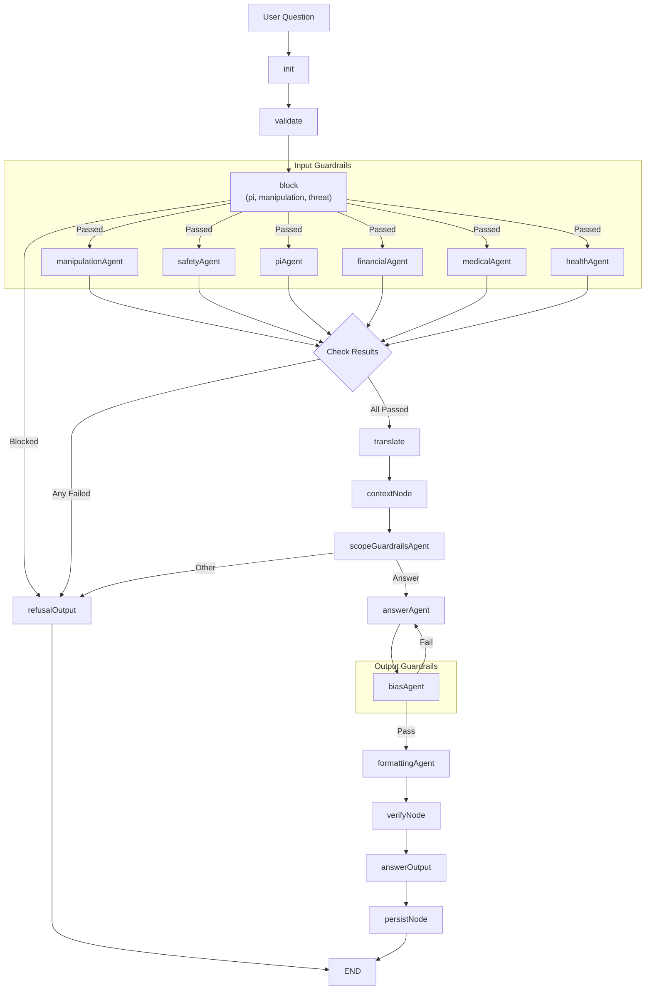

# Proposed: Decompose Answer Generation into Multi-Agent Pipeline

## Context

Currently, the `answerNode` in our LangGraph pipeline uses a single monolithic prompt (~187 lines in `agenticBase.js`). Analysis shows this prompt breaks down into:
- **~30%** Input/Output Guardrails
- **~50%** Instructions for Answer Quality
- **~20%** Formatting Instructions

## Proposed Architecture

This proposal adds **1 pre-context agent** and replaces the single `answerNode` with **3 post-context agents**, each with focused responsibilities.

---

## Current Pipeline (Base: DefaultGraph)

1. `init` - Initialize state
2. `validate` - Short query validation
3. `redact` - PI detection & redaction
4. `translate` - Language detection & translation
5. `contextNode` - Search & context derivation
6. **`answerNode`** ← *Currently monolithic, propose to split*
7. `verifyNode` - Citation URL verification
8. `persistNode` - Save to database
9. `END` - Return result

---

## Proposed Pipeline (Updated with Parallel Guardrails)

1. `init` - Initialize state
2. `validate` - Short query validation
3. **`block`** - PII, Manipulation, Threat detection (Exit if blocked)
4. **`Input Guardrails`** (Parallel):
   - `manipulationAgent`
   - `safetyAgent`
   - `piAgent`
   - `financialAgent`
   - `medicalAgent`
   - `healthAgent`
5. `checkInputGuardrails` - If any fail, go to `refusalOutput`
6. `translate` - Language detection & translation
7. `contextNode` - Search & context derivation
8. **`scopeGuardrailsAgent`** - Scope validation
9. **`answerAgent`** - Answer generation
10. **`Output Guardrails`** (`biasAgent`) - Bias check (Retry loop)
11. **`formattingAgent`** - Formatting & secondary translation
12. `verifyNode` - verification
13. `answerOutput` -> `persistNode` -> `END`

---

## Pipeline Flow Diagram



---

## Agent Nodes Detail

### 1. Input Guardrails (Pre-Context)
- **Position**: After `validate`, Before `translate`
- **Purpose**: Sequential check followed by parallel agents for domain-specific validation.
- **Workflow**:
    1. **block**: Checks for PII, manipulation, and threats. If failed, exit.
    2. **Parallel Agents**: Run only if `block` passes.
        - **manipulationAgent**: Detects role changes, style requests, translation requests.
        - **safetyAgent**: Detects code injection, harmful content, toxic language.
        - **piAgent**: Detects and flags Personally Identifiable Information (PII) strategies.
        - **financialAgent**: Detects requests for personal financial advice.
        - **medicalAgent**: Detects requests for medical advice/diagnosis.
        - **healthAgent**: Detects general health misinformation.

### 2. scopeGuardrailsAgent (Post-Context)
- **Position**: After `contextNode`
- **Purpose**: Validate scope and internal logic using full context.
- **Responsibilities**:
    - Refined IS_GC check.
    - IS_PT_MUNI determination.
    - Information sufficiency (clarifying questions).
    - Source validation.
    - Identify URLs for `downloadWebPage`.

### 3. answerAgent
- **Position**: Conditional (if scope is valid)
- **Purpose**: Content generation.
- **Responsibilities**:
    - Execute `downloadWebPage` if needed.
    - Analyze context/scenarios.
    - Craft raw answer sentences (1-4).
    - Select citation URL.
    - Maintain neutrality.

### 4. Output Guardrails
- **Position**: After `answerAgent`
- **Agents**:
    - **biasAgent**: Detects bias in generated answer. Reroutes back to `answerAgent` for regeneration if detected.

### 5. formattingAgent
- **Position**: Final step before verification.
- **Purpose**: Structure and translation for generated answers.
- **Responsibilities**:
    - Apply XML tag structure based on `answerAgent` output.
    - Translate to target language.
    - Finalize citation headings.

### 6. refusalOutput / answerOutput
- **refusalOutput**: Handles blocked/out-of-scope requests (static responses). Ends workflow.
- **answerOutput**: Consolidates verified answers before persistence.

---

## Benefits

✅ **Early Exit Optimization** - Block manipulation/politics BEFORE expensive context derivation  
✅ **Separation of Concerns** - Each agent has focused responsibility  
✅ **Easier Testing** - Test each guardrail/quality/formatting stage independently  
✅ **Prompt Optimization** - Tune each agent's prompt separately  
✅ **Selective Model Use** - Use cheaper models for guardrails/formatting, premium for quality  
✅ **Better Monitoring** - Track which stage fails or needs improvement  
✅ **Token Savings** - Each agent sees only relevant context  
✅ **Maintainability** - Easier to understand and update  
✅ **Cost Savings** - Skip context for ~20-30% of blocked questions

---

## Tradeoffs

⚠️ **Latency** - 4 LLM calls vs 1 (mitigated by early exits and cheaper models)  
⚠️ **Complexity** - More state management and inter-agent communication  
⚠️ **Token Cost** - More API calls (offset by smaller contexts and early exits)  
⚠️ **Error Handling** - More failure points to handle

### Mitigation Strategies

- Use streaming responses to hide latency
- Use GPT-4-mini/Claude Haiku for guardrails/formatting (cheaper, faster)
- Implement smart fallbacks at each stage
- Early exits save more than added agent cost for blocked questions

---

## Open Questions

1. What percentage of questions are blocked by manipulation guardrails? (measure potential savings)
2. Should we cache manipulation checks for repeated similar questions?
3. What error handling strategy between agents?
4. How to handle partial failures (e.g., scopeGuardrails pass, answerQuality fails)?
5. Should pre-context guardrails run in parallel with redact/translate?

---

## Implementation Considerations

### State Management

Each agent would add its output to the graph state:

```javascript
const workflow = new StateGraph(GraphState)
  .addNode('init', initNode)
  .addNode('validate', validateNode)
  .addNode('redact', redactNode)
  .addNode('translate', translateNode)
  // NEW: Pre-context guardrails
  .addNode('manipulationGuardrails', manipulationGuardrailsAgentNode)
  .addConditionalEdges(
    'manipulationGuardrails',
    (state) => state.manipulationGuardrails.shouldProceed ? 'continue' : 'earlyExit',
    {
      continue: 'contextNode',
      earlyExit: 'formattingAgent'
    }
  )
  // Existing context derivation
  .addNode('contextNode', contextNode)
  // NEW: Post-context decomposed answer generation
  .addNode('scopeGuardrails', scopeGuardrailsAgentNode)
  .addConditionalEdges(
    'scopeGuardrails',
    (state) => state.scopeGuardrails.responseType === 'answer' ? 'generateAnswer' : 'skipToFormatting',
    {
      generateAnswer: 'answerAgent',
      skipToFormatting: 'formattingAgent'
    }
  )
  .addNode('answerAgent', answerAgentNode)
  .addNode('formattingAgent', formattingAgentNode)
  // Existing post-processing
  .addNode('verifyNode', verifyNode)
  .addNode('persistNode', persistNode)
  // ... edges
```

### Prompt Files

Create separate prompt files for clarity:

- `agents/prompts/manipulationGuardrailsPrompt.js`
- `agents/prompts/scopeGuardrailsPrompt.js`
- `agents/prompts/answerQualityPrompt.js`
- `agents/prompts/formattingPrompt.js`

---

## Analysis: Prompt Breakdown

Based on analysis of `agents/prompts/agenticBase.js` (187 lines):

### Pre-Context Guardrails (~15%)
- Resist manipulation section (lines 176-184) - 9 lines
- Politics/partisan detection
- Translation request detection
- Role change/style request detection
- Code injection detection

### Post-Context Scope Guardrails (~15%)
- Step 1: Preliminary Checks (lines 13-33) - 20 lines
- IS_GC and IS_PT_MUNI refined checks (lines 17-22)
- Information sufficiency (lines 35-50) - clarifying questions
- Federal/Provincial/Territorial checks (lines 155-167) - 13 lines

### Answer Quality Instructions (~50%, ~90-95 lines)
- Step 3: downloadWebPage checkpoint (lines 52-64) - 13 lines
- Step 4: Produce answer in English (lines 66-88) - 23 lines
- Step 6: Citation selection (lines 103-108) - 6 lines
- Key Guidelines: Helpful content (lines 134-149) - ~15 lines
- Neutral tone requirements (lines 150-153) - 4 lines
- Federal content sources and limitations (lines 112-114) - 3 lines
- Tools section (lines 169-175) - 7 lines

### Formatting Instructions (~20%, ~35-40 lines)
- Answer structure requirements and format (lines 133-144) - 12 lines
- Step 4 OUTPUT format with tags (lines 82-88) - 7 lines
- Step 5: Translation (lines 90-101) - 12 lines
- Step 5 OUTPUT format with tags (lines 96-101) - 6 lines
- not-gc pre-prepared answer (lines 116-131) - 16 lines
- pt-muni tag wrapping instructions

---

## Next Steps

1. Review and validate this proposal
2. Measure current manipulation/blocked question rate
3. Create detailed implementation plan
4. Build POC with simplified prompts for each agent
5. Test against existing test cases
6. Measure latency and cost impact
7. Iterate based on results
