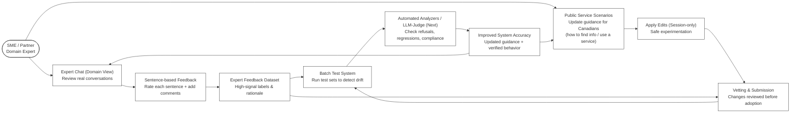

# SME Contribution Workflow

```mermaid
flowchart LR
  %% Circular SME contribution loop
  SME(["SME / Partner<br/>Domain Expert"])

  A["Expert Chat (Domain View)<br/>Review real conversations"]
  B["Sentence-based Feedback<br/>Rate each sentence + add comments"]
  C["Expert Feedback Dataset<br/>High-signal labels & rationale"]
  D["Public Service Scenarios<br/>Update guidance for Canadians<br/>(how to find info / use a service)"]
  E["Apply Edits (Session-only)<br/>Safe experimentation"]
  F["Vetting & Submission<br/>Changes reviewed before adoption"]
  G["Batch Test System<br/>Run test sets to detect drift"]
  H["Automated Analyzers / LLM-Judge (Next)<br/>Check refusals, regressions, compliance"]
  I["Improved System Accuracy<br/>Updated guidance + verified behavior"]

  SME --> A --> B --> C --> G --> H --> I --> A
  SME --> D --> E --> F --> G
  C --> F
  I --> D

  %% Optional styling (keeps it readable)
  classDef core fill:#fff,stroke:#333,stroke-width:1px;
  class SME,A,B,C,D,E,F,G,H,I core;
```

